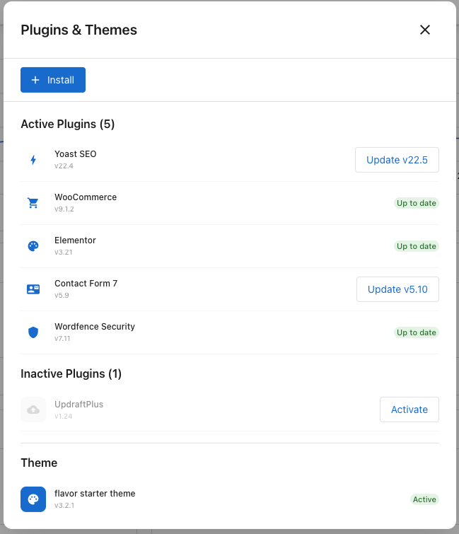

The **Plugins & Themes** panel lets you manage every plugin on your site and your active theme — install, update, activate, and deactivate without going into WordPress admin.

## What you see

- **+ Install** — Install a new plugin.
- **Active Plugins** — Plugins currently running on your site. Each row shows the version and either **Up to date** or an **Update v[version]** button.
- **Inactive Plugins** — Installed but not running. Each row has an **Activate** button.
- **Theme** — The active theme, its version, and an **Active** badge.

## Update a plugin

Click **Update v[new version]** on the plugin's row. The update completes in a few seconds and the badge changes to **Up to date**.

## Activate or deactivate a plugin

- To activate, click **Activate** on an inactive plugin's row.
- To deactivate, open the plugin's actions in WordPress Admin.

## Install a new plugin

1. Click **+ Install** at the top of the panel.
2. Search or browse for the plugin you want.
3. Click **Install** on the plugin's card.

The plugin appears under **Inactive Plugins**. Click **Activate** when you're ready.

:::tip
Create a backup before installing or updating a plugin. Test major updates on [staging](./staging) first.
:::

## Keep plugins healthy

- **Update regularly.** Plugin updates often include security fixes.
- **Remove what you don't use.** Inactive plugins left unmaintained become a security risk.
- **Stick to well-supported plugins.** A plugin that hasn't been updated in years is more likely to break with a WordPress core update.
