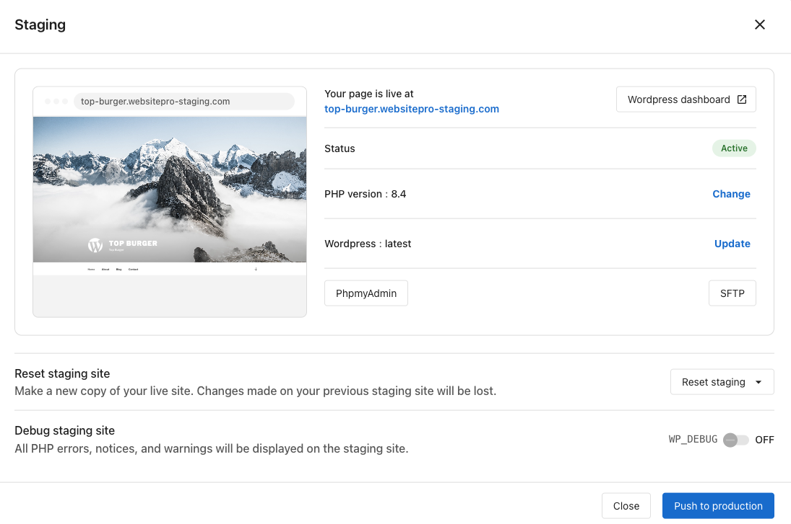

**Staging** is a private copy of your live site that no one else can see. Use it to test theme changes, plugin updates, redesigns, and content edits without risking the version visitors see. When the changes look right, push them to production in one click.

## What you can do

- **Preview the staging site** at its own staging URL.
- **Change the PHP version** on staging without touching production.
- **Update WordPress core** on staging first as a safety check.
- **Open phpMyAdmin** for the staging database.
- **Push to production** when changes are ready.

## Push to production

1. Verify your changes on the staging URL.
2. Click **Push to production**.
3. Confirm.

The live site is replaced with the staging copy in a few minutes.

:::tip
Create a backup of production before pushing, so you can roll back if needed. See [Backups](./backups).
:::

## Reset staging

If staging gets messy or out of sync with production, reset it. Click **Reset staging** and choose:

- **Reset from live site** — Make a fresh copy of production. Any changes on staging are lost.
- **Reset from backup** — Restore staging from a specific backup.

## WP_DEBUG

The **WP_DEBUG** toggle enables WordPress debug mode on staging — useful for diagnosing PHP errors and warnings without affecting your live site.

## FAQs

Does the staging site have its own URL?

Yes. The staging site has a unique URL so you can preview and share it without affecting your primary domain.

Will search engines index my staging site?

No. Staging URLs are blocked from search engine indexing by default to prevent duplicate content issues.

Why is staging taking so long to create?

Staging creation time depends on the size of your site's files and database. A large eCommerce site can take significantly longer than a small brochure site. If staging stalls for an unusually long time, reach out to support.

