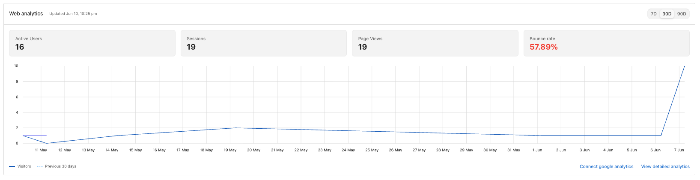
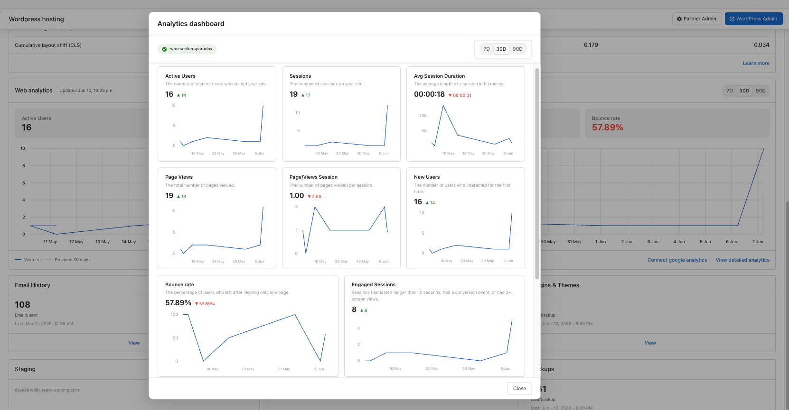

The **Web analytics** card surfaces visitor data for your site without leaving the dashboard. You can use the default analytics out of the box, or connect your own Google Analytics (GA4) property for more detail.

## What you see

- **Active Users** — Unique visitors during the selected period.
- **Sessions** — Visits to your site.
- **Page Views** — Total pages viewed across all sessions.
- **Bounce rate** — Percentage of sessions where the visitor left without interacting further. A high bounce rate is highlighted in red.
- **Visitor chart** — Daily visitors, with a dotted line showing the previous equivalent period for comparison.

Switch between **7D**, **30D**, and **90D** in the top-right to change the range.

## Connect Google Analytics

To replace the default analytics with your own GA4 property, click **Connect google analytics** at the bottom of the card and sign in to the Google account that owns the property.

Once connected, the card pulls from your GA4 data. This is helpful if you already use GA for marketing reports or want to share access with an agency or in-house team.

## View detailed analytics

Click **View detailed analytics** at the bottom of the card to open a full dashboard with more metrics — average session duration, page views per session, new users, engaged sessions, and per-day deltas.

## Troubleshooting

Numbers don't match Google Analytics directly

The card shows a snapshot that can lag GA by up to 48 hours. Differences inside that window usually resolve themselves.

"Unable to load Google Analytics"

A temporary connection issue. Refresh in a few minutes, or use the link in the error to reconnect your GA property.

No chart data after connecting GA

GA4 needs 24–48 hours to start collecting and indexing data after you first connect a new property. If you've waited longer, confirm the property has live traffic and reconnect.

