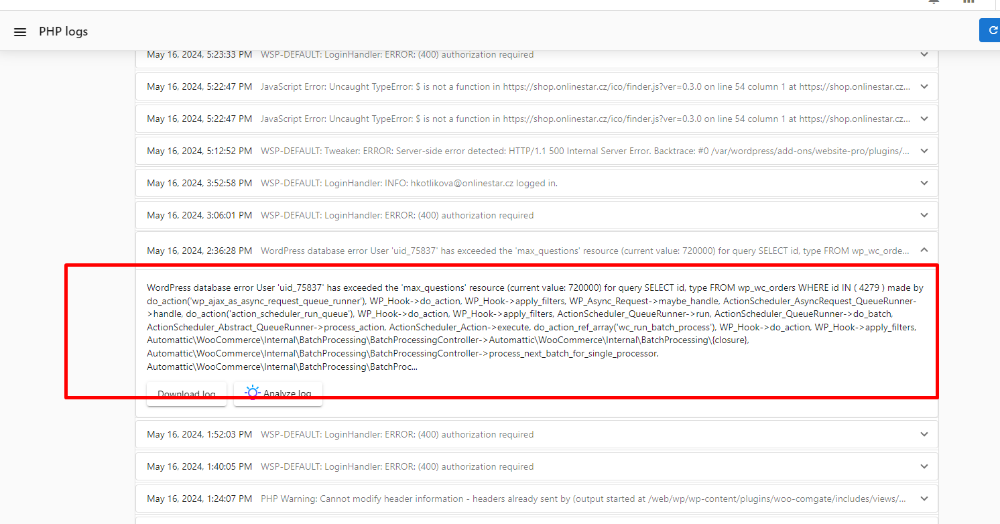

WordPress Hosting does not currently impose restrictions on database sizes.

For WordPress Hosting Pro accounts, certain [MySQL resource limits](https://dev.mysql.com/doc/refman/5.7/en/user-resources.html) are in place to manage extreme scenarios, such as traffic surges caused by attacks on websites. These limits, set at approximately 720000 queries per hour, are designed to handle normal site traffic comfortably and are unlikely to be exceeded under typical conditions.

If a site exceeds the MySQL resource limit, it may result in HTTP 500 internal server errors or PHP error logs indicating that the user has exceeded the "max\_questions" resource limit. Such issues are generally caused by poorly optimized plugins or themes, rather than limitations of the platform itself.

### How to Prevent and Resolve MySQL Limit Issues

1.  **Optimize Plugins and Themes** – Regularly audit and update plugins and themes to ensure they are well-coded and efficient.
    
2.  **Monitor Site Traffic** – Use monitoring tools to track traffic spikes and detect unusual activity.
    
3.  **Implement Caching Solutions** – Caching can reduce the number of direct database queries by serving stored content instead.
    
4.  **Database Optimization** – Regularly clean up unnecessary data, optimize database tables, and remove outdated records.
    
5.  **Security Measures** – Use security plugins and firewalls to prevent malicious attacks that generate excessive database queries.