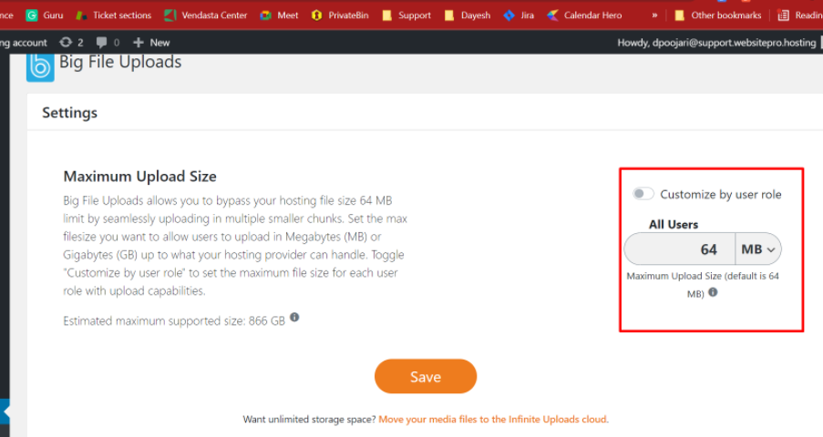

WordPress Hosting Pro gives partners the flexibility and power to manage WordPress files and data using advanced tools. This guide answers the most frequently asked questions about SFTP, phpMyAdmin, file uploads, and system access for developers and technical users.

#### **Q: How do I use SFTP to access my site’s file system?**

WordPress Hosting Pro allows you to connect via **SFTP** (Secure File Transfer Protocol), which encrypts your connection for secure file access.

**Step 1: Add an SFTP key pair**

1.  Go to your WordPress Hosting **Pro Dashboard** and find the **SFTP section**.
    
2.  Click **Add Key**, name your key, and generate the key pair.
    
3.  **Download the private key** associated with your site. This is required to authenticate your SFTP session.
    


**Step 2: Connect using FileZilla (or another SFTP client)**

1.  Open FileZilla and go to **File > Site Manager > New Site**.
    
2.  Configure the connection:
    
    *   **Host**: `sftp.websitepro.hosting`
        
    *   **Port**: `22`
        
    *   **Protocol**: `SFTP – SSH File Transfer Protocol`
        
    *   **Logon Type**: Key File
        
    *   **User**: Your provided username
        
    *   **Key file**: Browse and select your downloaded private key
        
3.  Click **Connect**
    

****

Once connected, you’ll be able to upload files, remove plugins/themes, and manage your site directly.

#### **Q: How can I find the database connection string for my site?**

Although you can't connect remotely, you can output your site’s database credentials by following these steps:

1.  Connect to your file system via SFTP.
    
2.  Upload a `.php` file with the following code:

    ```php
    <?php
    echo "Database Host: " . DB_HOST . "<br>";
    echo "Database Name: " . DB_NAME . "<br>";
    echo "Database User: " . DB_USER . "<br>";
    echo "Database Password: " . DB_PASSWORD . "<br>";
    ?>
    ```
    

3.  Visit the file in your browser, e.g., `http://yourdomain.com/filename.php`
    
4.  **Important:** Delete this file after use to maintain site security.
    

#### **Q: Can I check which PHP extensions are enabled?**

Yes. Follow these steps:

1.  On your computer, create a file named `phpinfo.php`.
    
2.  Add the following code:

    ```php
    <?php
    phpinfo();
    ?>
    ```

3.  Upload this file to your site’s `wp` directory using SFTP.
    
4.  Visit `yourdomain.com/phpinfo.php` in a browser.
    
5.  Look for the extensions section to confirm whether tools like `cURL` or `FTP` are enabled.
    
6.  **Delete the file after checking.**
    

#### **Q: Can I make changes to the `php.ini` file?**

No. The `php.ini` file is not accessible or editable on WordPress Hosting Pro or Standard. This is part of our secure hosting environment. If you need help with a specific PHP configuration, please contact Support.

#### **Q: Can I increase the upload limit for the All-in-One WP Migration plugin?**

Yes, but it depends on the plugin version:

*   Default limit: **64 MB**
    
*   With free extension: **Up to 512 MB**
    
*   For larger sites: **Use the All-in-One WP Migration Unlimited extension**
    

This extension is not installed by default. If you need help installing it, our support team can assist.

#### **Q: Can I connect to the database using MySQL Workbench or other remote clients?**

No. WordPress Hosting Pro site databases are **isolated inside a secure network**. For that reason:

*   Remote database tools like MySQL Workbench **will not work**
    
*   Direct configuration file transfers or database exports from other hosts may not be compatible
    

If you're migrating a site, we recommend using supported plugins like **All-in-One WP Migration**, or contact our support team for alternate solutions.

#### **Q: Why can’t I use plugins that require the XMLRPC.php file?**

The `xmlrpc.php` file enables remote access to WordPress, but it is **disabled by default** in WordPress Hosting Pro and WordPress Hosting Standard due to known security vulnerabilities.

Plugins that rely on it, such as **Jetpack** or certain **Zapier** integrations, may not function correctly.

For more context:

*   [What is XMLRPC.php? (Hostinger)](https://www.hostinger.com/tutorials/xmlrpc-wordpress)
    
*   [Why XMLRPC is blocked (WP Engine)](https://wpengine.com/resources/xmlrpc-php/)
    

### Q: How do I increase the file upload limit in WordPress?

**A:** You can increase the upload limit using a plugin, but the maximum limit in WordPress Hosting Pro is **256 MB**.

To increase the default upload limit:

1.  In WordPress, go to **Plugins > Add New**
    
2.  Install **Big File Uploads – Increase Maximum File Upload Size ** 
    
3.  Activate the plugin
    
4.  Navigate to **Media > Big File Uploads** and set your desired limit (up to 256 MB) ****
    

> If you need to upload files larger than 256 MB, use **SFTP** to upload directly to your server.