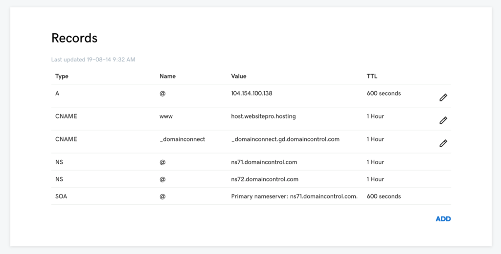
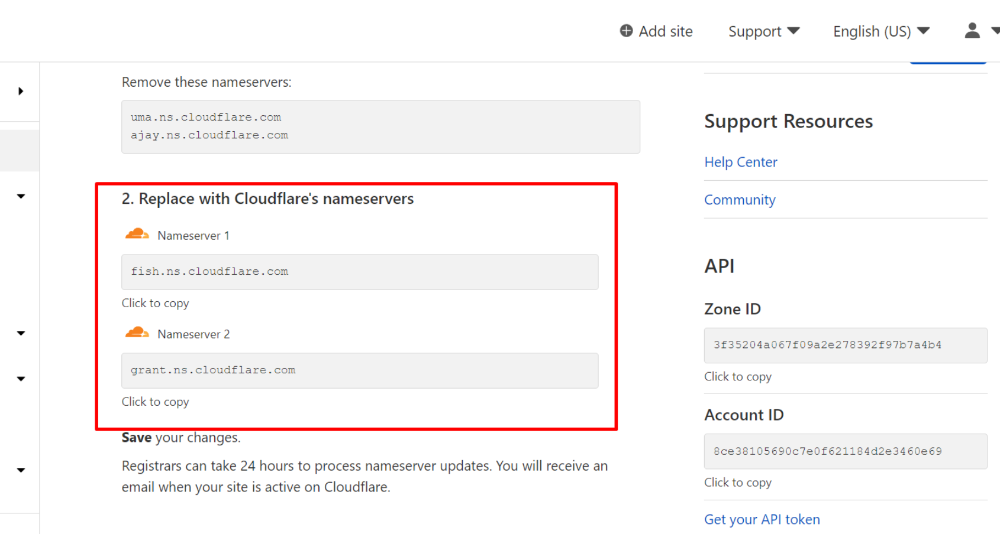
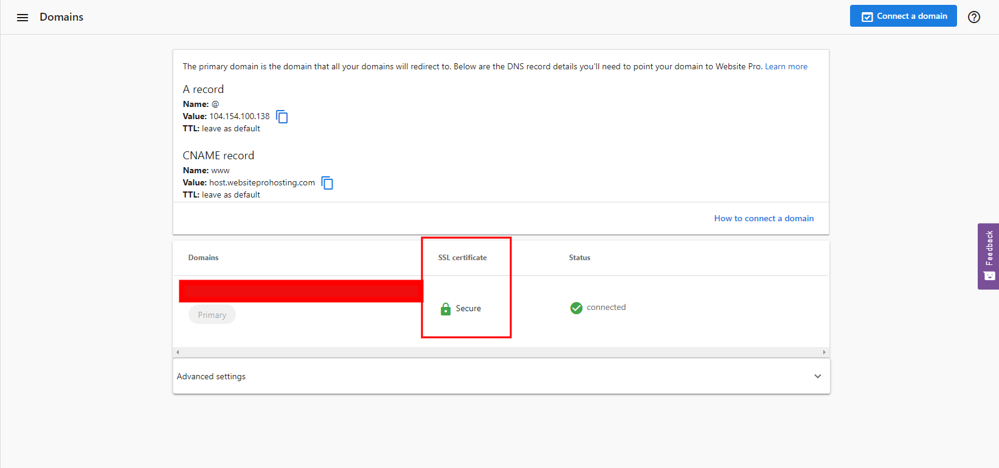

### Q: What are DNS Records?

The **Domain Name System (DNS)** is a collection of standards and infrastructure that allows internet clients (like Chrome, Safari, or Edge) to map human-readable domain names to server addresses.

Think of it like giving a taxi driver the name of a place, such as “the mall,” instead of the exact address; the driver can look up the location and find the directions.

DNS records serve as "listings" for domain addresses. They’re configured on **NameServers**, which respond to queries about domains, such as “Where can I find mybusiness.com?” WordPress Hosting Pro works with three main types of DNS records:

**Types of DNS Records Used by WordPress Hosting Pro**

**1\. A Records**

*   **Meaning**: “A” stands for **Address Record**.
*   **Purpose**: Points a domain name to a specific IP address.
*   **Example**: An A Record for `mybusiness.com` might direct traffic to IP `216.239.38.21`.
*   **In General**: “If you’re looking for `mybusiness.com`, you should find it at IP address `216.239.38.21`.”

**2\. CNAME Records**

*   **Meaning**: Stands for **Canonical Name Record** (here, "canonical" means “the rule that must be followed”).
*   **Purpose**: Points one domain name to another domain name.
*   **Example**: Setting a CNAME for `www.mybusiness.com` will ensure it points to `mybusiness.com`. If configured incorrectly, this could override other records for subdomains like `smtp.mybusiness.com`.
*   **In General**: “If you’re looking for `www.mybusiness.com`, you should find it at `mybusiness.com`.”

**3\. CAA Records**

*   **Meaning**: Stands for **Certificate Authority Authorization**.
*   **Purpose**: Controls which Certificate Authorities (CAs) can issue SSL/TLS certificates for your domain, which verify your domain’s identity and secure communication.
*   **Example**: A CAA Record might specify that only certain CAs, like Let’s Encrypt, can create SSL/TLS certificates for your domain.
*   **In General**: “If you’re an authorized Certificate Authority, you may issue SSL/TLS certificates for this domain.”

If there is **no CAA Record** (or if it’s empty), any Certificate Authority can issue certificates for the domain—this is the most common setup.

This overview should help clarify how DNS records function to direct and secure traffic to your website.

This article covers the most frequently asked questions about connecting domains, configuring DNS records, managing SSL certificates, and ensuring your site shows as secure. Whether you're pointing a domain from GoDaddy, using Cloudflare, or troubleshooting an SSL issue, you'll find the answers here.

#### **Q: Do I need an A Record or CNAME or both to connect a domain?**

To connect a domain to WordPress Hosting Pro, you'll need either an **A Record** or a **CNAME Record**, depending on what part of the domain you're connecting:

*   Use an **A Record** to link the **root domain** (e.g., `mybusiness.com`).
    
*   Use a **CNAME Record** to link a **subdomain** (e.g., `www.mybusiness.com`).
    

You must use at least one of these. It’s common to use both: an A Record for the root and a CNAME for `www`.

#### **Q: When should I use a CNAME Record?**

Use a **CNAME Record** any time you want a subdomain (like `www` or `blog`) to point to your WordPress Hosting Pro site.

Examples:

*   `www.business.com`
    
*   `listings.business.com`
    

For the “Host” field in the record, only enter the subdomain part (e.g., `www` or `listings`).

#### **Q: When should I use an A Record?**

Use an **A Record** when connecting your **primary/root domain**, such as `mybusiness.com`, directly to your WordPress Hosting Pro site.

#### **Q: How do I configure my DNS records to connect to WordPress Hosting Pro?**

To connect a domain:

**A Record**

*   Host: `@`
    
*   Points to: `34.149.86.124`
    

**CNAME Record**

*   Host: `www`
    
*   Points to: `host.websiteprohosting.com`
    

Additionally, be aware of **CAA Records**:

*   If no CAA Record exists, any certificate authority (CA) can issue an SSL certificate.
    
*   If using a CAA Record, you **must authorize** `letsencrypt.org` (used by WordPress Hosting Pro) to issue certificates.
    

#### **Q: How do I point a GoDaddy domain to WordPress Hosting Pro?**

**Part 1: DNS Settings in GoDaddy**

1.  In GoDaddy, go to **Domains > All Domains**.
    
2.  Select your domain and go to **Manage DNS**. 
    
3.  Under **Records**:
    
    *   Add an **A Record** for `@` that points to `34.149.86.124`.
        
    *   Add a **CNAME Record** for `www` that points to `host.websiteprohosting.com`.
        
4.  Click **Save**.
    
5.  Allow up to 24 hours for all changes to take full effect. During this time your old host may still be serving your site’s traffic. You can check on the status of your DNS Settings using tools like [MxToolbox DNS Lookup](https://mxtoolbox.com/DNSLookup.aspx) or viewing the **Domains** tab in WordPress Hosting **Pro.**

****

> Flush Google’s DNS cache for faster propagation: [Google DNS Cache Flush Tool](https://developers.google.com/speed/public-dns/cache)

**Part 2: Connect Domain in WordPress Hosting Pro**

1.  Log into WordPress Hosting **Pro** and go to the **Domains** tab.
    
2.  Click **Connect a Domain** and enter your domain.
    
3.  Wait a few minutes for the domain to show as "Connected."
    
4.  If needed, disable **Redirect to HTTPS** temporarily while the SSL certificate is provisioning. Remember to re-enable it once secure.
    
5.  Click **Make Primary** on the domain that you want all your visitors to be redirected to.

#### **Q: How do I move my domain to Cloudflare DNS?**

1.  Create an account at [Cloudflare](https://www.cloudflare.com/).
    
2.  Choose a free or paid plan.
    
3.  Add your domain.
    
4.  Cloudflare will display **nameservers** to replace at your domain registrar. 
    
5.  Update your **domain’s nameservers** to Cloudflare’s.
    
6.  All DNS records must now be managed in the **Cloudflare DNS zone**.
    

More details: [Cloudflare setup guide](https://support.cloudflare.com/hc/en-us/articles/201720164-Creating-a-Cloudflare-account-and-adding-a-website)

### Q: How do I connect a Cloudflare-managed domain toWordPress Hosting Pro?

**A:** You can connect a Cloudflare-managed domain to WordPress Hosting Pro by following a few key configuration steps in both Cloudflare and WordPress Hosting Pro.

#### Step-by-step instructions:

1.  **Ensure your DNS records are set correctly**
    
    *   Add the necessary **A** and **CNAME** records for your domain in Cloudflare as described in the DNS setup instructions for WordPress Hosting Pro.
        
    *   A Record: `@ → 34.149.86.124`
        
    *   CNAME Record: `www → host.websiteprohosting.com`
        
2.  **In Cloudflare:**
    
    *   Go to the **SSL/TLS > Overview** tab and set **SSL** to `Full`
        
    *   Under **SSL/TLS > Edge Certificates**, turn **“Always Use HTTPS”** to `Off` temporarily
        
3.  **In WordPress Hosting Pro:**
    
    *   Go to the **Domains** tab and add your domain
        
    *   Wait for the domain status to show **“Connected”** (DNS propagation may take time)
        
4.  **Return to Cloudflare:**
    
    *   Once connected in WordPress Hosting Pro, go back to **Edge Certificates** and switch **“Always Use HTTPS”** to `On`
        

#### Additional Notes:

*   **Four-level domains (e.g. `www.your.business.com`)** may face limitations when using Cloudflare’s proxy (orange cloud) feature.
    
    *   **Solution 1:** Disable **DNS and HTTP Proxy (CDN)** mode for that domain
        
    *   **Solution 2:** Purchase a custom SSL certificate in Cloudflare under  
        `SSL/TLS > Edge Certificates > Order SSL Certificate`
        

> If HTTPS doesn't activate immediately, this is usually due to DNS caching. You can flush DNS manually or wait up to 24 hours for propagation.

#### **Q: Why do DNS record changes take time to update?**

DNS records are cached by Internet Service Providers (ISPs) to improve global internet performance. That’s why changes don’t take effect instantly.

**Two ways to influence DNS update speed:**

*   **Adjust TTL (Time To Live):**
    
    *   TTL tells systems how long to cache the record.
        
    *   Set it to 5–60 minutes for quicker propagation (if your provider allows it).
        
*   **Flush DNS manually:**
    
    *   Use [Google’s DNS Flush Tool](https://developers.google.com/speed/public-dns/cache) to refresh their cache for your domain.
        

Propagation can still take up to 24 hours depending on the ISP.

#### **Q: Do I need to do anything to get an SSL certificate for WordPress Hosting Pro?**

No. **All WordPress Hosting Pro sites are automatically issued an SSL certificate** from Let’s Encrypt. This typically completes within a few minutes, but can take up to 24 hours.

#### **Q: Why does my site still show as “Not Secure” even with SSL?**

This issue is usually caused by **mixed content**—when some elements (like images or scripts) on your site still load over `http://` instead of `https://`.

To troubleshoot:

1.  Open your site.
    
2.  Press **F12** or right-click and choose **Inspect**, then open the **Console** tab.
    
3.  Look for errors about insecure content such as 
    

Any `http://` assets must be updated to `https://` or replaced.

Recommended guide:  
[How to fix mixed content in WordPress (WPBeginner)](https://www.wpbeginner.com/plugins/how-to-fix-the-mixed-content-error-in-wordpress-step-by-step)

#### **Q: Does WordPress Hosting Pro support AAAA Records or IPv6?**

Currently, **AAAA Records (IPv6) are not supported.** WordPress Hosting Pro requires only an **A Record** that points to the IPv4 address: `34.149.86.124`.

### Q: How many subdomains can I use with WordPress Hosting Pro?

There is no limit to the number of sub-domains allowed or supported by WordPress Hosting Pro, however, all sub-domains will be redirected to a single primary domain.

For example, a customer can decide to have:  

*   website.com(PRIMARY)
*   portal.website.com
*   portal2.website.com
*   portal3.website.com
*   portal100.website.com

All these sub-domains can be added to WordPress Hosting Pro, but you can only have **1 primary domain****.** All secondary domains will redirect to the primary domain.

Important things to note:

*   The sub-domain CNAME DNS record has to point to [**host.websiteprohosting.com**](http://host.websiteprohosting.com/)
*   All the sub-domains will redirect to the primary domain.
*   Each sub-domain cannot be configured to redirect to anywhere else other than the primary domain on WordPress Hosting Pro.
*   When setting up sub-domains, you would add only the subdomain portion as the host in your record.