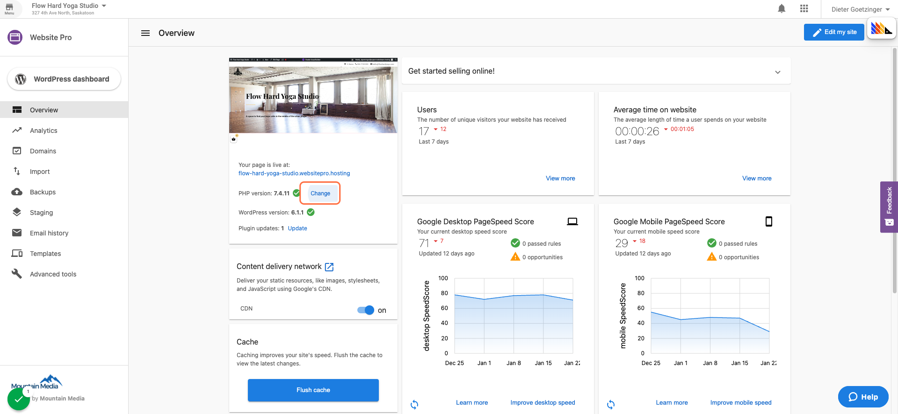
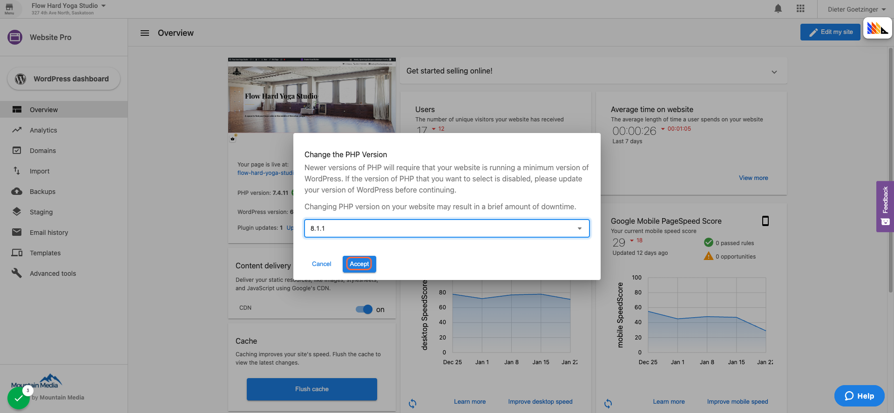
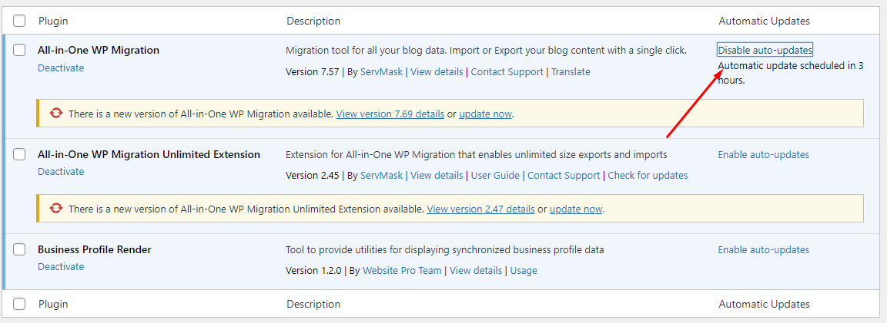

This article answers frequently asked technical questions about the infrastructure, server behavior, and performance capabilities of Vendasta’s WordPress Hosting Pro product.

### Q: Can I upgrade to PHP 8.1 on WordPress Hosting Pro?

Yes. WordPress Hosting Pro supports PHP 8.1 and allows you to upgrade via your dashboard. This upgrade is optional, but recommended since PHP 7.4 has reached its end of life and no longer receives security updates.

**Before upgrading, ensure:**

*   Your site is using **WordPress version 6.0 or higher**
    
*   All themes and plugins are up to date and compatible
    
*   You have created a **backup** (you can restore if issues arise)
    

**To upgrade PHP:**

1.  Go to the WordPress Hosting **Pro dashboard**
    
2.  Click on **Change PHP version ** 
    
3.  Select **8.1.1**
    
4.  Click **Accept ** 
    

> You can roll back to an earlier version if needed.

### Q: Is WordPress Hosting Pro well suited for high-traffic websites?

Yes. WordPress Hosting Pro is optimized to handle very high traffic volumes. It features:

*   **Unlimited pageviews**, and database storage, and bandwidth
    
*   Hosting on **Google Cloud Platform’s C2 machines**, which are optimized for compute-heavy workloads
    
*   Dynamic scaling: usage scales up or down based on traffic (e.g., less load at night, more during peak hours)
    
*   Global content delivery via **Google Cloud CDN**, improving speed and reliability worldwide
    

### Q: How much RAM and CPU does WordPress Hosting Pro allocate?

WordPress Hosting Pro does not have a fixed RAM/CPU limit per site. Instead, the infrastructure automatically **scales resources based on demand**:

*   Low resource usage during quiet hours (e.g., overnight)
    
*   More server power is dynamically allocated when traffic increases
    

You don’t need to manually configure or monitor server performance — the platform adjusts automatically.

### Q: Can I install custom applications like Node.js or tweak server settings?

No. WordPress Hosting Pro runs in a **shared server environment** and does not provide root or SSH access.

As a result:

*   You **cannot deploy custom server-side applications** like Node.js
    
*   You **cannot modify NGINX or Apache configurations**
    
*   `.htaccess` files are not supported, as WordPress Hosting Pro uses NGINX
    

For projects requiring server-level customization, a VPS or dedicated server may be a better fit.

### Q: Can I downgrade or upgrade WordPress versions?

Yes, you can upgrade or downgrade the WordPress core version using the [WP Downgrade plugin](https://wordpress.org/plugins/wp-downgrade/).

This is helpful if:

*   A plugin or theme doesn’t support the latest WordPress version
    
*   You want to revert to a known stable version for compatibility reasons
    

> Always back up your site before changing WordPress versions.

### Q: How does WordPress Hosting Pro manage WordPress core updates?

*   **Minor WordPress core updates** are applied automatically to keep sites secure
    
*   **Plugin auto-updates** are off by default (to avoid potential site breakage)
    
*   Partners can manually enable automatic plugin updates from the dashboard
    

This provides a balance between safety and control — especially important for client sites.

### Q: Does WordPress Hosting Pro support Apache tweaks or advanced server customization?

No. WordPress Hosting Pro does not allow Apache-style configuration or custom server directives.

Reasons include:

*   It’s a **shared environment**, so global server changes aren't permitted
    
*   WordPress Hosting Pro uses **NGINX**, not Apache — so `.htaccess` rules won’t work
    

> If you’re curious about the difference between NGINX and Apache, check out this overview: NGINX vs Apache