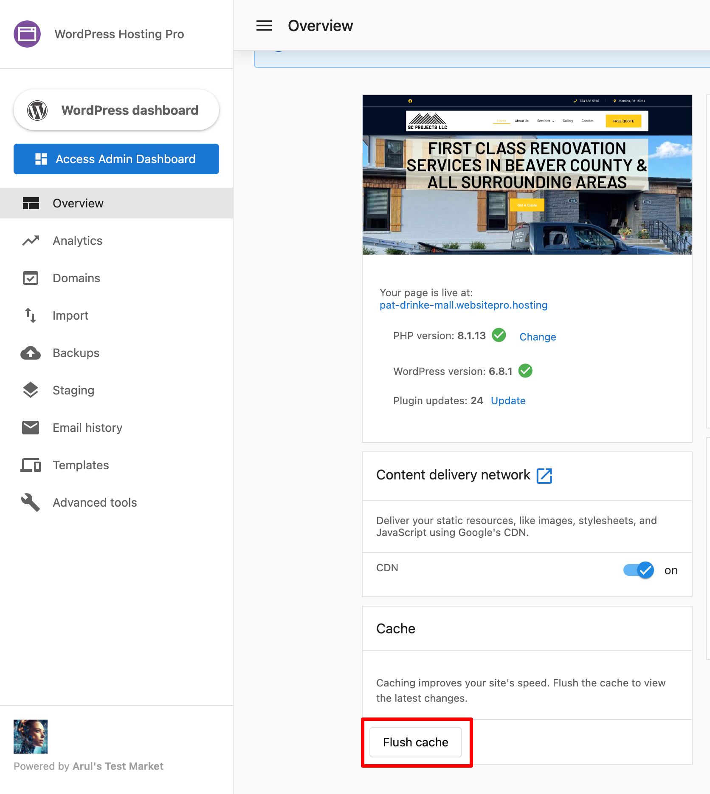
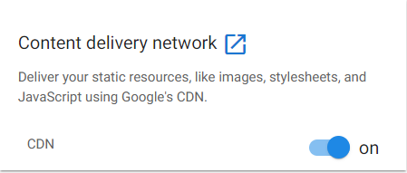

Your website’s speed and reliability directly impact user experience and SEO. This FAQ answers common questions about caching, page speed, image optimization, content delivery, and why some visual updates may not appear immediately.

#### **Q: Why is my Google PageSpeed score low, especially on mobile?**

Google PageSpeed scores often differ between mobile and desktop and can appear low even if your website feels fast. This is because PageSpeed scores are based on technical metrics like Core Web Vitals—not just real-world loading speed.

Several factors can influence scores:

*   Theme builders (like Divi, Elementor, WPBakery) are heavier and impact mobile scores more.
    
*   Excess plugins and unused themes can slow the site.
    
*   Locally hosted videos significantly affect performance. Host videos on YouTube and embed them.
    
*   Poor Core Web Vitals scores will impact your overall PageSpeed.
    

**How to improve performance:**

*   Use the "Improve Desktop/Mobile Speed" buttons in the WordPress Hosting Pro or Standard dashboard.
    
*   Remove unnecessary plugins and themes.
    
*   Use a lightweight theme, or build with clean HTML (note: hardcoded sites are not supported by Marketing Services).
    
*   Use Google PageSpeed Insights to view actionable suggestions.
    
*   Monitor Core Web Vitals in the WordPress Hosting dashboard.
    
*   Contact Marketing Services for help with image optimization, caching setup, or plugin audits.
    

Even with a low PageSpeed score, try loading your site manually on both desktop and mobile—you’ll likely find that it performs well.

#### **Q: What is caching, and how does it work in WordPress Hosting Pro?**

Caching stores parts of your website so they can load faster for visitors. WordPress Hosting Pro uses multiple caching layers, including:

*   **Nginx reverse proxy caching** (active for 1 hour)
    
*   **Google Cloud CDN** (serves content from nearby servers)
    
*   Optional plugin-level caching (e.g., from Divi)
    

WordPress Hosting Pro caches public-facing pages that meet all the following conditions:

*   HTTP status is 200 (OK)
    
*   Request is a GET or HEAD
    
*   No URL parameters
    
*   Visitor is not logged in
    
*   Visitor does not have a special cookie (e.g., wp-postpass)
    

Caching is bypassed for:

*   Admin areas (`/wp-admin`)
    
*   Logged-in sessions
    
*   URLs with query parameters
    

To clear your site’s cache:

*   Go to WordPress Hosting Pro > Overview
    
*   Click the **Flush Cache** button
    

You can also bypass the cache by appending a query string to any URL (e.g., `example.com/page?v=123`).

If you're using WordPress Hosting Pro’s staging environment (available on Pro only), cache is automatically cleared when updates are pushed live.

#### **Q: Why aren’t my site changes showing up right away?**

If your changes only appear when logged in as an admin or after waiting an hour, this is likely due to caching.

To resolve:

*   Click **Flush Cache** in your WordPress Hosting Pro dashboard
    
*   Wait one hour (the default cache expiration time)
    
*   Use staging to make changes and then push to live (cache clears automatically)
    
*   **Tip** - If you would like to access the un-cached version of a page, use a query param, i.e., add a _?v=12345_ to the page URL you’d like to access (so [www.mysite.com](http://www.mysite.com/) becomes [www.mysite.com?v=123456](http://www.mysite.com/?v=123456), bear in mind any random number will work) to the end of the URL. This will be slower to load the page, but it will bypass the NGINX cache.
    

#### **Q: Why aren't my CSS changes in Divi Builder taking effect?**

Divi Builder uses **Static CSS File Generation** by default, which can cause CSS changes not to apply immediately.

To fix this:

*   Temporarily disable Static CSS File Generation in the Divi theme options.
    
*   After editing, you can re-enable the feature to improve site performance.
    

More information here:  
[Divi's Static CSS Generation Guide](https://www.elegantthemes.com/blog/theme-releases/divi-performance-enhancement-introducing-static-css-file-generation-for-divi)

#### **Q: How do I optimize images in WordPress?**

WordPress compresses images by default (to 82% quality), but further optimization is recommended.

Recommended image dimensions:

*   Blog posts: 1200×630 px
    
*   Headers: 1048×250 px
    
*   Logos: 200×100 px
    
*   Featured images: 1200×900 (landscape) or 900×1200 (portrait)
    
*   Backgrounds: 1920×1080 px
    

To optimize images:

*   Resize and compress using tools like TinyPNG or ImageOptim before upload
    
*   Use lazy loading
    
*   Choose descriptive filenames and alt text
    
*   Use optimization plugins like Smush, EWWW Image Optimizer, or ShortPixel
    

You can also reach out to Marketing Services for support with image cleanup and lazy loading setup.

#### **Q: What is a CDN, and how does WordPress Hosting Pro use it?**

A **Content Delivery Network (CDN)** speeds up your site by storing and serving content from servers that are geographically close to your visitors.

All WordPress Hosting Pro sites use **Google Cloud CDN** by default, which provides:

*   Faster global load times
    
*   Better performance in mobile and remote environments
    
*   Built-in security and privacy protections
    
*   1-click cache clearing for global content updates
    

To disable the CDN:

*   Visit your WordPress Hosting Pro dashboard
    
*   Toggle **Enable CDN** off
    

More about CDN functionality:  
[What is Cloud CDN? (Google)](https://cloud.google.com/blog/topics/developers-practitioners/what-cloud-cdn-and-how-does-it-work)

#### **Q: Why is my bounce rate extremely low in Google Analytics?**

A bounce rate below 10% may suggest a technical issue rather than high engagement. One common cause is duplicate Google Analytics tags—often from both a theme and a plugin.

To troubleshoot:

1.  Install the [Google Tag Assistant Chrome extension](https://www.analyticsmania.com/post/google-tag-assistant-tutorial/)
    
2.  Visit your site and click through a few pages
    
3.  Use the Tag Assistant to identify tag errors:
    
    *   Red: Major issue
        
    *   Yellow: Minor warning
        
    *   Blue: Non-standard implementation
        
    *   Green: Tags working properly
        

Fix any duplicate tracking codes and retest to ensure proper data collection.

For additional performance testing:  
[GTMetrix Site Speed Test](https://gtmetrix.com/)