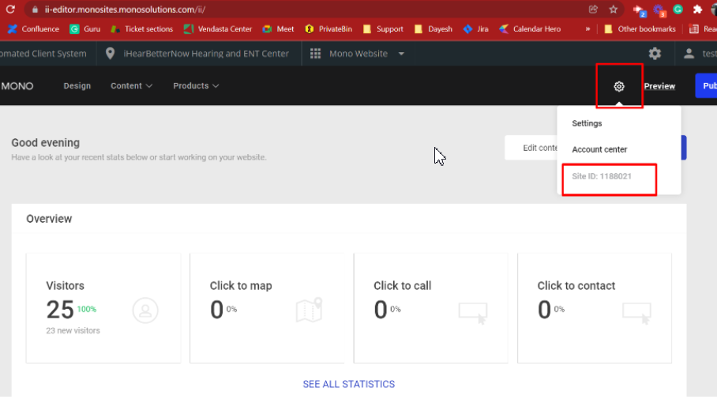
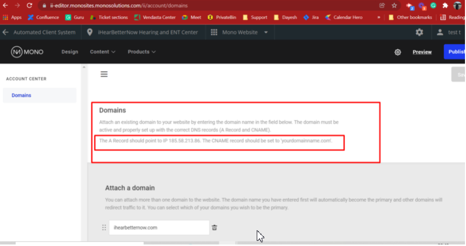

This FAQ provides answers to common questions about unpublishing sites, exporting websites, managing DNS and site data, viewing real-time changes, and working with sitemaps. These tools help you take control of how your website is managed, shared, and discovered online.

### Q: How do I unpublish a WordPress site?

Unpublishing a WordPress website can be done in several ways depending on your goals:

*   **To take a site offline completely** in WordPress Hosting Pro, you can cancel or deactivate the WordPress Hosting product. This removes public access and stops all future backups.
    
*   **To temporarily hide a site**, use a maintenance mode plugin. This is useful for rebranding, major updates, or staging.
    
*   **To fully remove a site**, you can manually delete the site’s files via SFTP or use a plugin that disables public access.
    

> Deactivating a WordPress Hosting Pro product will make both the production and staging sites inaccessible and return a "site not found" error.

### Q: How do I export a website from WordPress Hosting Standard or Pro?

You can export your website using the **All-in-One WP Migration** plugin:

1.  Install the plugin in the WordPress dashboard.
    
2.  Go to the plugin menu and click **Export > File**.
    
3.  Download the exported `.wpress` file to your local device.
    

> If your website has been deactivated, contact Vendasta Support to request the most recent backup file (available for a limited time after cancellation).

### Q: What is a sitemap and why does it matter?

A **sitemap** is a blueprint of your website that helps search engines like Google find and index all the pages on your site.

There are two main types:

*   **XML sitemap** – Used by search engines to crawl your website effectively
    
*   **HTML sitemap** – Helps visitors navigate your site content
    

To check if you have a sitemap:

*   Visit `https://yourdomain.com/sitemap.xml`
    

If one isn’t available, use a plugin like **Yoast SEO** or a tool such as [xml-sitemaps.com](https://www.xml-sitemaps.com/) to generate it.

Sitemaps are especially useful for new websites, websites with few backlinks, or sites with deep page structures.

### Q: How do I find my Mono site’s Site ID and DNS settings?

If you're migrating from the Mono Website Builder:

1.  Launch the Mono product and click the **Settings** icon (top-right corner) 
    
2.  Locate the **Site ID** — this is required for any support escalations
    
3.  To view DNS records, go to **Account Center ** 
    
4.  DNS settings will be listed there for domain connection or migration
    

> To connect a domain to Mono, ensure the correct DNS records are added to your registrar.

### Q: How do I bypass caching to see my most recent changes?

WordPress Hosting Pro uses caching to speed up your site. However, changes may not show immediately due to this caching.

To bypass the cache temporarily:

*   Add `/?skip` to the end of your page URL
    
    *   Example: `https://examplewebsite.com/?skip`
        

This forces your browser to pull the latest version of the page.

> For a more permanent solution, you can manually flush your site’s cache in the WordPress Hosting **Pro Overview** tab.