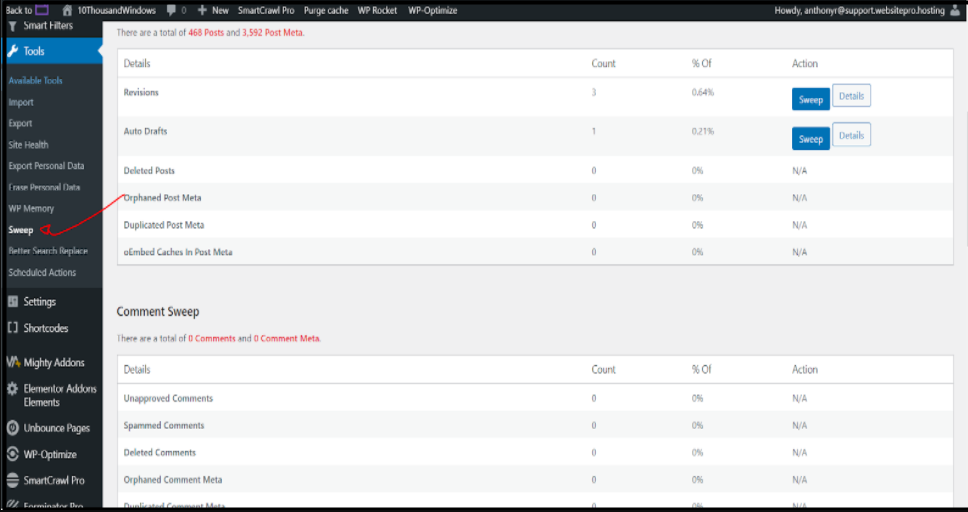
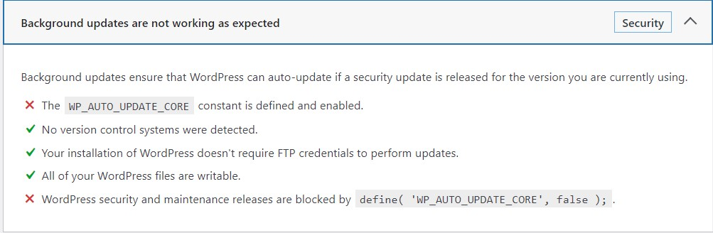
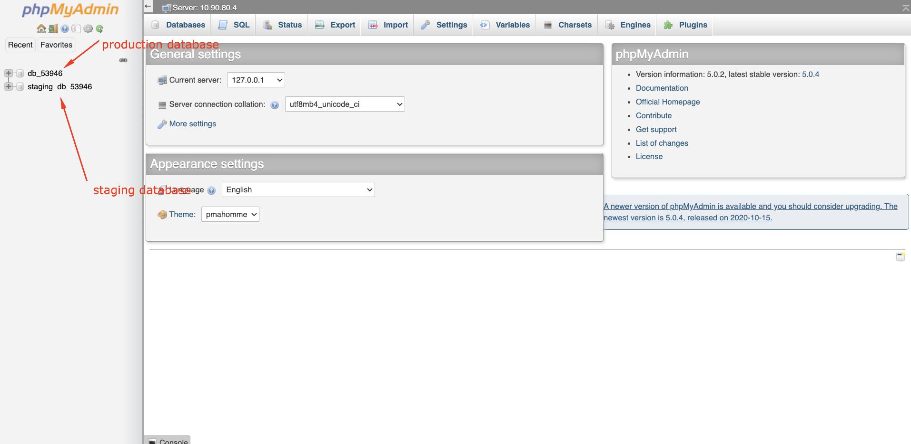
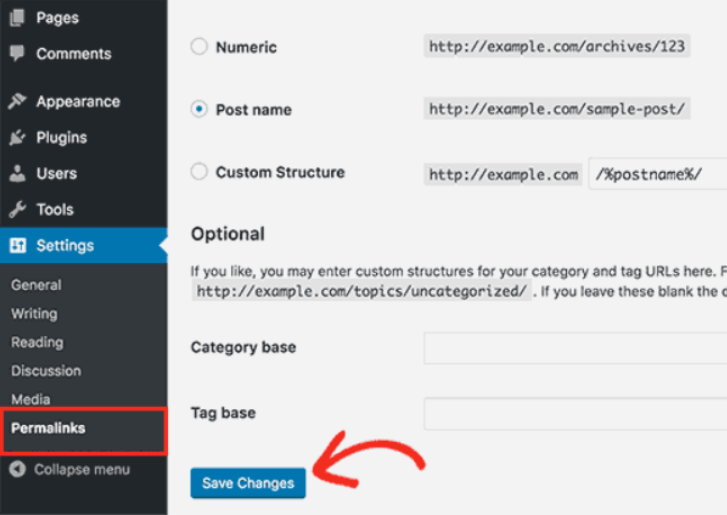

WordPress Hosting Pro offers a robust hosting platform, but certain plugin behaviors or configuration mismatches can lead to errors. This article addresses the most common issues faced by users and how to resolve them using safe and supported methods.

#### **Q: Why am I getting a memory limit error when editing with Divi or Elementor?**

Memory issues in Divi or Elementor are usually caused by:

*   Too many post revisions stored in the database
    
*   Conflicting plugins
    

**Recommended steps:**

1.  **Backup your site.**
    
2.  Install the **WordPress Sweep plugin** to clear unnecessary post revisions.
    
3.  If issues persist, disable plugins one by one to find the culprit.
    

**Known conflicting plugins include:**

*   MetaSlider
    
*   Photo Gallery
    
*   Recent Posts Widget With Thumbnails
    
*   Simple Custom Post Order
    
*   Smart Grid Gallery
    
*   Testimonial Rotator
    
*   Unbounce Loading Pages
    
*   WordPress Importer
    
*   WP-Optimize – Clean, Compress, Cache
    
*   WP Responsive Menu
    

#### **Q: Why do I see a "Storage engine MyISAM is disabled" error?**

WordPress Hosting Pro supports only the **InnoDB** storage engine. Plugins or themes trying to use **MyISAM** will fail.

**Why?**  
This is a stability and reliability decision made by our cloud provider. MyISAM is outdated and lacks support for transactions and row-level locking.

**Workaround:**  
If the plugin requires MyISAM, contact the plugin developer to explore switching to InnoDB in the table creation script.

#### **Q: What does the `WP_AUTO_UPDATE_CORE` error mean?**

This WordPress Site Health warning simply means that **core auto-updates are turned off**.

**Why this is safe:**  
Auto-updating WordPress core versions can break your site if your plugins/themes are not compatible. Vendasta recommends manual updates to maintain stability.

No action is needed unless your team chooses to handle updates differently.

#### **Q: Why am I seeing "Access Denied" errors when importing a `.sql` file via phpMyAdmin?**

This error typically occurs when:

*   The `.sql` file includes `CREATE DATABASE` statements (not permitted)
    
*   You're trying to import into a non-existent database
    

**To fix it:**

*   **Remove all `CREATE DATABASE` and `USE` commands** from your `.sql` file
    
*   Only use the two pre-created databases in WordPress Hosting Pro (Production and Staging)
    

You cannot create new databases in WordPress Hosting Pro, only use the ones provisioned per site.

#### **Q: Why are my WordPress posts returning 404 errors?**

This is a common permalink issue. Here's how to fix it:

1.  Log in to the WordPress Dashboard
    
2.  Navigate to **Settings > Permalinks**
    
3.  Without changing anything, click **Save Changes**
    

****

This action will flush the rewrite rules, often resolving 404 errors on blog posts or custom URLs.