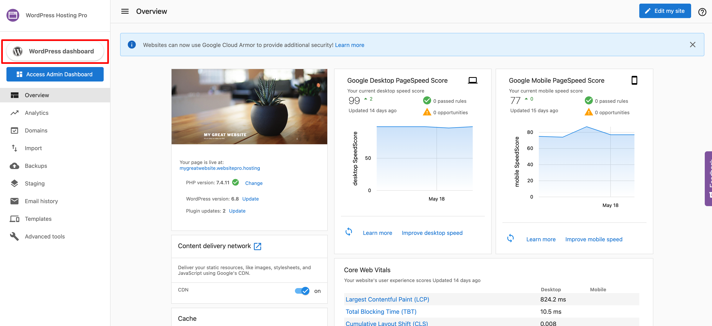
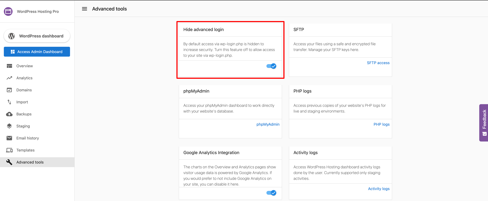

This article covers the most frequently asked questions about accessing the WordPress Dashboard through WordPress Hosting Pro, managing user roles, and understanding access to server-level files like `.htaccess` and `robots.txt`.

#### **Q: How do I log into the WordPress Dashboard using WordPress Hosting Pro?**

Accessing your WordPress Dashboard is handled securely through the WordPress Hosting Pro platform.

#### Clients:

*   Log into **Business App**
    
*   Go to **My Products > WordPress Hosting Pro**
    
*   Click **WordPress Dashboard**
    

#### Partners (Admins):

1.  Log into **Partner Center**
    
2.  Navigate to the client’s account
    
3.  Click **WordPress Hosting Pro** to launch the product
    
4.  Click **WordPress Dashboard**

#### **Q: How does WordPress Hosting Pro handle WordPress login?**

WordPress Hosting Pro uses a **custom SSO (Single Sign-On) integration** to provide secure access to the WordPress Admin Dashboard:

*   Clicking the “WordPress Dashboard” button generates a WordPress user that matches the Business App user.
    
*   Unauthenticated access attempts to `/wp-admin` are redirected or denied.
    
*   This login method enhances site security and centralizes user management.
    

> **Note:** Plugins that alter or override login behavior—such as _Rename wp-login.php_—can interfere with WordPress Hosting Pro’s login system and **should not be used**. If a plugin locks you out, you can use **SFTP access** to remove it from your file system.

To disable the WordPress Hosting Pro login override, toggle off **Hide Advanced Login** under **Advanced Tools** in the WordPress Hosting Pro dashboard.

#### **Q: How do I change a user’s role in WordPress?**

There are two supported methods for updating a WordPress user’s role:

**Option 1: Create via Business App**

1.  Create a Business App user.
    
2.  Log in to WordPress as that user.
    
3.  Navigate to **Users > Edit User > Role**, and assign a new role.
    

**Option 2: Create in WordPress first**

1.  In WordPress, create a user **with the same email** as their Business App account.
    
2.  Assign the desired role under **Users > Role**.
    

> **Important:** The email addresses **must match** exactly between Business App and WordPress. If they differ, a duplicate user will be created.

#### **Q: Can I edit the `.htaccess` file on WordPress Hosting Pro?**

WordPress Hosting Pro is hosted on **NGINX**, which does not use `.htaccess` files (an Apache-only feature). While you can **view** the `.htaccess` file via SFTP, any changes made to it **will have no effect**.

This ensures platform-wide performance and security consistency.

#### **Q: Is the `robots.txt` file accessible?**

Yes, but only when using a **custom domain**.

*   The `robots.txt` file is **not accessible** on:
    
    *   The default WordPress Hosting Pro domain (`yourbusiness.websitepro.hosting`)
        
    *   The staging domain (`yourbusiness-staging.websitepro.hosting`)
        
*   The file **is accessible** when the site is live on a **custom domain** (e.g., `www.yourbusiness.com/robots.txt`)
    

This behavior supports white-labeling and privacy during development.