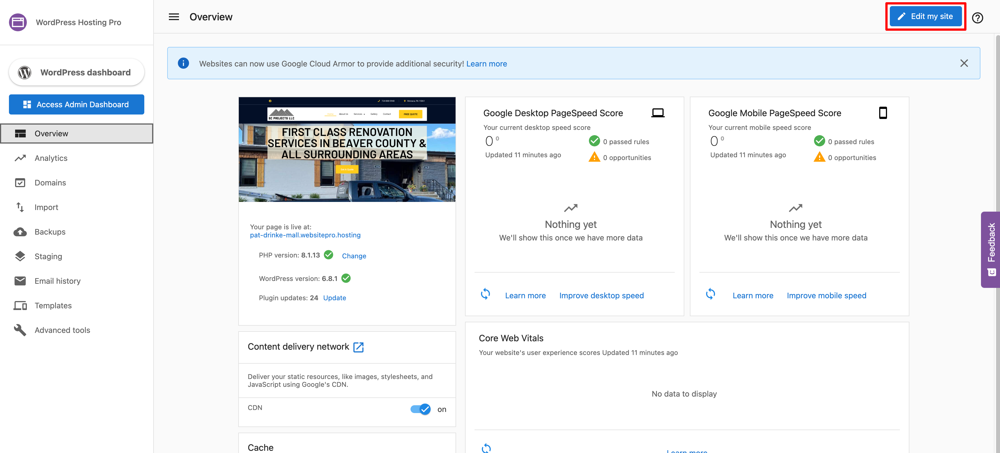
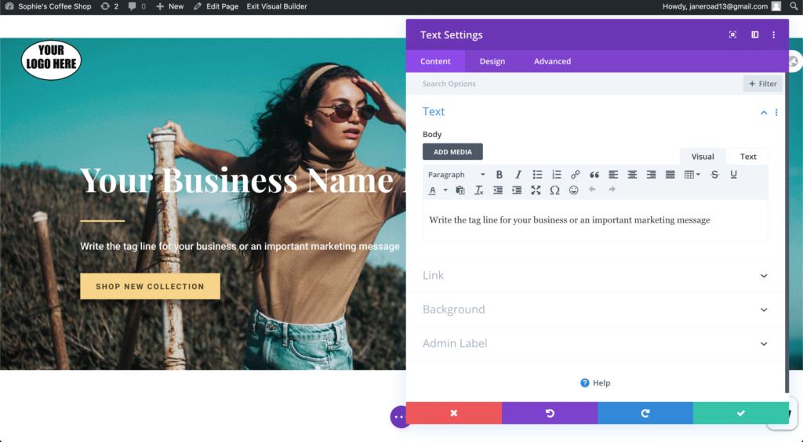
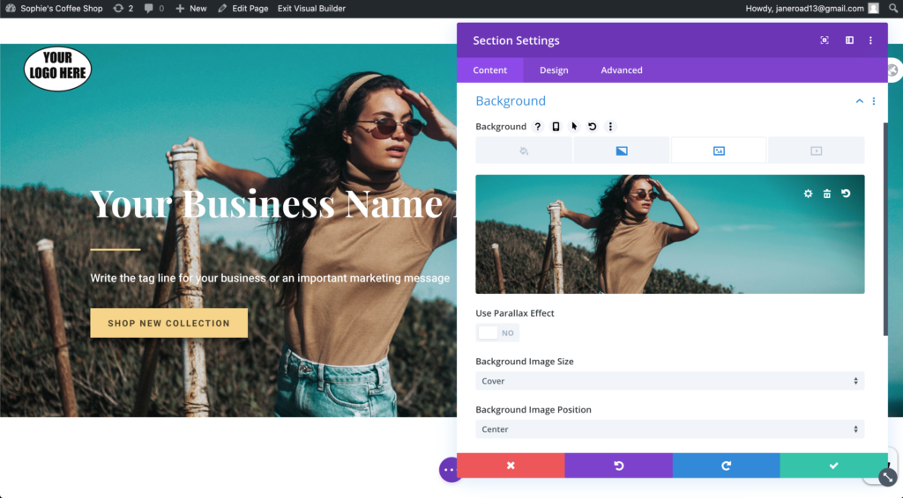
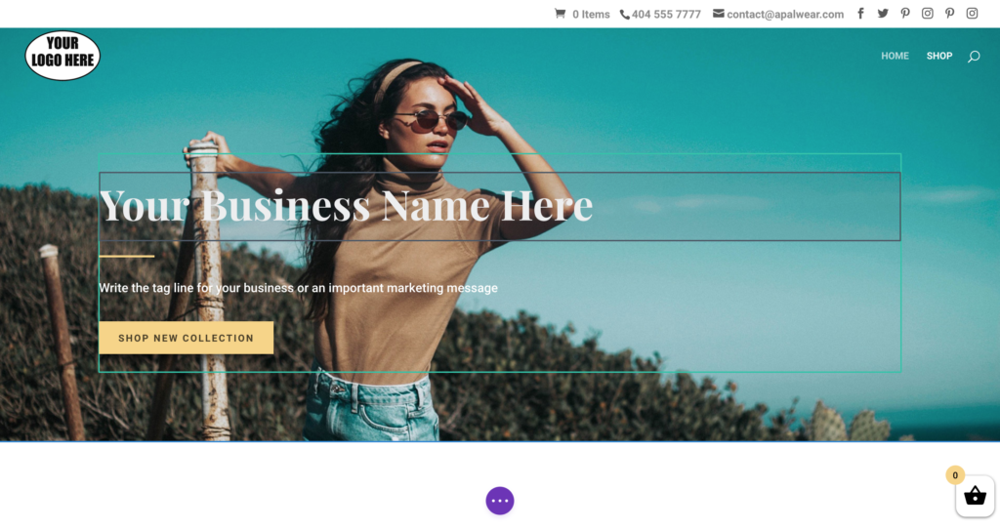

### Edit your site with Divi Builder

Getting your business up and selling is possible with WordPress Hosting Standard, Pro or Premium. This powerful product allows you to quickly and easily create a website and online store powered by WordPress and WooCommerce. To make the transition to ecommerce seamless, we also have a visual builder, called Divi Builder, within every Website Standard account. This allows you to design and create beautiful websites without having to write a single line of code. 

Before we jump in, let’s make sure we’re familiar with Divi Builder.

Divi Builder is a WordPress plugin that allows you to insert, remove, and edit content blocks on the front end of your website. It boasts unlimited layout possibilities and its fluid content areas are perfect for a responsive design approach. It allows those site owners with little or no design, or development experience, to create beautiful sites, with a simple drag-and-drop interface.

Let’s start editing your website using Divi Builder! 

### Accessing Divi Builder

On the WordPress Hosting dashboard, click the “Edit My Site“ button to start editing the front end, or the content of your website.  

**[Editing text and images on your website](https://www.elegantthemes.com/documentation/divi/visual-builder/)**

*   It’s time to customize your site! Let’s start with text elements. Click on the text box you’d like to edit and start making changes.
*   Alternatively, when you hover over an element, a small dark toolbar will appear. Click on the **gear icon** to pull up a window that provides more options for editing and customization. Click on the window’s green checkmark to save any changes.

*   This same process also works with any buttons on the page, however, as buttons have more options, you’ll need to open the editing modal to further customize it. You can do this by double-clicking the button or opening it by clicking the gear icon in the same way that you did with the text box.
*   Now it’s time for images. Many templates will have a large picture set as the background or banner across the top of the website. To change the image, simply hover over it (while not interfering with text or other elements) and double-click. An editing modal should pop up. Click on the “**Background”** section. Your current background image should be showing. Click the garbage can icon to delete the placeholder image and then click “**Add image.**” You can either drag the image from a file on your computer or click to browse your files. 

*   To edit other images on the site, simply double-click the image and replace it with your own. 

### Adding and removing elements on your website

*   If there are any elements (text blocks, images, etc.) that you don’t want on your website, simply hover over the element and select the garbage can icon.
*   If you want to add elements to your page, either:
    *   Hover over the area you’d like to add an element and click the grey “+”;
    *   Hover over the element above the spot you’d like your new element to be placed, and look for a green “+.” _You may have to actually click on the element above for it to appear_. 

*   This will bring up an “**add row**” selector with different options as to the number of columns in your new element. Perhaps you would like three blocks of text side-by-side? Choose the row with three columns. Maybe a wide picture on the right and a narrow text box on the left? Choose the row that shows the corresponding spacing. Just want something to go straight across your entire page? Simply choose the first option available, the one with a single column.
*   A window will appear with several different element options. Search for the **Image** option to add a picture, the **Text** option for adding text, or browse to see what other options are available.

### Saving your work and moving on to edit another page

*   Once you’re happy with how your website looks, or every so often along the way, you’ll want to save your progress. Look for the purple icon with three dots at the bottom of your page and click it. The icon should multiply and you’ll now have several purple icons. You’ll also have a green “**Save**” button in the bottom right corner. Click it to save your changes.

To edit another page (_ex. the Shop page_), click “**Exit Visual Builder**” at the top of your page. Once you’ve done so, you’ll see your page exactly as your customers will see it. Next, navigate to the page you’d like to edit and then re-enable the visual builder using the button at the top of the screen. 

### Changing the logo and contact information on your website

*   To change the logo and contact information in the top bar of the website you will need to navigate to the **WordPress Dashboard**. Click the name of your business in the top left corner of the screen. Once in your WordPress dashboard, in the left navigation bar click the Divi tab (towards the bottom of the side navigation menu). 
*   You are now on the **General Divi Settings tab**. The top row is where you can change the logo. Click the “Upload” button.

*   Once you’ve uploaded your logo, scroll to the bottom of the page and click the green “**Save changes**” button.
*   Next, we’ll input your business’ contact information. Back in the left navigation. You may notice that the Divi Builder tab has been extended to include several sub-headings. Click on “**Theme Customizer.**”
*   A new page will load. This is an alternative editor. Click on the “**Header and Navigation**” section, and then “**Header Elements.**” The navigation bar should now contain two text bars for you to insert your business information.
*   Click the blue “**Publish**” button at the top of the page to save your changes to your webpage.

**Congratulations, you now have the knowledge you need to edit your website!**

[WooCommerce](https://docs.woocommerce.com/) _and_ [Divi Builder](https://www.elegantthemes.com/blog/theme-releases/divi-3) _have extensive documentation and tutorials on how to set up, edit, manage, and operate your store._