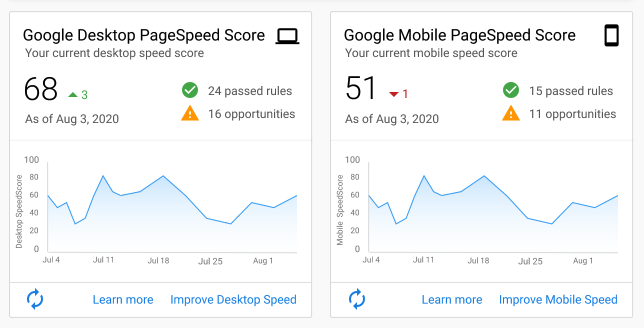
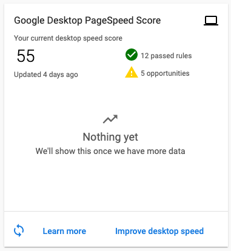

Vendasta's WordPress Hosting product has introduced richer PageSpeed data to the dashboard. Users are able to see a trend of their website's page speed over time and, at a glance, understand opportunities to improve it.

This additional PageSpeed data can help partners and their clients understand the impact of any recent site changes. 

PageSpeed scores are measured weekly for both desktop and mobile, if a user would like to see an updated score they can do so by clicking the **refresh** button in the bottom left corner of the card. 

If a user clicks to **Improve Desktop** or **Mobile Speed** they will be taken to Google's PageSpeed Insights in another tab. From here, a user can dig into what is causing their site to receive its score and what to change to improve it. 

When a user clicks to **Learn more** a Google article will open in a new tab informing the user about why page speed is so important. 

If the website has recently been created the trend line will not appear as there is not enough data to support it. 

