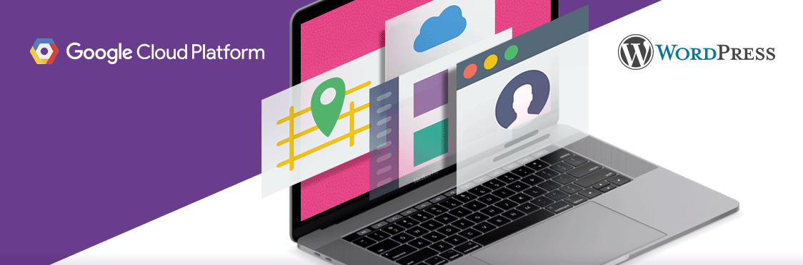

### Google-fast WordPress sites

Hosting websites can be time-consuming, stressful, and often requires technical expertise. WordPress Hosting provides reliable, easy-to-use hosting backed with top-notch security, speed, and storage.

WordPress Hosting hosts your WordPress site on Google Cloud Platform. Your WordPress site utilizes state-of-the-art infrastructure, ensuring it's secure and protected, fast, and scales as your business grows. Plus, one login gives you access to your WordPress dashboard and built-in Google Analytics reporting! With WordPress Hosting, you get a fast, secure, and robust WordPress site for your business.

**Product Description**

Host your website on a platform that's fast, secure, and easy to use—it's all possible when you combine Google Cloud Platform with WordPress.
