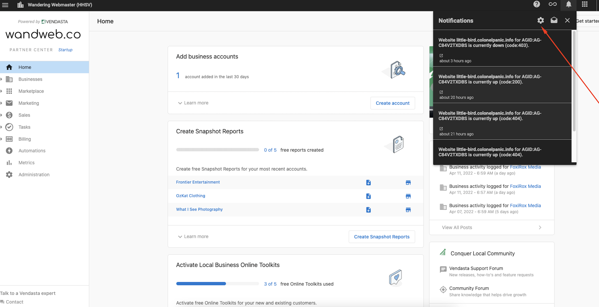
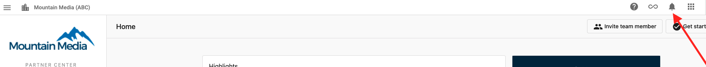
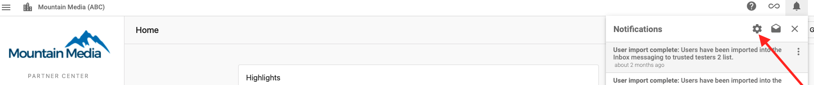
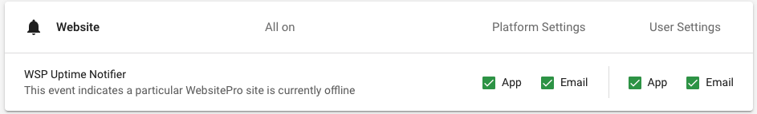

Stay informed about your website's status with real-time notifications, so you can quickly resolve issues and maintain exceptional performance.

### What are real-time performance notifications?

Real-time performance notifications provide enhanced visibility into your website's status by sending alerts the moment there is a change in your site's availability.

You can opt-in to receive in-app or email notifications to be notified in real-time in the event of unplanned downtime, and the moment the service is restored.

### Why are real-time notifications important?

**Stay Informed:** Downtime impacts your business. Real-time notifications help you monitor your website's status and act quickly with accurate, timely information. 

**Proactive Response:** Instead of waiting to discover that your website is down, notifications allow you to proactively respond to issues before visitors or customers are affected.

### How do real-time notifications work?

*   The client's website is pinged every 30 minutes
*   If the ping is successful, no action is taken
*   If there is an unsuccessful ping, a notification is sent based on your preferred notification settings (in-app and or email) 
*   Notification is sent on a status change only (for example, if a website in-service goes offline suddenly or vice versa for a restored website)
*   Notification is only sent once until another change of state

### How to activate notifications

Notifications can be enabled in three easy steps:

1\. Click on the notifications bell in your dashboard.

2\. Click on the gear icon that takes you to the settings

3\. Scroll down to the website section to enable notifications

