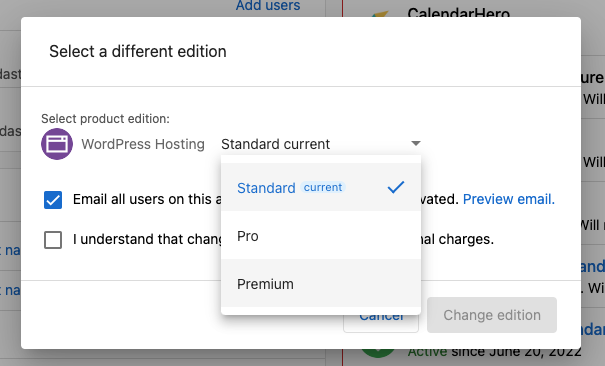
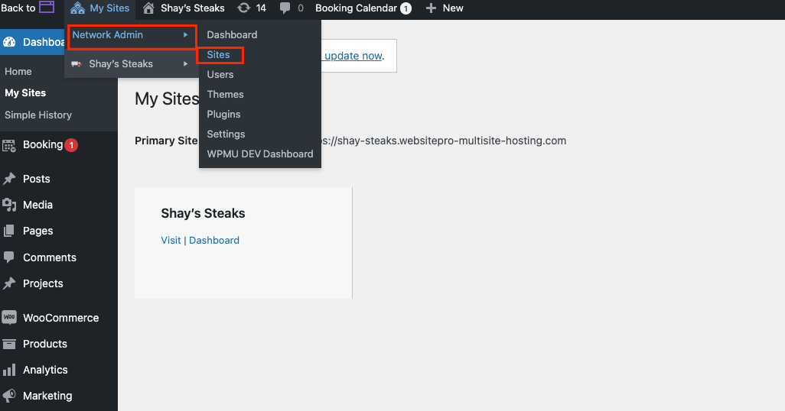
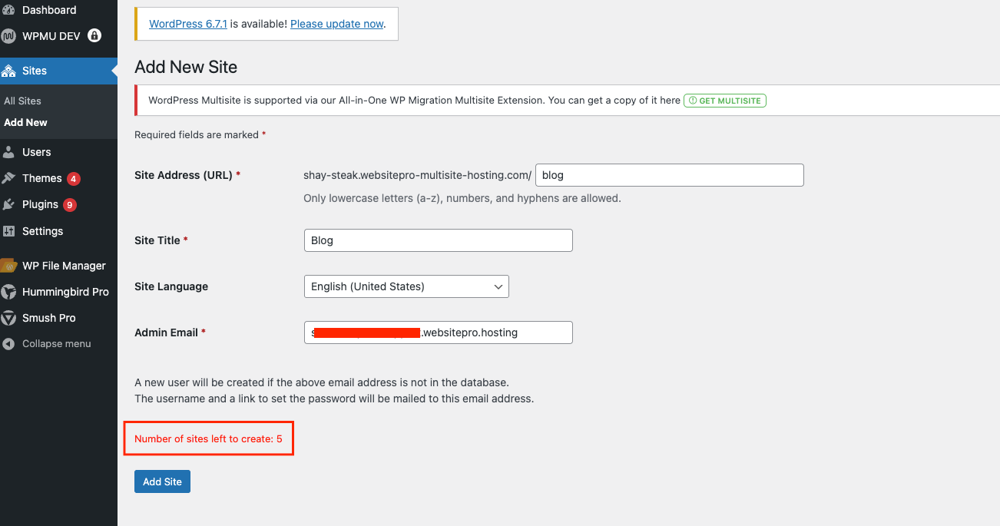
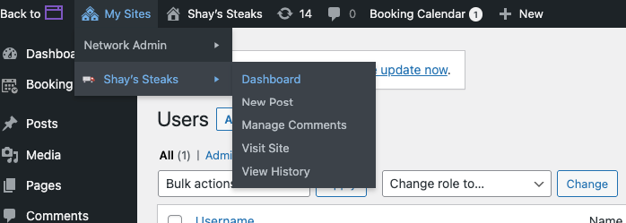
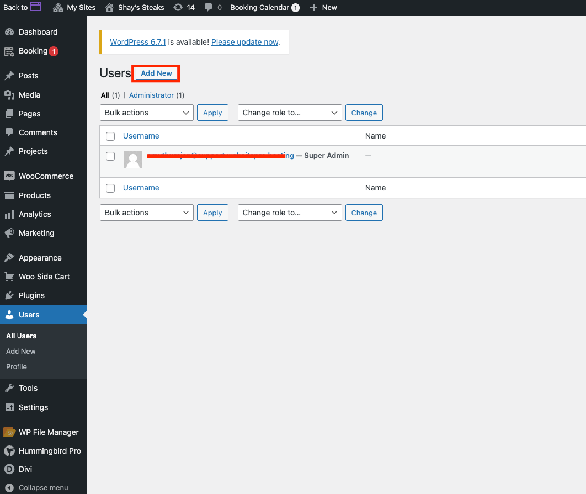

**WordPress Hosting Premium** is a robust multisite hosting solution tailored for managing multiple WordPress websites under one account. Hosted on **Google Cloud Platform**, it offers centralized control, enhanced security, and scalable infrastructure which is ideal for agencies, educational institutions, and corporate networks.

### Overview of WordPress Hosting Premium

**Centralized Site Management**

Manage multiple websites from a single dashboard with distinct roles:

*   **Network Admins**: Oversee network-wide settings, themes, plugins, and users.
    
*   **Site Admins**: Manage site-specific content and configuration independently.
    

**Google Cloud Hosting**

*   Daily automated backups.
    
*   Elastic scaling to handle traffic surges.
    
*   Free SSL certificates included.
    

### Security Capabilities

*   DDoS protection and Web Application Firewall (WAF) using Google Cloud Armor.
    
*   HTTPS encryption with SSL for all hosted sites.
    

### Developer-Oriented Tools

*   **SFTP Access.**
    
*   **phpMyAdmin** for advanced database access.
    
*   **Custom Domain Support** for main site.
    
*   Plugin and theme controls managed at the network level by Super Admins, with content control delegated to Site Admins.
    

### Use Case Applications

**Marketing Agencies**

Efficiently manage all client sites and streamline plugin/theme updates and content deployment.

**Educational Institutions**

Create departmental subsites with consistent branding and independent administration.

**Corporate Networks**

Manage branch sites centrally with localized content updates.

### Platform Enhancements

*   Global Content Delivery Network (CDN) for optimized load times
    
*   Uptime monitoring to ensure availability
    
*   Integrated Google Analytics for site performance tracking
    

### Email Hosting

WordPress Hosting Premium does not include email hosting. Partners can connect their preferred third-party email provider (e.g., Google Workspace or Microsoft 365) for business communications.

### How to Use WordPress Hosting Premium

**Step 1: Activation**

New Activation

1.  Log in to Partner Center.
    
2.  Navigate to **Accounts > Manage Accounts**.
    
3.  Select the appropriate account.
    
4.  Click **Order Products** and search for “WordPress Hosting”.
    
5.  Choose **Premium** from the version dropdown.
    
6.  Confirm and complete the order.
    

Upgrading from WordPress Hosting Standard or Pro

1.  Locate the existing WordPress Hosting product in Partner Center.
    
2.  Select the three-dot menu > **Change Edition**.
    
3.  Choose **Premium**.
    
4.  Acknowledge the pricing change notice and proceed. 
    

**Step 2: Launching the Product**

1.  Access the setup screen via Partner Center.
    
2.  Choose a site template:
    
    *   Use default templates, or
        
    *   Import a custom one with the All-in-One plugin.
        
3.  Define the site name, business name, and domain.
    
    *   A default domain ending in `.wp-premium-hosting.com` is included.
        
4.  Click **Launch** to begin site creation.
    

**Step 3: Creating a Subsite**

1.  Go to the **WordPress Dashboard**.
    
2.  Navigate to **Network Admin > Sites**. 
    
3.  Select **Add New** and enter:
    
    *   Site Address (URL)
        
    *   Site Title
        
    *   Admin Email 
        

**Step 4: Assigning a Site Admin**

*   Site Admins have access to content and settings for their assigned subsite only.
    
*   Network Admins retain control over all plugins, themes, and global configurations.  
    

**Step 5: Connecting a Custom Domain (Main Site)**

Update DNS settings through your domain registrar:

**A Record**

*   Name: `@`
    
*   Value: `35.227.228.214`
    

**CNAME Record**

*   Name: `www`
    
*   Value: `host.wp-premium-hosting.com`
    

DNS propagation typically takes a few hours.

**Note**: If upgrading from WordPress Hosting Standard or Pro, the original domain will redirect to the new Multisite domain. The legacy domain may display “SSL Pending” or “Disconnected” in the dashboard—this is expected and does not affect site availability.

### FAQs

**Q: What is WordPress Hosting Premium?**  
A hosting solution for managing multiple WordPress sites through one interface. Ideal for agencies, institutions, and corporate teams.

**Q: How can I activate WordPress Hosting Premium?**  
Activate as a new product or upgrade from an existing WordPress Hosting Standard/Pro product via Partner Center.

**Q: Can I use my own domain?**  
Yes. Custom domains can be applied to the main site using DNS records.

**Q: Are security features included?**  
Yes. Includes Cloud Armor protection, SSL certificates, and regular backups.

**Q: Can Site Admins control plugins and themes?**  
No. Only Network Admins can manage plugins and themes across the network.

**Q: How long does initial setup take?**  
Setup completes within minutes after launch initiation.

**Q: Will I retain my old domain after upgrading?**  
Yes. It will redirect to your Multisite domain automatically.

## Frequently Asked Questions regarding Upgrades

Can I upgrade from Standard to Premium later?

Yes, you can upgrade your account edition at any time through the Partner Center or Marketplace. The system handles the migration of your existing site into the Premium environment.

