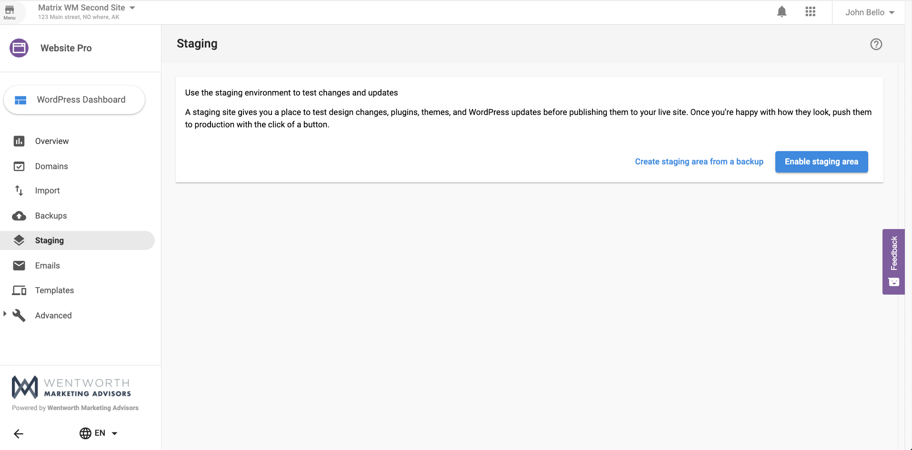
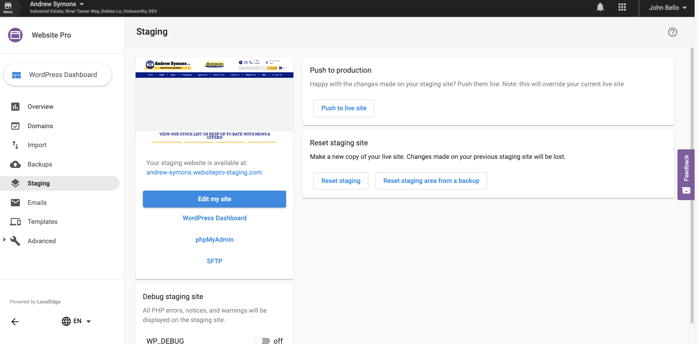
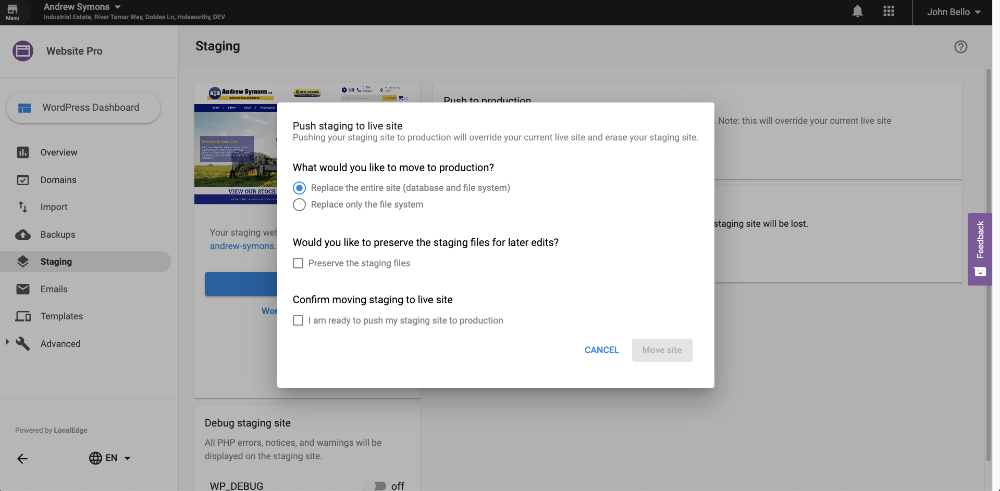
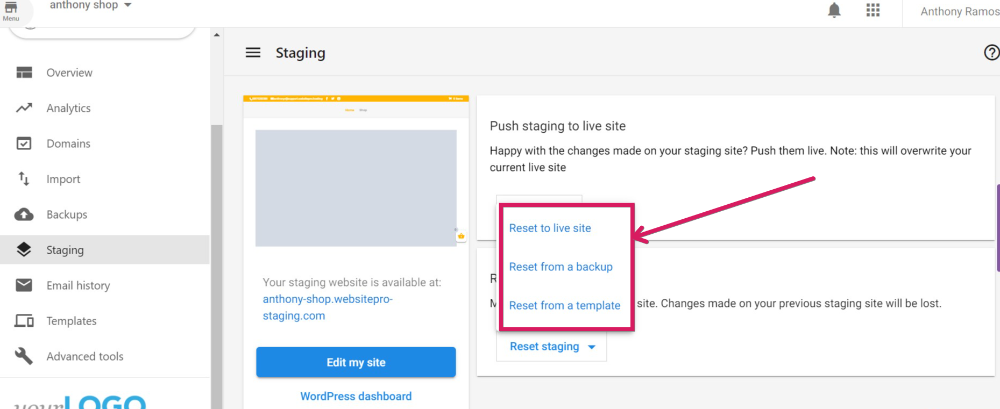

**WordPress Hosting** accounts can create a staging environment for their websites, make the necessary changes in the staging environment, and push the change to production with minimum downtime. Standard accounts can only edit their production websites directly. A staging site is separate from the production site, and you can even import All-In-One and WordPress Hosting backups to a staging environment.

When it comes to managing your website, ensuring it runs smoothly and without interruption is crucial. However, making updates or adding new features directly to your live site can often lead to unexpected issues. This is where a **staging website** becomes invaluable. A staging website is a safe, controlled environment where you can make changes without affecting your live site or your visitors.

Below is a staging view, for a site that hasn't created a staging environment:

The site below has a staging environment:

In the staging environment, customers can test out their site updates, and once satisfied push to live.

Please Note: If you still want the staging files to be present after pushing the site to live, please checkbox "Preserve the Staging files" or they will be deleted. 

### Resetting a Staging Site

There are 3 ways to reset your staging site:

1) Reset to live site - This will reset the staging site and make an exact copy of the live site currently.

2) Reset from backup - This will reset the staging site from whichever backup you select from the backup list - this is a better approach when you need to compare the actual site vs the content of an older backup.

3) Reset from template - Reset the staging site from the template selection - this means the staging site will be different from your actual site, and it will install a fresh template from the template selections for you to work with.

## Frequently Asked Questions

Will search engines index my staging site?

By default, staging environments are usually set to "discourage search engines from indexing this site" in WordPress settings, or protected via a separate URL structure, to prevent duplicate content issues.

Does the staging site have its own URL?

Yes. The staging build will have a unique URL so you can view and share it without affecting your primary domain.

Why is my staging site taking a long time to create?

Staging creation time depends on more than just the site's file size—it also depends on how large and complex the site's **database** is.

**Examples:**

* A 4.5 GB eCommerce site with **10,000+ products** will take significantly longer than a 4.5 GB brochure site with 5 pages and large media files.
* This is because staging involves copying both the **file system** and performing **database writes**, which can be slow for content-heavy or highly dynamic sites.

If your staging site is taking longer than expected, give it additional time or reach out to support if it's stalled for an extended period.

Does WordPress Hosting Pro block SEO bots from crawling temporary URLs?

Yes. WordPress Hosting Pro automatically restricts SEO bots from indexing temporary URLs (e.g. `sitename.websitepro.hosting`).

**Why this matters:**

* Prevents premature indexing of incomplete or placeholder content
* Protects your SEO reputation
* Avoids duplicate content penalties from search engines

**Best practice:**  
Connect your **custom domain** before launching your site or beginning any SEO efforts. Only custom domains allow full indexing and visibility by search engine bots.

> Temporary URLs are not intended for public visibility or long-term use. SEO bots are blocked by design until a custom domain is in place.

