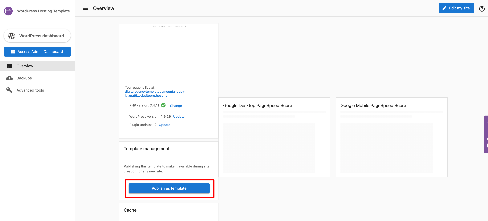
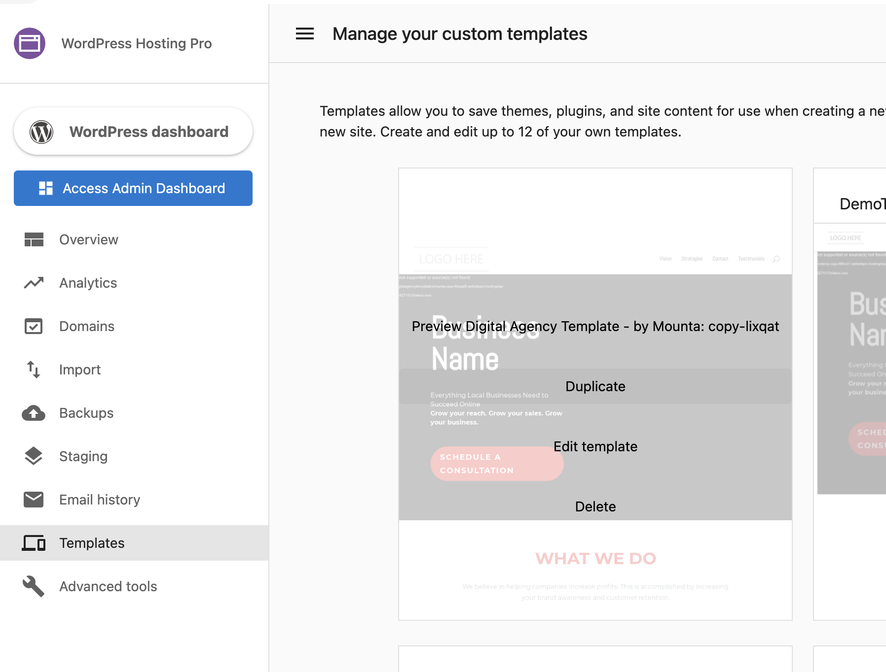
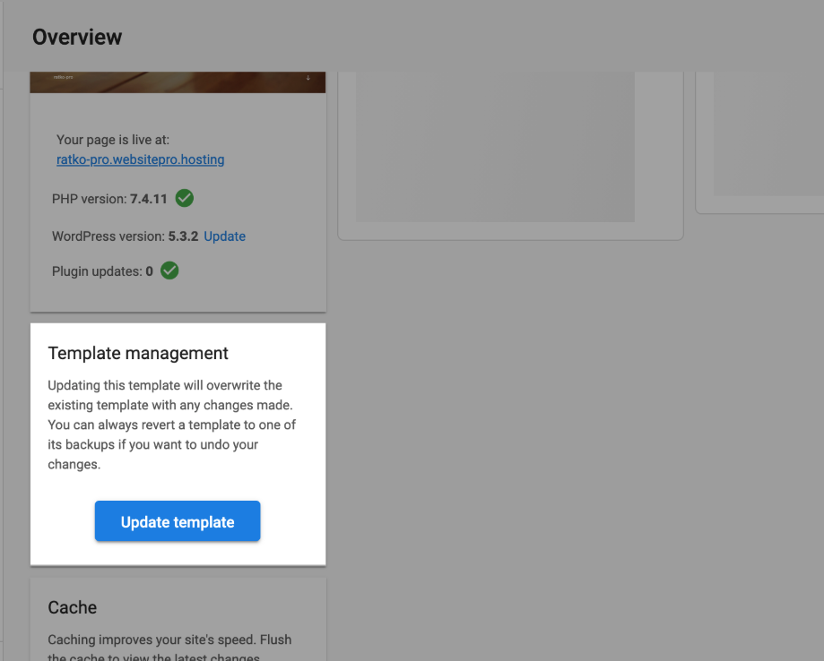

You can create and manage custom templates through the Templates tab in WordPress Hosting Standard/Pro/Premium.

Custom templates allow you to save themes, plugins, and site content for use when creating a new site. Admin users have access to this tab, and the templates you create will be visible when creating new sites. Create and edit up to 12 of your own templates.

Creating and managing your templates is straightforward.

When creating websites, you often need to install the same set of plugins, themes, and sometimes even content repeatedly. With templates, you can save time by setting up templates as starting points for each website you create, skipping repetitive manual work and focusing on creating quality website content.

## How do custom templates work?

**Duplicate Template**

This feature lets you duplicate your existing templates, or create new ones using any of the pre-built templates as a starting point.

:::note
You can only duplicate a template that has been published. To publish a template, click on **Edit Template > Template Management > Publish as Template**.
:::

1. Go to **WordPress Hosting > Templates** and hover over a template. You will now see a **Duplicate** option.

2. Clicking on **Duplicate** will prompt you to define a new template name. Simply type in your new template name and click **Create Template**.
3. To edit the template, click on **Edit Template**. You will be taken to the WordPress Dashboard where you can edit your site.
4. To save the changes made to your new custom template, click **Update Template** under Template Management.

## Frequently Asked Questions (FAQs)

Can I import my own custom templates to WordPress Hosting Standard or WordPress Hosting Pro?

Yes. You can create custom templates by importing an existing WordPress site and saving it as a new template in WordPress Hosting Pro or Standard.

**Steps to create and import a custom template:**

1. **Export your existing WordPress site:**
   * In the WordPress dashboard of the site you want to use as a template, install the **All-in-One WP Migration** plugin.
   * Go to **All-in-One WP Migration > Export** and download your site file.

2. **Create a new template in WordPress Hosting Pro/Standard:**
   * Navigate to WordPress Hosting > **Templates** in the dashboard.
   * Create or duplicate a template.
   * Enter the WordPress dashboard for that template and install the **All-in-One WP Migration** plugin again.

3. **Import the site into the template:**
   * Go to **All-in-One WP Migration > Import** and upload the exported file from Step 1.
   * Once imported, return to the **Template Overview** page and click **Publish as Template** or **Update Template**.

**Best practices for template performance:**

* Keep your templates simple.
* Avoid bundling more than **30 plugins**.
* Minimize large media uploads inside the template.
* Treat templates as a **starting point**; additional customizations can be made on a per-site basis after launch.

