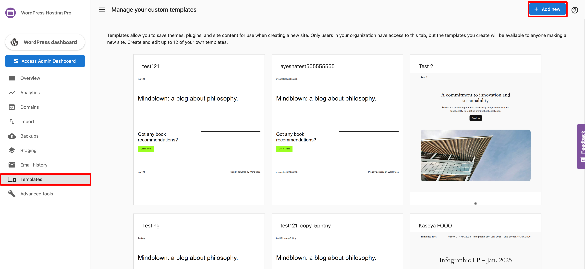
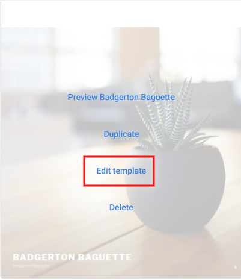

### What are custom templates?

Partners offering the WordPress Hosting product have the ability to create custom templates to either offer to their customers or to use as a quick way to spin up websites. These templates allow users to install plugins, themes, and pages that will be installed automatically when creating a new site.

### Why are custom templates important?

When creating websites, agencies often have to install the same set of plugins and themes. This manual overhead eats up time that could be better spent crafting the unique content of the website.

With templates, you can front-load that work. You will only need to set up the template once, and can then use that with each site you generate.

Additionally, users may want to create templates and offer them to their customers who will be using the product DIY.

### How do custom templates work?

**Note:** Partners have the ability to add up to 12 of their own templates. Should you wish to add more, you will need to first delete one of your existing templates.

1.  As a Partner Center admin, access WordPress Hosting from an account that has **not** completed its site setup.
    *   This can be done from **Partner Center > Accounts > Manage Accounts > Select account > WordPress Hosting.**
2.  Navigate to the **Templates** tab.
3.  Click **+Add New**.
4.  Enter your template's name and domain.
5.  Click **Create Template**.

From here, create your template as though you were building a standard site. You may wish to include a theme, plugins, or pages that you commonly require.

Once you're satisfied with how your template looks, click **Save as Template**. Should you edit this template at a later time, click **Update Template** to overwrite the previous version.

*   *   To edit a previously created template, click **Edit Template** on that template's card.  
        