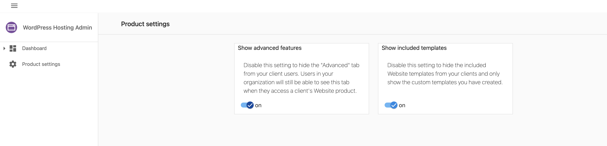
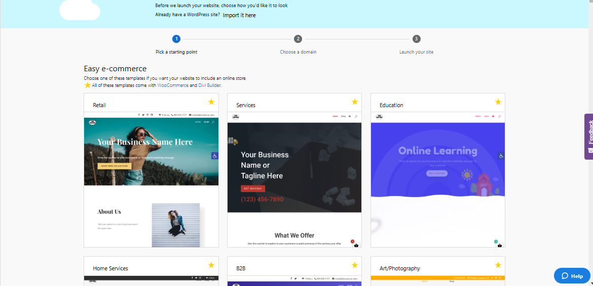
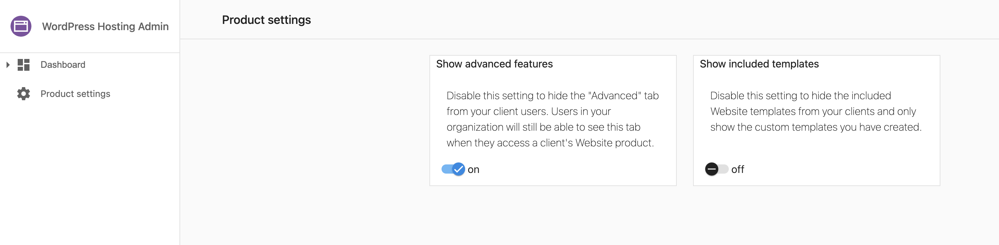
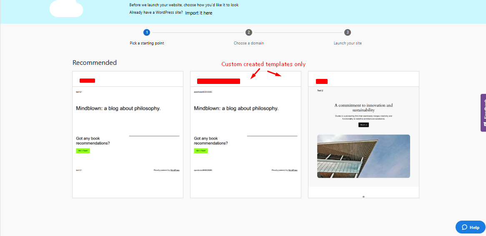

To hide the pre-built templates included in the initial WordPress Hosting setup, follow these simple steps:

1. Go to the **Product Info** tab.
2. Click on **Admin Tools**.
3. Select **Product Settings**.

Within the **Product Settings** section, you'll see an option labeled **Show Included Templates**. Toggle this setting off to hide the default pre-built templates. Disabling this option ensures that these templates will no longer be visible when creating new sites.

**Here's an illustration of the setting in action:**

When the included Website templates are enabled:

When the included Website templates are disabled:

