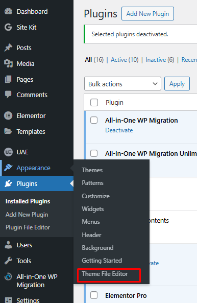
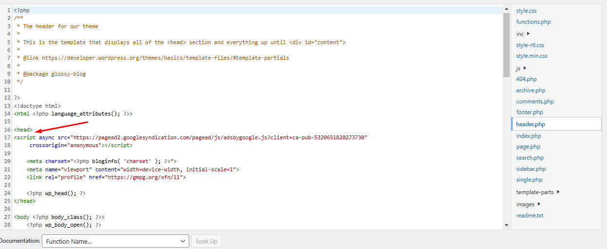

Adding a Google Tag or AdSense code to your WordPress site is a straightforward process. Follow these steps to ensure the code is correctly integrated into your website.

## Step 1: Sign In to Your WordPress Backend

1. Go to your WordPress login page.
2. Enter your credentials and sign in to access the WordPress dashboard.

## Step 2: Access the Theme File Editor

1. In the menu on the left, click **Appearance**.
2. From the dropdown menu, select **Theme File Editor**.

## Step 3: Locate the Header File

- In the right-hand panel of the Theme File Editor, look for the **Theme Header (header.php)** file.
- **Note:** The file name might differ depending on your theme. For example, if you're using the "WordPress Twenty Twenty-One" theme, the header file is named **header.php**.
- Open the header file and confirm that it contains a `<head>` tag.

## Step 4: Add the Google Tag/AdSense Code

1. Copy the Google Tag/AdSense code snippet from your Google account.
2. Paste the code snippet within the `<head>` tag in the header file.
3. Click **Update File** to save your changes.

:::important

**Theme Changes:** If you change your WordPress theme, the **header.php** file might be overwritten. In such cases, you'll need to repeat the above process to re-add the code to the new theme's header file.

**Backup:** Before making changes to your theme files, it's a good idea to back up your website to prevent accidental data loss.

:::

By following these steps, you can successfully integrate Google Tag or AdSense code into your WordPress site.
