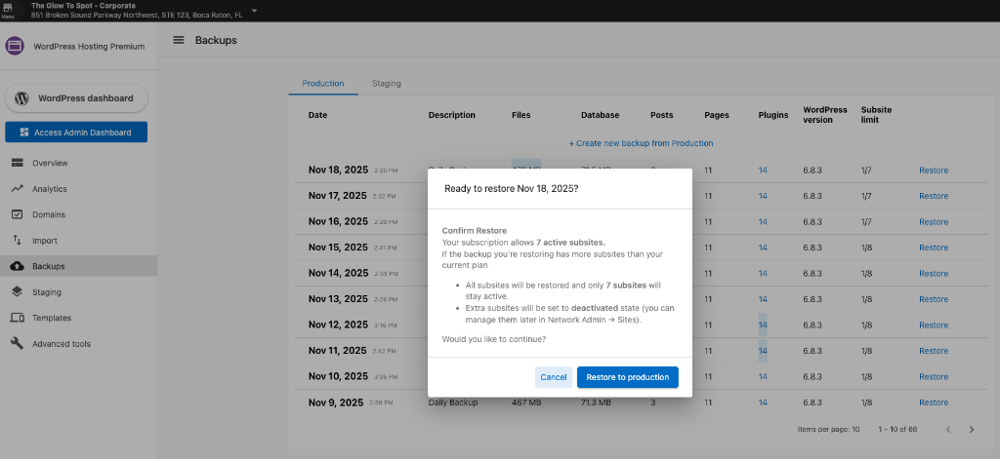

The **Additional Subsites add-on** allows you to expand your **WordPress Hosting Premium** plan beyond the default **1 primary + 5 subsites**. This add-on is useful for agencies, franchises, and multi-location brands that need to manage multiple sites within a single WordPress multisite network.

---

### Default setup

By default, **WordPress Hosting Premium** includes:

* 1 Primary Site + 5 Subsites  
* Shared themes, plugins, and branding  
* Centralized control from one WordPress network dashboard  

---

### How the add-on works

When you add the Additional Subsites Add-on to your WordPress Hosting Premium plan, you can create more subsites than the default limit. Your total subsite capacity will be visible in your WordPress dashboard, and you can manage all subsites from the Network Admin area.

---

### Managing subsites

In **WordPress Dashboard → Network admin → Sites**, you can:

* View all **Active** and **Deactivated** subsites  
* See your total subsite limit and current usage
* Restore deactivated subsites when needed  
* Keep total active subsites within your purchased limit  

---

### Backup and restore

When restoring backups, the system automatically respects your subsite limit:

* If a backup contains more subsites than your current limit, extra subsites are restored in **Deactivated** mode
* The same rule applies when restoring from staging
* You can reactivate deactivated subsites later if you increase your capacity

### FAQs

**Q: How can I add more subsites?**  
Contact your account administrator to add the Additional Subsites Add-on to your WordPress Hosting Premium plan.

