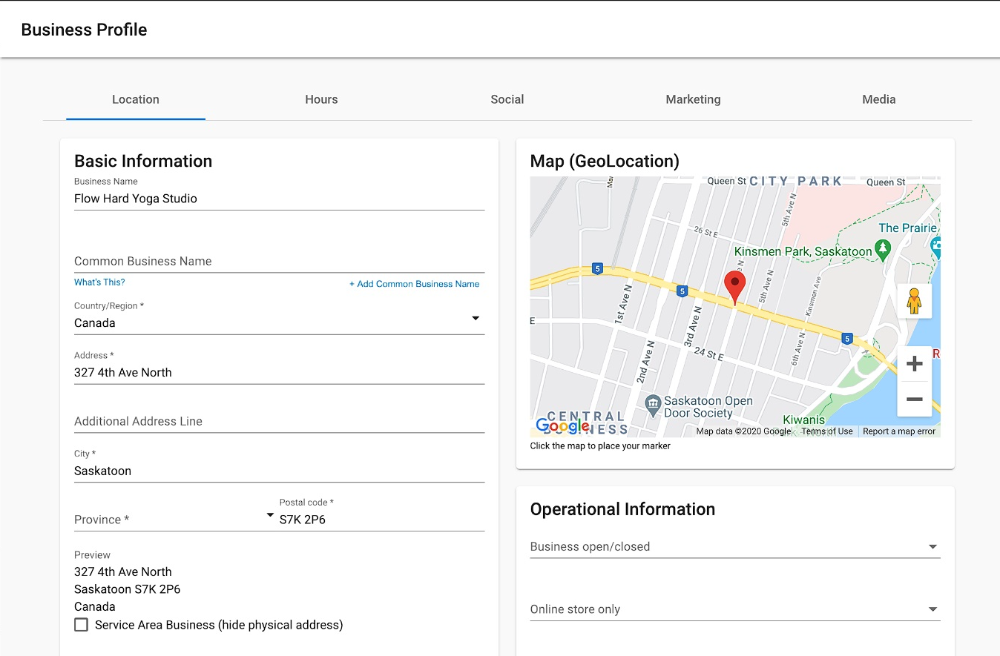
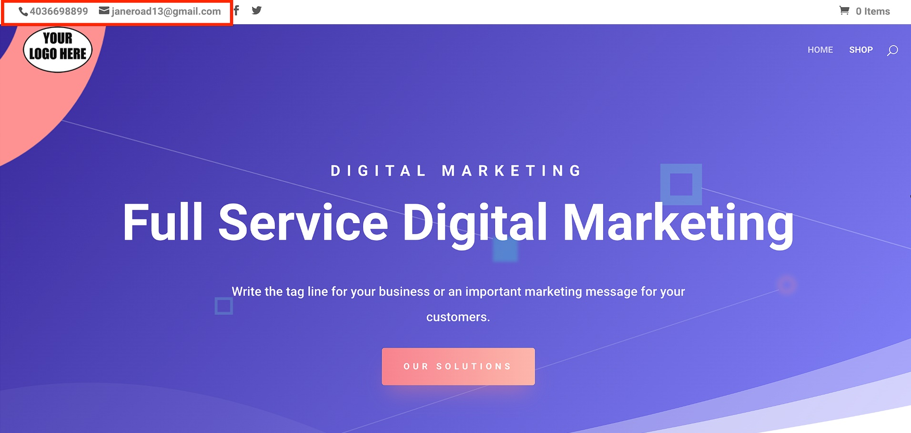
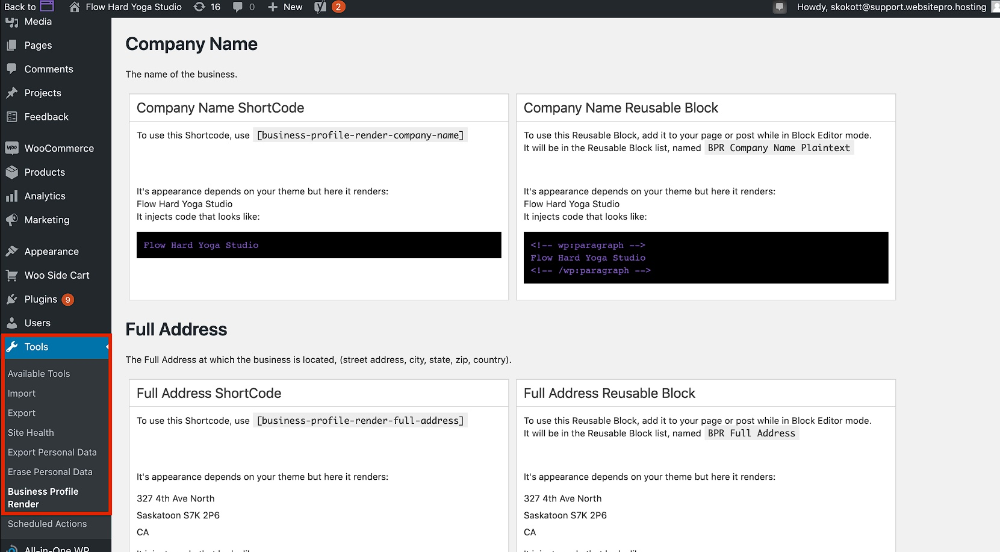

You can easily update business information on your website created with WordPress Hosting Standard or Pro.

If you select one of the 7 eCommerce templates (with Divi Builder and WooCommerce), your contact information will automatically appear on the front end of your site. This information is pulled from the Business Profile in Business App.

Additionally, every templated site comes with an already installed plugin that allows you to input shortcodes or code blocks in various places on your website. These shortcodes are synchronized with the Business Profile and when updated in Business App, will be reflected on the website.

With the sync of information you only have to worry about updating it in one area of the platform. This helps reduce errors and outdated information, ensuring that your customers can easily contact your business when they need to.

It also provides website designers and developers with the flexibility to input shortcodes and blocks to display business information however they'd like.

## How Does the Business Profile Sync Work?

Before creating a new website with WordPress Hosting, ensure all business information is up-to-date and accurate in the Business App Business Profile section.

## Contact Information

Once your business information is correct, you can create your new website. One of the 7 eCommerce templates is required for this sync.

Once the site is created, you should see accurate contact information reflected on the front end of your website.

## Shortcodes

To use shortcodes and have the information from the Business Profile sync with your website, navigate to the WordPress Dashboard.

From here select the **Tools** tab and **Business Profile Render** sub-tab.

This plugin provides ways to automatically sync information on your site from the Company Name to a specific social network link. It includes both shortcodes and reusable blocks.

Specific instructions on how to properly utilize each type of block are located within the tab in WordPress.

## Updating Header Contact Information

To make changes to the contact details displayed in your website's header, follow these steps:

1.  Open your **WordPress Dashboard**.
2.  Navigate to **Appearance** > **Customize**.
3.  Go to **Header and Navigation** > **Header Elements**.
4.  From there, you can update the **phone number** or **email address** as needed.

:::info
Header contact information can also be updated through the Business Profile sync if you're using one of the 7 eCommerce templates. Changes made in Business App will automatically sync to your website header.
:::

## Benefits of Business Profile Sync

*   **Single source of truth** – Update information once in Business App, and it syncs everywhere
*   **Reduced errors** – No need to manually update multiple locations
*   **Time savings** – Changes reflect automatically across your website
*   **Consistency** – Ensures your contact information is always accurate and up-to-date
