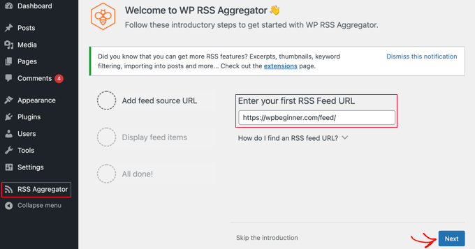

WordPress offers several built-in and plugin-based features to enhance your website's content and functionality. This guide covers three common content features: FAQ sections, password-protected pages, and RSS feeds.

## Create an FAQ Section

An **FAQ (Frequently Asked Questions) section** serves as a valuable resource for visitors by addressing common questions in a structured and easily accessible manner. It enhances **user experience** by providing quick answers, reducing the need for customer support interactions. A well-organized FAQ section improves **website navigation, builds trust**, and can even boost **SEO rankings** by incorporating relevant keywords.

### Method 1: Using a Plugin (Easy & Recommended)

**Step 1: Install an FAQ Plugin**

1.  Log in to your **WordPress Dashboard**.
2.  Go to **Plugins** > **Add New**.
3.  Search for **"Accordion FAQ"** or **"Easy Accordion"**.
4.  Click **Install Now**, then **Activate** the plugin.

**Step 2: Create an FAQ Section**

1.  Navigate to **FAQ** > **Add New FAQ** in your dashboard.
2.  Enter a title (e.g., "Frequently Asked Questions").
3.  Add each question as a separate entry and write the corresponding answer.

**Step 3: Customize the FAQ Appearance**

1.  Some plugins allow you to change styles, colors, and layouts.
2.  Go to **Settings** in the plugin and adjust the design as needed.

**Step 4: Display the FAQ Section**

1.  Copy the **shortcode** generated by the plugin.
2.  Paste it into a page, post, or widget where you want the FAQ to appear.
3.  Click **Publish**, and your FAQ section is live!

### Method 2: Using Built-in Gutenberg Blocks

**Steps:**

1.  **Go to Your Page/Post** – Open the WordPress Dashboard and navigate to **Pages** > **Add New** (or edit an existing page).
2.  **Add a Heading Block** – Type "FAQs" as the section title.
3.  **Use the "Paragraph" or "List" Blocks** – Manually enter the **questions** in **bold** and add answers below.
4.  **Format for Clarity** – Use the **"List" block** or separate questions using **Heading (H3 or H4) blocks**.
5.  **Publish or Update** – Click **Publish/Update** to save changes.

### Which Method Should You Choose?

*   **Use a plugin** if you want a **professional-looking** FAQ section with animations and styling.
*   **Use the manual method** if you prefer a lightweight solution without extra plugins.

## Password Protect a Page

Password-protecting a page enhances **security and privacy** by restricting access to sensitive content. It ensures that only authorized users can view confidential information, such as **internal documents, client portals, or exclusive content**. This helps prevent **unauthorized access, data breaches, and misuse** of critical information.

### How to Password Protect a Page

**Step 1: Log into the WordPress Dashboard**

**Step 2: Create a New Page or Edit an Existing One**

*   To create a new page, navigate to **Pages** > **Add New**.
*   If you want to password protect an existing page, go to **Pages** > **All Pages** and select the page you want to edit.

**Step 3: Set the Visibility to Password Protected**

*   On the right-hand side of the page editor, find the **Publish** box.
*   Click the **Edit** link next to the **Visibility** option.
*   Select **Password Protected** and then enter the password you'd like to use.

**Step 4: Update/Publish the Page**

*   After you've entered the password, click **OK** and then click **Publish** if it's a new page or **Update** if you are editing an existing page.

**Step 5: Share the Password**

*   Now, only users who have the password will be able to view the page. You can share the password with those who need access.

### Important Notes

*   Only people who know the password can access the page.
*   Password-protected pages are not visible in search engines unless the user has the password.
*   This feature is built into WordPress and does not require plugins.

## Display RSS Feeds

RSS (Really Simple Syndication) makes it easy to automatically pull content from other sites and display it on yours. This can boost user engagement, grow website traffic, and increase page views.

### Method 1: Using a Widget

To display an RSS feed using WordPress's built-in widget:

1. Navigate to **Appearance** > **Widgets** in the WordPress dashboard.
2. Click the **Add Block** (+) button at the top of the screen.
3. Search for **RSS** widget and add it to your desired widget area.
4. Enter the RSS feed URL you want to display.
5. Configure the number of items to show and other display options.

### Method 2: Using a Plugin

For more advanced RSS feed functionality, you can use a plugin like **WP RSS Aggregator**.

**Step 1: Install the Plugin**

1. Go to **Plugins** > **Add New**.
2. Search for **"WP RSS Aggregator"**.
3. Click **Install Now**, then **Activate** the plugin.

**Step 2: Add Your First RSS Feed**

1. Upon activation, you will be asked to add your first RSS feed URL.
2. Enter the feed URL (e.g., `https://example.com/feed/`).
3. Click the **Next** button.

**Step 3: Display the Feed**

1. On the next page, you'll see the latest feed items from the RSS feed you linked.
2. Click the **Create Draft Page** button to add the feed to a new page draft, or use the **shortcode** on the right to add them to any post, page, or widget area.

### Which Method Should You Choose?

*   **Use the widget** if you want a simple RSS feed display in your sidebar or footer.
*   **Use a plugin** if you need more control over feed display, multiple feeds, or advanced customization options.

## Summary

These three content features serve different purposes:

*   **FAQ Sections** – Help visitors find answers quickly and reduce support requests
*   **Password Protection** – Secure sensitive content and control access
*   **RSS Feeds** – Display external content and keep your site updated with fresh information

All three features can enhance your WordPress site's functionality and user experience. Choose the methods that best fit your needs and technical comfort level.
