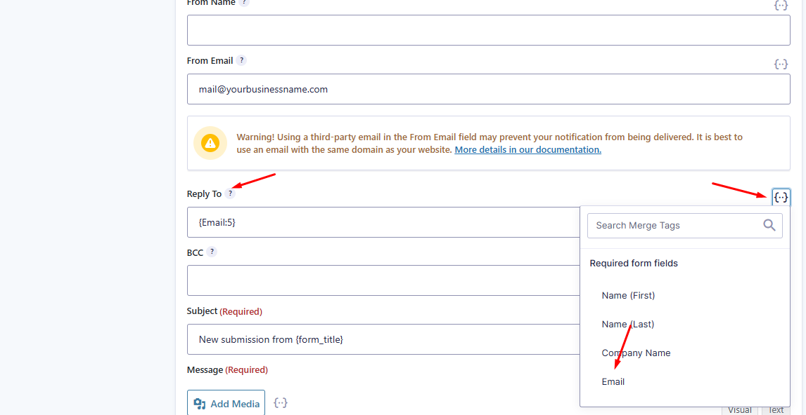

Gravity Forms is a powerful tool for capturing leads, but to ensure those leads sync correctly with your CRM, certain configurations must be set up properly. This article walks you through the **essential steps** to ensure contact form submissions are parsed and recorded accurately.

## Ensure Proper Form Field Mapping

When using Gravity Forms with CRM integration (like WordPress Hosting CRM), form fields must be set to dynamically pass data. This includes:

*   Mapping fields like **Name**, **Email**, **Phone**, etc., using the correct **merge tags**.
*   Using dynamic shortcodes in your form-to-CRM configuration to ensure that field data is parsed and passed along correctly.

:::warning
If fields are not mapped correctly, contact entries may not appear in the CRM.
:::

## Configure Email Notifications Correctly

To prevent emails from being flagged as spam or failing delivery, you must configure both the "From Email" and the "Reply-To Email" correctly.

### From Email

Set the **From Email** address to one that matches your website's domain.

**Example:**  
If your website is `example.com`, use:

    admin@example.com

**Avoid:**  
Using emails like `yourname@gmail.com` or `contact@yahoo.com`, as these can fail DMARC/DNS checks and get flagged or blocked.

### Reply-To Email

To ensure the **user's email** is captured and used for CRM contact creation:

1. Go to **Form** > **Settings** > **Notifications**.
2. In the **Reply-To** field, click on the **merge tag selector** `{..}`.
3. Choose the form field that collects the user's **Email**.

This ensures that the CRM picks up the correct contact email from the form submission.

## Troubleshooting Form Sync Issues

If contact sync isn't working, verify the following:

*   The form fields haven't changed recently (which could break existing mappings).
*   The correct merge tags are still in place.
*   The email notification settings match what's outlined above.

:::info
This issue has been confirmed on AGID instances `AG-NFJKB35TT3` and `AG-FSJ3Z47NXP` due to recent field changes.
:::

## Updating Other Sites

If similar syncing issues are occurring on other sites:

*   Check the **email notification settings**.
*   Confirm field mapping and dynamic tag usage.
*   Contact Support for assistance with applying the necessary fixes.

## Summary Checklist

| Task | Status |
|------|--------|
| Use domain-matching **From Email** | ✅ |
| Set **Reply-To** to dynamic Email field | ✅ |
| Use correct form merge tags | ✅ |
| Validate fields haven't changed recently | ✅ |
| Test form submission and CRM contact creation | ✅ |
