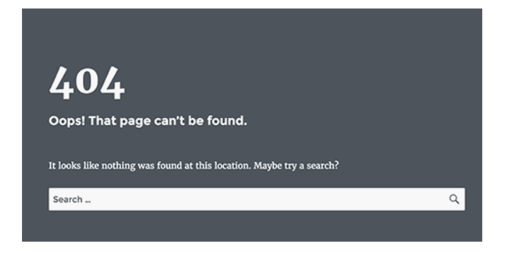
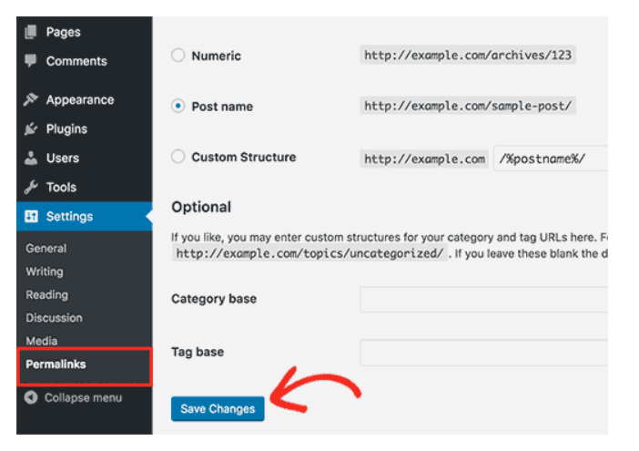

Encountering a **"Page Not Found" (404 error)** can frustrate users and harm your website's credibility, leading visitors to abandon your site. Broken links also negatively impact **SEO and user experience**.

If you're encountering 404 errors on your WordPress posts or pages, there are several steps you can take to resolve the issue. You can also customize your 404 page to provide a better experience for visitors who land on broken or non-existent pages.

A **301 redirect** is a permanent redirection that automatically sends users to a new URL when the original page has moved or been deleted. This ensures that visitors and search engines are directed to the correct content instead of encountering errors. 301 redirects are particularly useful for fixing 404 errors when pages have been moved or URLs have changed.

## Troubleshooting 404 Errors

If you're experiencing 404 errors on pages or posts that should exist, try these troubleshooting steps:

### 1. Re-Save Permalink Settings

Often, simply reconfiguring your permalink structure can fix the problem.

*   In your WordPress Dashboard, go to **Settings** > **Permalinks**.
    
*   Without making any changes, click **Save Changes**.
    

This action refreshes your permalink settings and flushes the rewrite rules, which commonly resolves 404 errors.

### 2. Check for Plugin Conflicts

Plugins can sometimes interfere with your site's URLs. To identify the culprit:

*   Temporarily **disable all plugins**.
    
*   Then, **reactivate them one by one**, checking the site after each activation to pinpoint the issue.
    

### 3. Clear Your Website Cache

A stale cache can cause persistent errors. Make sure to **flush your cache** using your caching plugin or hosting dashboard.

### 4. Review Error Logs

Access your **site logs** to uncover additional details. They can help identify whether a plugin, theme, or server configuration is behind the issue.

## Creating a Custom 404 Page

A custom **404 error page** improves user experience by guiding visitors who land on a broken or non-existent page. Instead of showing a generic error, you can redirect them to helpful content, search options, or your homepage.

### Method 1: Using a Plugin (Easy & Recommended)

**Step 1: Install a 404 Page Plugin**

1.  Log in to your **WordPress Dashboard**.
2.  Navigate to **Plugins → Add New**.
3.  Search for **"404page – your smart custom 404 error page"**.
4.  Click **Install Now**, then **Activate** the plugin.

**Step 2: Create a Custom 404 Page**

1.  Go to **Pages → Add New**.
2.  Name the page **"404 - Page Not Found"**.
3.  Add a message like:
    
    > "Oops! The page you're looking for doesn't exist. Try searching or go back to the homepage."
    
4.  Add a **search bar**, **homepage link**, or **popular posts** section.
5.  Click **Publish**.

**Step 3: Set It as the Default 404 Page**

1.  Go to **Appearance → 404 Error Page** (from the plugin settings).
2.  Select the page you just created.
3.  Click **Save Changes**.

### Method 2: Manually Editing the 404.php File (For Developers)

**Step 1: Access Your Theme Files**

1.  Go to **Appearance → Theme File Editor**.
2.  Select **404.php** from the right panel.

**Step 2: Edit the File**

Replace the existing code with:

`<?php get_header(); ?> 
 <h1>Oops! Page Not Found</h1> 
Sorry, the page you are looking for doesn't exist.
 <a href="<?php echo home_url(); ?>">Return to Homepage</a> 
 <?php get_footer(); ?>`

**Step 3: Save and Test**

*   Click **Update File** and visit a non-existent URL (e.g., `yourwebsite.com/randompage`).
*   Your custom 404 page should now appear!

### Which Method Should You Choose?

*   **Use a plugin** if you want a quick and easy way to set up a custom 404 page.
*   **Manually edit the 404.php file** if you prefer a lightweight solution without extra plugins.

## Creating 301 Redirects to Fix 404 Errors

A **301 redirect** is a permanent redirection that automatically sends users to a new URL when the original page has moved or been deleted. This ensures that visitors and search engines are directed to the correct content instead of encountering errors. 301 redirects help preserve **SEO value**, improve **user experience**, and ensure a seamless browsing experience for visitors.

You can create 301 redirects in WordPress using several methods:

1. Creating 301 Redirects With AIOSEO Plugin
2. Creating 301 Redirects With Redirection Plugin
3. Creating 301 Redirects With Simple 301 Redirects Plugin
4. Redirecting Existing Pages With Page Links To Plugin

### Method 1: Creating 301 Redirects With AIOSEO Plugin

The simplest way to manage and create 301 redirects is with the **All in One SEO** (AIOSEO) WordPress plugin. AIOSEO offers a powerful redirection manager addon that makes it easy to find broken links on your website and set up 301 redirections to fix them.

:::warning
You need **AIOSEO Pro** to use the redirection manager. The free version of AIOSEO doesn't include 301 redirects.
:::

First, install and configure the AIOSEO Pro plugin on your website.

Once the plugin is active, go to **All in One SEO** > **Redirects** in your WordPress dashboard and click the **Activate Redirects** button.

Next, click the **Settings** tab and select **PHP** as the Redirect Method.

This is the simplest method for creating redirects and doesn't require any server-side configuration.

AIOSEO also lets you select the Web Server redirect method. However, it requires configuring Apache or NGINX on your web server. This requires technical knowledge and is not recommended for beginners.

**Creating 301 Redirects**

Now you're ready to create 301 redirections. To get started, go to the **Redirect** tab.

1. Enter the link you'd like to redirect in the **Source URL** field.
2. Enter the new destination for the link in the **Target URL** field.
3. Make sure the **Redirect Type** is set to **301 Moved Permanently**.
4. Click the **Add Redirect** button.

If you want to redirect multiple URLs to a new location, click the **Add URL** button under the Source URLs field.

You can scroll down to view the logs of the redirects you have created. It shows the number of people who visited the redirected link under the **Hits** column and a toggle option to enable or disable individual 301 redirects.

**Adding 301 Redirects to Fix 404 Errors**

AIOSEO can also help you track 404 error pages and fix them.

To turn this option on:

1. Scroll down to the **Redirect Logs** section in the Settings tab.
2. Enable the options for **404 Logs** and **Redirect Logs**.
3. Select the time period to keep the logs. We recommend keeping them for a maximum of one month for smooth and fast server performance.
4. Click the **Save Changes** button.

You should now see a new **404 Logs** tab appear in the Redirects section. This is where AIOSEO will track and show your broken links and allow you to set up redirections. You will also see the number of visits to the link under **Hits** and the last accessed date and time.

:::info
You won't find any data when you first enable the 404 logs. The plugin only starts to record 404 error pages after the setting is enabled.
:::

Next, click the **Add Redirect** link next to the 404 error URL you'd like to redirect. This is not the button at the bottom.

You will now see options to enter a Target URL and select the Redirect Type from the dropdown menu.

Enter your new URL and choose **301 Moved Permanently** as your redirection type. Click the **Add Redirect** button.

AIOSEO will now create a 301 redirect for your broken link. To see if the redirection is working properly, visit the old URL to check if you're taken to the new target destination.

**Adding 301 Redirects Directly From a Post or Page**

AIOSEO also lets you redirect a published post or page while you are editing it.

1. Scroll to the bottom of the page in the WordPress editor.
2. Find the **AIOSEO Settings** section and click on the **Redirects** tab.

The source URL has been filled in for you. Enter the new URL in the **Target URL** field, and select **301 Moved Permanently** from the Redirect Type drop-down menu.

If you change the permalink of a post while editing, AIOSEO will offer to redirect the old URL to the new one.

Click the **Add Redirect** button to complete the process.

**Redirecting Full Websites**

If you move your website to a new domain name, your visitors may encounter broken links, and your site SEO may suffer.

You can use AIOSEO to move your entire website to a new location without losing traffic or search engine rankings. This is a full site 301 redirect.

### Method 2: Creating 301 Redirects With Redirection Plugin

Another way to add and manage redirects in WordPress is with the **Redirection** plugin.

First, install and activate the plugin.

:::info
While setting up 301 redirects using a WordPress plugin is easy, it has some minor performance setbacks. Depending on your WordPress hosting provider, your redirects may be a few microseconds slower than other methods.
:::

Once activated, visit **Tools** > **Redirection** and click the **Start Setup** button.

Next, select options to monitor permalink changes in WordPress and keep a log of all your redirects and 404 errors. Enable these options and click the **Continue Setup** button.

The plugin will now automatically test the REST API. When the status comes back as Good, click the **Finish Setup** button.

The redirection plugin will perform a few more tasks to complete its setup. When the progress bar reaches 100%, click the **Continue** button and then the **Ready to Begin** button.

The plugin is now ready for you to create your 301 redirects. To get started, navigate to the **Tools** > **Redirection** section of your WordPress panel. Look at the **Add new redirection** section at the bottom of the screen.

You will see the basic settings to add a redirection. If you click the gear icon, you'll see more options to choose your redirection type.

1. Enter the Source URL of your old page.
2. Add the Target URL you want to redirect to.
3. Make sure the HTTP code option is set to **301 – Moved Permanently**.

Once you have entered all the details, click the **Add Redirect** button.

### Method 3: Creating 301 Redirects With Simple 301 Redirects Plugin

One of the easiest ways to create 301 redirects is with the **Simple 301 Redirects** plugin. As the name suggests, it makes 301 redirects simple.

To start, install and activate the plugin on your website.

After that, visit **Settings** > **301 Redirects**. Here you can enter the old URL in the **Request** field and your target URL in the **Destination** field.

Once you've done that, click the **Add New** button to create the 301 redirect. Simple 301 Redirects will begin working immediately.

### Method 4: Redirecting Existing Pages With Page Links To Plugin

Sometimes you may want to keep a post in your site's feed or a page listed a certain way on your site but have the content hosted elsewhere. This is where the **Page Links To** plugin comes in handy.

Once you install and activate the plugin, it adds a meta box to your WordPress editor. Here you can enter the address of the new location where you want to send your users.

When you press **Update** or **Publish**, WordPress will treat the post or page as normal, but when someone visits it, they will instead be redirected to the custom URL you chose.

For example, you might have a blog where you occasionally create downloadable content, but you want users in your online store site to see certain posts as products. You can use this plugin to do that without risking duplicate content penalties from Google or splitting your user base.
