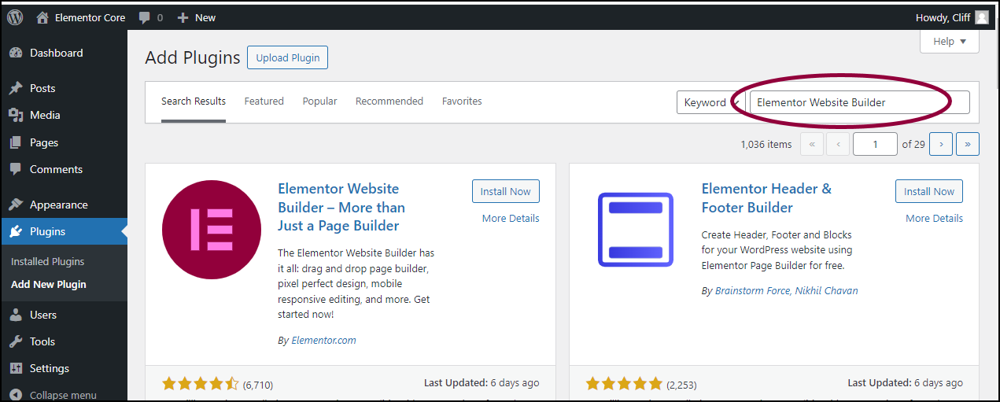
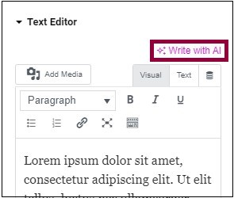
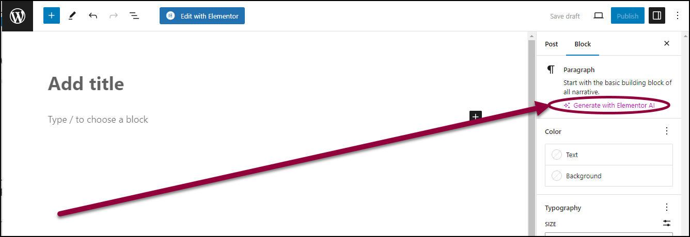
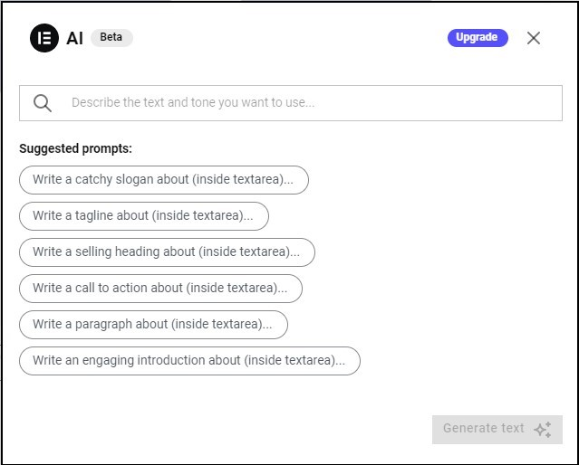
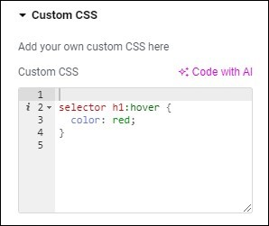

Elementor AI is a powerful tool integrated into the Elementor page builder, enabling users to generate text, code using artificial intelligence. This guide will walk you through how to use Elementor AI effectively within your WordPress dashboard.

### Step 1: Ensure You Have Elementor Installed

Before using Elementor AI, make sure that Elementor is installed and activated on your WordPress site. If you haven't installed it yet:

1.  Navigate to **Plugins > Add New** in your WordPress dashboard.
    
2.  Search for **Elementor**.
    
3.  Click **Install Now** and then **Activate**.
    

### Step 2: Enable Elementor AI

Elementor AI is available within the Elementor editor. To enable it:

1.  Open any page or post using Elementor.
    
2.  Click on any **Text Editor** widget.
    
3.  In the text editing panel, locate the **AI icon**.
    
4.  If prompted, activate Elementor AI by following the on-screen instructions.
    

### **Step 3: Generate AI-Powered Content**

Once Elementor AI is enabled, you can start using it to create content effortlessly:

**Generating Text Content**

1.  Click on the **AI icon** in the text editor.
    
2.  Enter a prompt, such as "Generate a product description for a fitness tracker."
    
3.  Elementor AI will provide a text output based on your input.
    
4.  Click **Insert** to add the content to your page.
    

**Editing and Refining Content**

Elementor AI allows you to refine generated content by providing suggestions. You can:

*   Improve grammar and readability.
    
*   Rewrite content in a different tone.
    
*   Translate text into multiple languages.
    

### Step 4: Using AI for Code Generation

Elementor AI can also generate HTML, CSS, and JavaScript code. To use this feature:

1.  Open the **Custom HTML or CSS editor** in an Elementor widget.
    
2.  Click the **AI icon**.
    
3.  Describe the code you need (e.g., "Create a CSS animation for a button hover effect.")
    
4.  Insert and tweak the generated code as needed.
    

__

### Step 5: Save and Publish Your Work

Once you’re satisfied with the content:

1.  Click **Update** to save changes.
    
2.  Click **Preview** to see how it looks on your site.
    
3.  If everything looks good, click **Publish**.