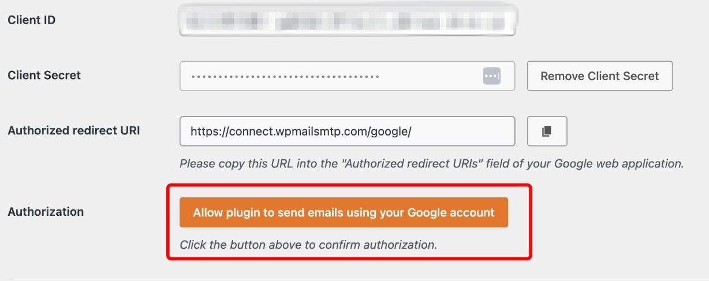

This article walks you through setting up Gmail SMTP for your WordPress website using the **WP Mail SMTP** plugin and **Google Cloud Console**. This configuration allows you to send emails securely via Gmail instead of relying on your hosting server.

### Prerequisites

*   A Gmail or Google Workspace account
*   Admin access to your WordPress site
*   Access to Google Cloud Console

## Step 1: Create a Project in Google Cloud

1.  Go to [Google Cloud Console](https://console.cloud.google.com/).
2.  Log in with your Google account.
3.  Click **Create Project**, name it (e.g., **Gmail SMTP**), and click **Create**.

## Step 2: Enable the Gmail API

1.  In the Google Cloud Console, navigate to **APIs & Services** > **Library**.
2.  Search for **Gmail API**, click it, and then click **Enable**.
3.  Click **Create Credentials** to begin setting up your OAuth access.

4. Click **Create Credentials** to Generate Client ID.

## Step 3: Set up OAuth consent screen & credentials

1.  Go to **Credentials** > **OAuth consent screen**.
2.  Choose **User Type** as **External**, then click **Create**.

3. Fill in:

    *   **App name**: SMTP
    *   **User support email**: Your Gmail address
    *   **Developer contact email**: Your Gmail address

4. Skip scopes and click **Save and Continue**.

5. Under **Credentials**, click **Create Credentials** > **OAuth Client ID**.

    *   **Application type**: Web application
    *   **Name**: Web Client 1 (or your choice)
    *   **Authorized JavaScript origins**: `https://yourdomain.com`
    *   **Authorized redirect URI**: `https://connect.wpmailsmtp.com/google`

6. Click **Create** and copy both the **Client ID** and **Client Secret**. You'll need these in Step 5.

## Step 4: Publish the App

1.  Go back to **OAuth Consent Screen**.
2.  Click **Publish App** to switch from testing to production mode.

:::info
Testing mode limits usage to 100 users. Publishing removes this limit.
:::

## Step 5: Configure WP Mail SMTP plugin

### Install the Plugin

1.  Go to your WordPress dashboard.
2.  Navigate to **Plugins** > **Add New**.
3.  Search for **WP Mail SMTP**, install, and activate it.

### Configure the plugin

1.  Go to **WP Mail SMTP** > **Settings**.
2.  Fill in:

    *   **From Email**: Your Gmail address
    *   **Force From Email**: Enabled
    *   **From Name**: e.g., "Test Email"
    *   **Mailer**: Google

3.  Paste your **Client ID** and **Client Secret** from Google Cloud.
4.  Save the settings.

### Authorize Gmail

1.  Click **Allow plugin to send emails using Google**.
2.  Log in to your Google account and grant permissions.
3.  If prompted with a warning, click **Advanced** > **Go to WP Mail SMTP** and continue.
4.  You'll be redirected back to your site once authorization is complete.

## Step 6: Disable WordPress Hosting Pro Mail System

1.  In your WordPress dashboard, go to **Settings** > **General**.
2.  Disable the **WordPress Hosting Pro Mail System** to allow WP Mail SMTP to take over.

## Step 7: Test the configuration

1.  Install the **WP Mail SMTP Email Test** plugin (if not included).
2.  Go to **WP Mail SMTP** > **Tools** > **Email Test**.
3.  Send a test email.
4.  Look for the message: "Email has been sent!"
5.  Check your inbox to confirm delivery.

You've now configured Gmail SMTP on your WordPress website. This setup improves deliverability and ensures your site uses Gmail's secure and reliable email service.
