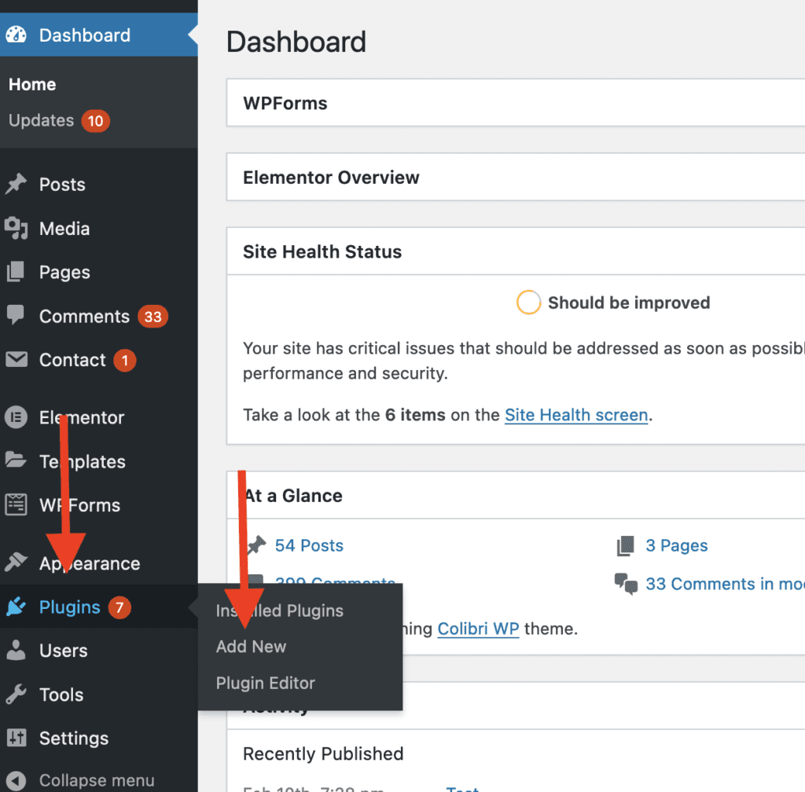
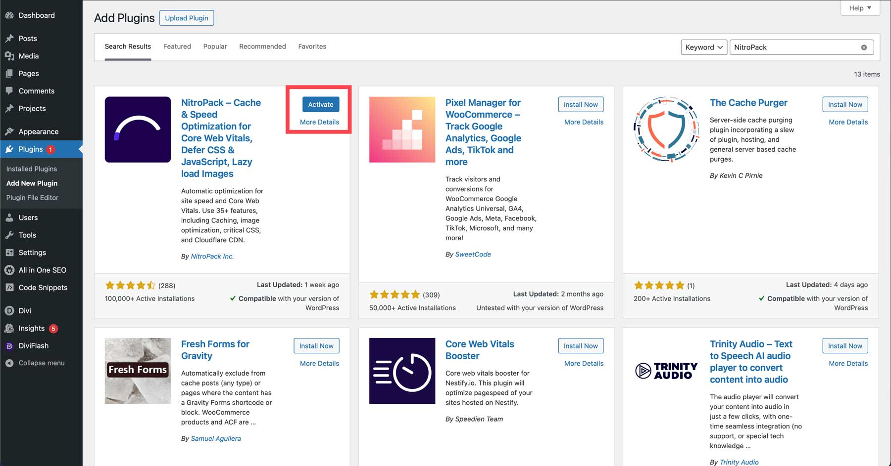

Here is the step-by-step guide on how to install NitroPack on WordPress:

1.  Login to your **WordPress admin** dashboard and go to **Plugins > Add new.  
    **
2.  Search “**NitroPack by NitroPack LLC”** then click **Install Now** button.  
    
    
    
3.  Go to **Plugins > Installed Plugins.**
4.  Click **Activate** link on NitroPack.
5.  Your NitroPack installation is complete!

### How to Connect NitroPack to Your WordPress

After successfully installing NitroPack then you need to connect it to your WordPress. Here is the step-by-step guide on how to connect NitroPack to Your WordPress:

1.  Create an account at [NitroPack](https://nitropack.io/) if you don’t have one yet.
2.  Login to your account and go to the **“Connect Your Website”** menu on the left.
3.  Open your WordPress admin dashboard and go to **Plugins > Installed Plugins > NitroPack > Settings.**
4.  Click **“Connect to NitroPack”  
    **
5.  Now, you have connected your WordPress to NitroPack!

### NitroPack Setup Guide

After your WordPress is connected with NitroPack, you can now start configuring which features to use in the NitroPack plugin. Here is the step-by-step guide on how to setup NitroPack on your site:

First of all, go to the settings tabs of NitroPack so you can see the **NitroPack dashboard**.

### NitroPack Dashboard

There are 4 tabs in NitroPack Dashboard:

**Optimized Pages**

The tab on the top left is the **Optimized Pages** where you can see how many and what pages have been optimized by NitroPack.

**Plan**

The tab on the top right shows what **Plan** you get for NitroPack. 

**Settings**

The tab on the bottom left is the **Setting** to enable features like cache warmup and HTML compression. Besides that, you can directly disconnect the NitroPack plugin from your WordPress site.

**Configuration**

The tab on the bottom right is the **Configurations** where you can choose between 5 options for your NitroPack optimization:

1.  **Standard**: A predefined configuration that enables basic optimization without much regard for a high score.
2.  **Medium**: Well-balanced optimization that is suitable for most cases.
3.  **Strong**: The optimization includes advanced features like automatic image lazy loading and font definition modification. 
4.  **Ludicrous**: A predefined configuration that enables all optimizations to achieve the highest possible score.
5.  **Manual**: Customize your own optimization settings. If you activate this option, you get to see the **Advanced settings** for configuration custom.