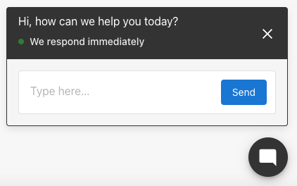
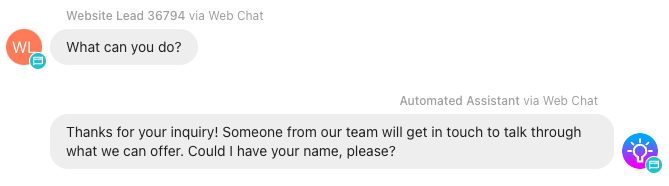
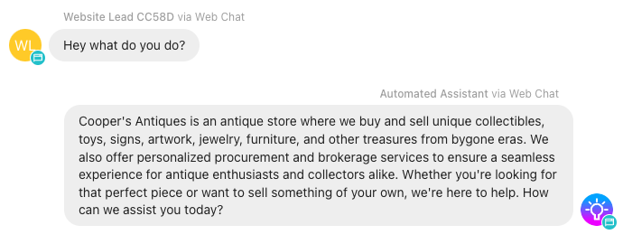
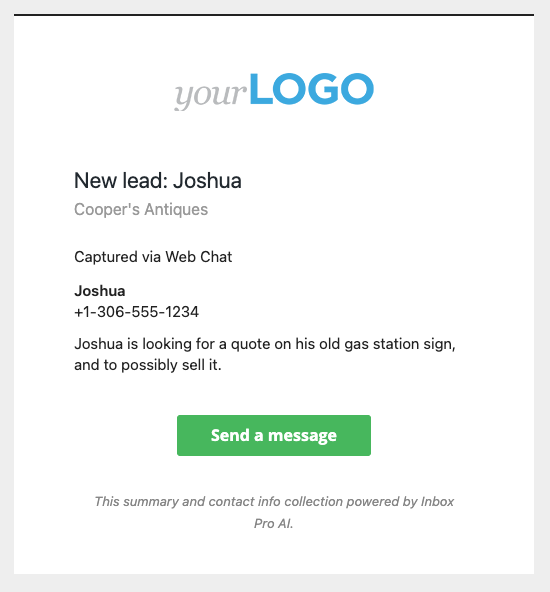
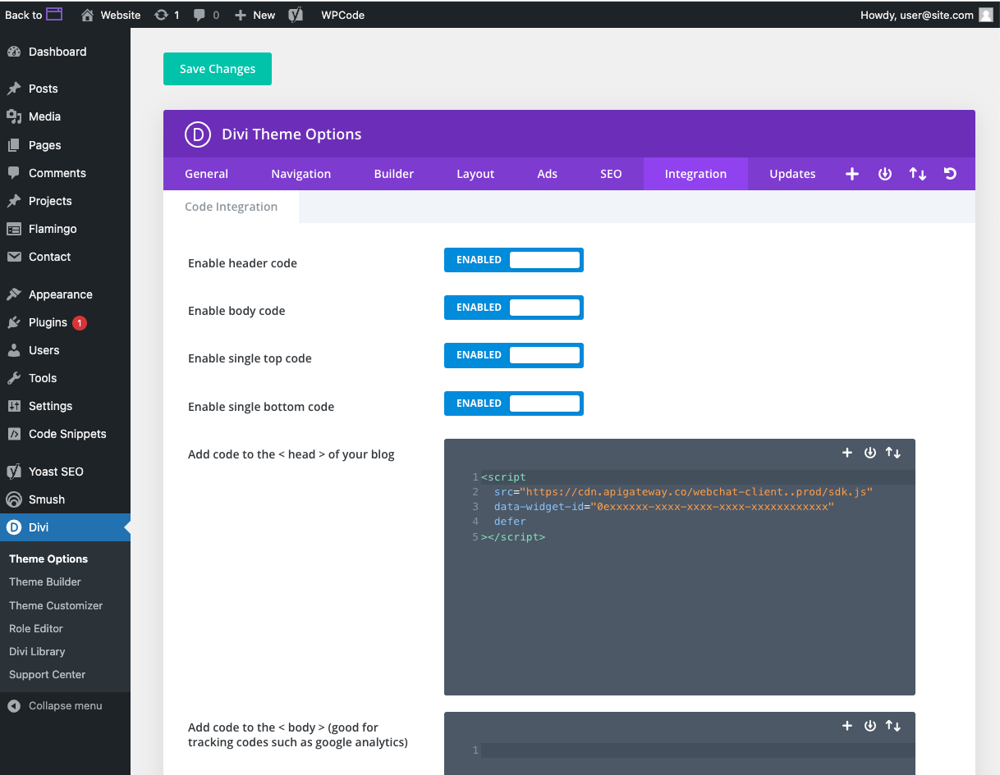
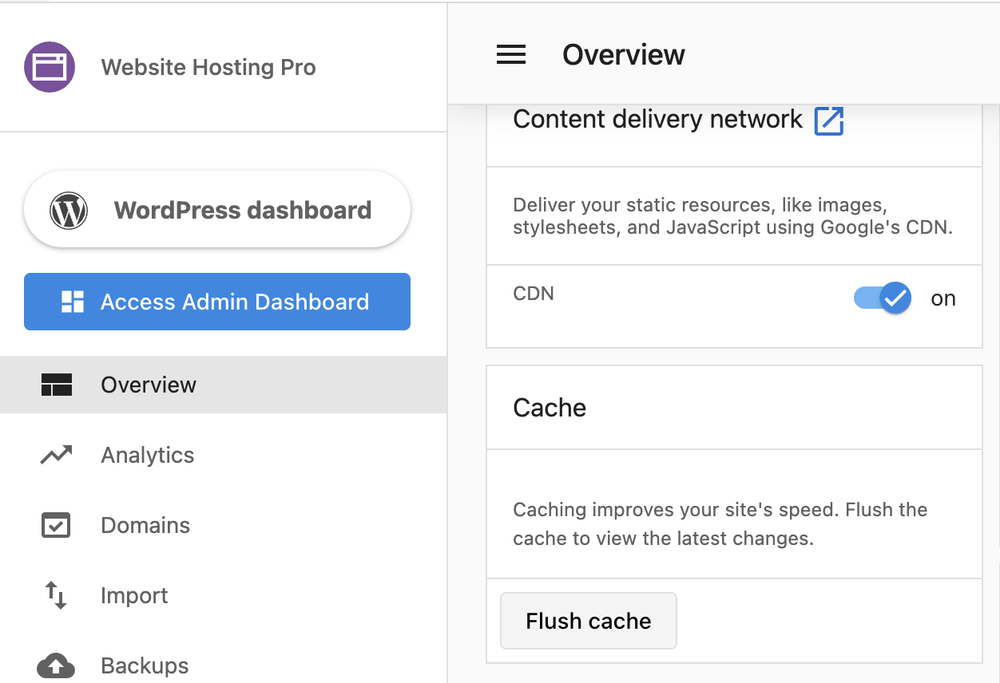
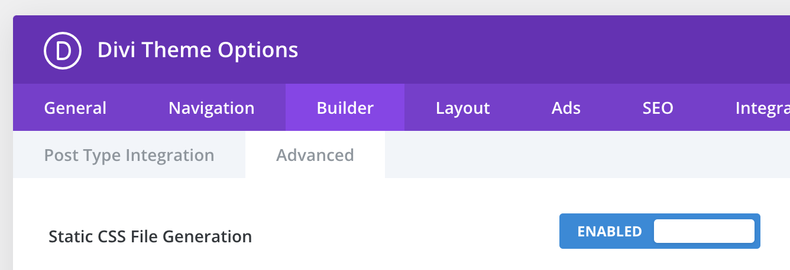
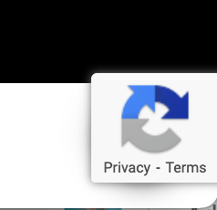

# Inbox Pro web chat widget installation and troubleshooting
With AI-assisted web chat, businesses can capture more leads from their website.  An AI assistant will chat live with a website visitor, capture their contact information so a business can follow up later via SMS or email, and turn them into a customer. AI-assisted web chat is a feature of Inbox Pro product. Contact your sales rep today to have the widget activated for your website.

Once installed on a business website, the chat widget will appear to website visitors and encourage them to chat, with the goal of capturing a lead for the business.



Conversations will appear in Inbox where a business person can respond to the lead via SMS, and try to turn them into a customer. (SMS available for US and Canada-based businesses)

AI Assistant with no knowledge about the business
-------------------------------------------------

By default, the AI assistant "just works" with the goal of capturing lead contact info, even without any context or knowledge about the business website it has been installed on – it will engage with a website visitor, recording their question and needs, attempt to get their name and contact info (mobile number, with a fallback to email address) and alert the business that they have a new lead.



AI Assistant with business profile knowledge
--------------------------------------------

The AI assistant can be given basic knowledge about a business from your business profile, to be able to answer questions about what the business does, where it's located, its hours, and how to contact them. This can be enabled or disabled.

These fields are shared with the AI from the account's business profile:

*   Business Name
*   Address and/or Service Areas
*   Website
*   Phone Number
*   Categories
*   Hours
*   Services Offered
*   Short Description
*   Long Description
*   Social Media URLs



How am I notified about a new lead?
-----------------------------------

When your AI assistant is successful in capturing a name and contact info, a few things will happen automatically:

1.  A new contact is added to the CRM, with the captured info: First name, last name, phone number, and email address.
    1.  If a user updates their contact info in the AI-assisted web chat (like for example, if they make a mistake), the latest contact info will be updated on the contact automatically.
2.  A "New lead" email notification is sent to users of the account, that have the notification enabled (this notification is enabled by default for Business App users)



What can I customize?
---------------------

*   **Color**: It's possible to customize the color of the chat widget, to match the website it's installed on.
*   **AI knowledge**: It's also possible to give your web chat AI assistant additional context and knowledge about the business it's representing, be enabling "Allow access to your business profile" in Menu > Settings > Inbox Settings > Web Chat Configuration

How to install the Inbox Pro Web Chat widget on a website
---------------------------------------------------------

To install your web chat widget on your website: After Inbox Pro is activated, go to Settings > Inbox Settings > Web Chat Configuration – and set up your web chat widget. After configuring, you can copy and paste your install code into the <head> element of your website, typically just before the closing </head> tag. 

### OPTION 1: To install on a WordPress site using a plugin

1.  Download the web chat widget installation plugin from Settings > Inbox Settings > Web Chat Configuration > Installation
2.  Navigate to your WordPress backend admin, usually at _your-website.com_/wp-admin
3.  Go to Plugins > Add new plugin
4.  Upload the zip file containing the plugin you just downloaded.
5.  Activate the plugin. Your web chat widget should now appear on every page of your website.

### OPTION 2: To install using widget code on a WordPress site with Divi theme:

1.  Copy your web chat installation code into your clipboard.
2.  Navigate to your WordPress backend admin, usually at _your-website.com_/wp-admin
3.  Go to Divi > Theme Options > Integrations
4.  Paste the code into the section titled "Add code to the < head > of your blog."
5.  Save changes. Your web chat widget should now be live on your website, on all pages.



Troubleshooting common issues:
------------------------------

### Issue: I cannot type the 'space' key, or a certain character into the chat widget

Some plugins can interfere with the ability to type in the widget because they "hijack" that key for their own functions.

**Space key:** Divi theme "Smooth scrolling" function can interfere with the ability of your website visitors to type the 'space' key with the web chat widget. If you have the Divi theme on a WordPress website, you can disable smooth scrolling by going to Divi > Theme Options and disabling the **Smooth Scrolling** function. This should restore the space key on your website.

WordPress Jetpack plugin can also hijack some of the keys to open and close their own chat functions. Disabling the JetPack plugin will restore the function of these keys as well.

### Issue: I don't see the web chat on my site, even though it's installed in the right place

If the Web Chat code is installed on your website and enabled in Inbox Settings, and you cannot see it on your website, the most likely next cause is cache or plugin issues. You can try additional steps on your website to clear cache or any blocking plugins to get the web chat to appear.

### Caching issues

Most websites use multiple types of caches that help the site to load faster. You'll want to reset the caches, to get your latest website changes to appear.

1.  **Browser cache** – to tell your browser to load the website without using local device cache
    1.  Shift+command+R (Mac)
    2.  Ctrl + F5 (PC)
    
2.  **Website hosting cache** – clear the cache that the Website product manages, by clicking the 'Flush Cache' button on the Website overview page.  
    

3.  **Divi CSS cache** – Disable the Static CSS File Generation cache in your Divi Theme options > Builder > Advanced
    

4.  **Other Cache plugins** – Ensure there are no other cache plugins activated on your website; if so, disable them.

### Google reCAPTCHA badge is in the way  


When reCAPTCHA is being used on a website form, this badge will appear in the bottom right of a webpage – which could be in the way of the web chat widget.

You can hide the badge completely on your website with some custom CSS; just make sure to follow Google's required alternative ways to inform the user that reCAPTCHA is being used. Read more: [https://developers.google.com/recaptcha/docs/faq#id-like-to-hide-the-recaptcha-badge.-what-is-allowed](https://developers.google.com/recaptcha/docs/faq#id-like-to-hide-the-recaptcha-badge.-what-is-allowed)

To hide the reCAPTCHA badge, go to your website CSS editor, 

1.  Log in to your WordPress dashboard
2.  Go to **Appearance** » **Customizer**
3.  Click **Additional CSS**
4.  Add the snippet below:

```css
.grecaptcha-badge {
    visibility: hidden!important;
}
```

5.  Save and preview your website.
