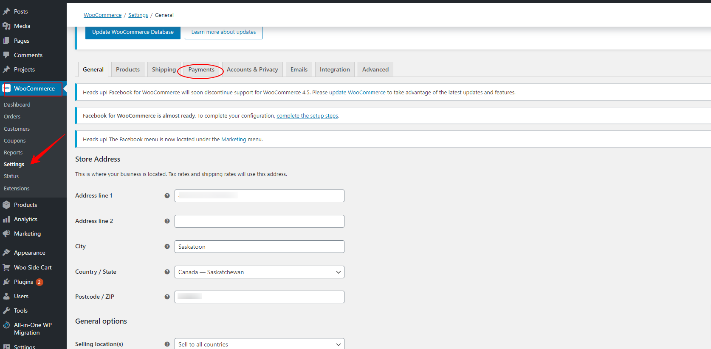
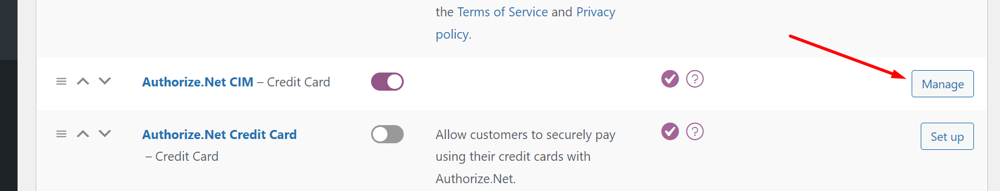
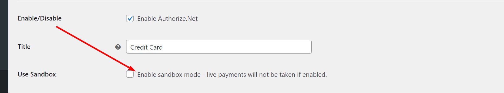

**To set up WooCommerce payments:**

1) Navigate to the WordPress Dashboard from WordPress Hosting Standard/Pro.

2) Click on "WooCommerce" in the left navigation, then select "Settings."

3) Click on "Payments."  

4) Select the payment method and complete the setup for the selected method.

5) Click save at the bottom of the page.

6) (Optional) To test the payment flow, enable the Sandbox mode.  

