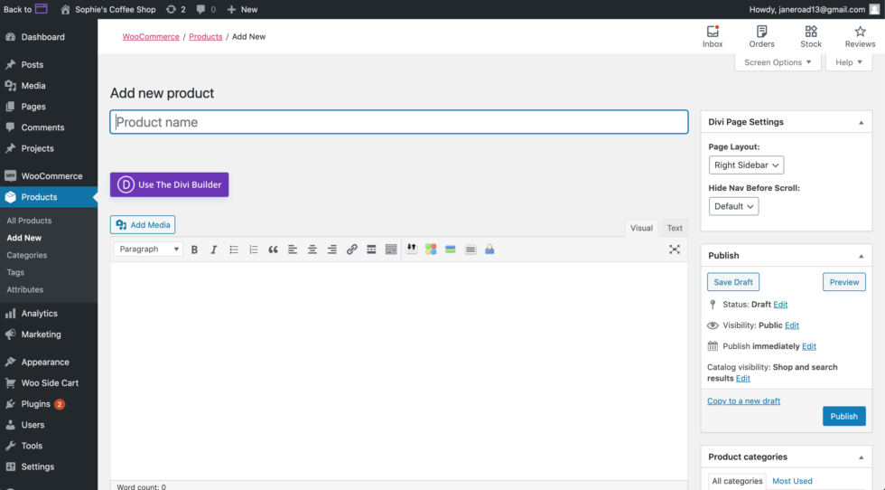
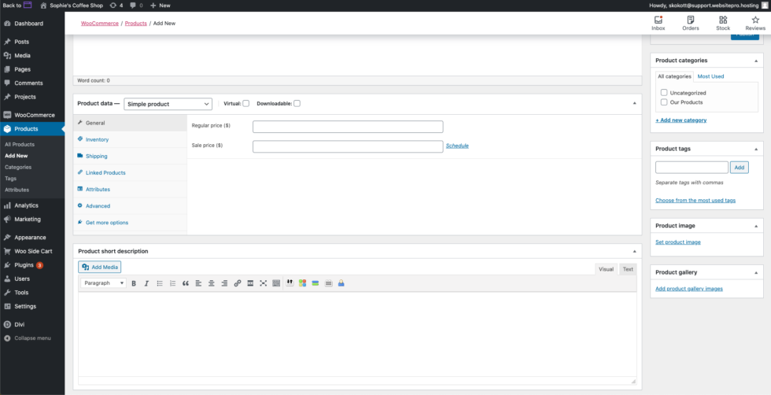
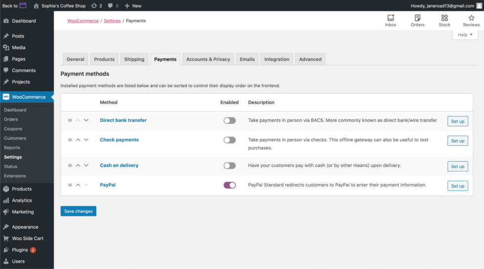

# Set Up Your WooCommerce Store 
From startups and small businesses to huge brands, every business can benefit from an ecommerce website where they sell their products or services. In today's competitive and convenience focused society, no longer do consumers want to go out to buy items, instead, they want to shop from the comfort of their own homes; making ecommerce a perfect solution for both businesses and buyers. 

Getting your business up and selling is possible with Website Express/Pro. This powerful product allows you to quickly and easily create a website and online store powered by WordPress and WooCommerce.

Before we jump in, let's make sure we're familiar with WooCommerce.

<iframe width="795" height="315" src="https://www.youtube.com/embed/1KahlicghaE?si=l09rVXWPEzdXq2iZ" title="YouTube video player" frameborder="0" allow="accelerometer; autoplay; clipboard-write; encrypted-media; gyroscope; picture-in-picture; web-share" referrerpolicy="strict-origin-when-cross-origin" allowfullscreen></iframe>

WooCommerce is a plugin that integrates easily with your existing or brand new WordPress site; transforming your website into a fully functional ecommerce website with just a few clicks. WooCommerce provides basic store functionality right out of the box right from your WordPress dashboard. Plus it has hundreds of available extensions that allow you to customize your store however you see fit.

Let's start building your ecommerce store utilizing WooCommerce! 

Setting up your online store
----------------------------

*   To begin building out your store, you'll need to navigate to your **WordPress dashboard**. Once on the WordPress dashboard hover over the WooCommerce tab in the left navigation and click **Settings**.  
*   Once on this page, look to the top right corner. You should see a tab with the heading, **"Help"** and a downward arrow. Click on it.
*   A new menu should appear. On the left side, you should see four different tabs. Click on the **Setup Wizard** tab, then the blue Setup Wizard button. Follow all the steps and fill in all forms (as applicable).

<video width="795" height="448" controls>
  <source src="/video/Setting-Up-Your-WooCommerce-Store-Step-1.mp4" type="video/mp4" />
  Your browser does not support the video tag.
</video>

[Adding products to your online store](https://docs.woocommerce.com/document/managing-products/?_ga=2.31343295.1240451283.1591295667-1340702708.1584992186)
-----------------------------------------------------------------------------------------------------------------------------------------------------------

*   Now it's time to add products to your online store! On the left side navigation bar of WordPress, you should see the **"Products"** tab. Click it.
*   You will see a couple of placeholder products already in your store. You can either edit one of these, or you can start from scratch.
    *   To start from scratch, add a new product to the store: click the **"Add New"** button at the top of the page. 
    *   To edit a placeholder product, simply double-click the product name and replace the existing content with your own. Scroll down to see the area where you can input the price of your product, inventory numbers, and any attributes.

*   You are able to replace or upload a new product image by clicking **"Set Product Image"** on the lower right side of the page. If you'd like to add additional images, see below and click "**Add Product Gallery Images**".

<video width="795" height="448" controls>
  <source src="/video/Adding-Products-to-WooCommerce-Store.mp4" type="video/mp4" />
  Your browser does not support the video tag.
</video>

Setting up payments for your online store
-----------------------------------------

*   To set up the ability to take payments, hover over the WooCommerce tab in the left navigation and click "**Settings**". 
*   Click the **"Payments**" tab.

There will be a number of options available to you. All are turned off unless you enable them, which you can do by clicking on the toggle under the Enabled column. It should turn purple once activated. After, click the "**Setup**" button to the right of the option you selected. It will take you to a page directing you to fill out the required information to fully set up the payment method.

*   If you would like to use a different payment processor (ex. Stripe), WooCommerce has a variety of [additional plugins](https://wordpress.org/support/article/managing-plugins/) for this.
    *   To add an additional payment processor, hover over the Plugin tab on the left navigation bar, then click "**Add New"**. Find the "**Search Plugins**" text box and search for "WooCommerce Stripe", or your preferred payment processor. Once it appears, click "**Install Now**" and "**Activate**". Then return to the payments tab to set it up. 

<video width="795" height="448" controls>
  <source src="/video/Adding-an-additional-payment-processor.mp4" type="video/mp4" />
  Your browser does not support the video tag.
</video>

**Congratulations, you now have the knowledge you need to build out your ecommerce store. Happy selling!**

_[WooCommerce](https://docs.woocommerce.com/) and [Divi Builder](https://www.elegantthemes.com/blog/theme-releases/divi-3)_ _have extensive documentation and tutorials on how to set up, edit, manage, and operate your store._
