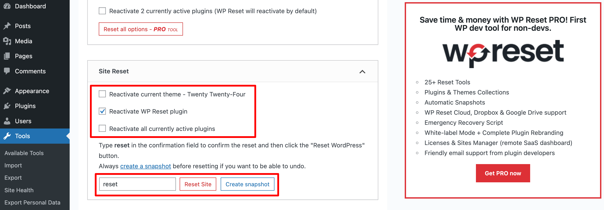

Resetting your WordPress site removes all content, settings, and customizations, returning it to a fresh WordPress installation. This is useful when you want to start over or test a clean setup.

:::warning
**This action cannot be undone.** All your posts, pages, media, plugins, themes, and settings will be permanently deleted. Always create a backup before resetting your site.
:::

## Before You Reset

**Important steps before resetting:**

1.  **Create a backup** – WordPress Hosting Pro creates daily backups automatically. Make sure you have a recent backup you can restore if needed.
2.  **Export important content** – If you have content you want to keep, export it before resetting.
3.  **Note your current setup** – Write down which plugins and themes you're using so you can reinstall them if needed.

## How to Reset Your WordPress Site

### Step 1: Install the WP Reset Plugin

1.  Go to your WordPress dashboard.
2.  Navigate to **Plugins** > **Add New**.
3.  Search for **"WP Reset"**.
4.  Click **Install Now**, then **Activate** the plugin.

### Step 2: Access WP Reset Tools

1.  In the dashboard, go to **Tools** > **WP Reset**.

### Step 3: Reset the Site

1.  Scroll to the reset section.
2.  Type **"reset"** in the confirmation box (this prevents accidental resets).
3.  Click **Reset Site**.

That's it! Your site will be reset to a fresh WordPress installation, ready for new configurations.

## After Resetting

After resetting, you'll need to:

1.  **Reinstall plugins** – Install any plugins you need for your site.
2.  **Install a theme** – Choose and install a theme for your site.
3.  **Configure settings** – Set up your site title, permalinks, and other basic settings.
4.  **Create content** – Start adding pages and posts to your site.

## Alternative: Restore from Backup

If you reset your site by mistake or want to go back, you can restore from a backup:

1.  Go to WordPress Hosting Pro dashboard.
2.  Navigate to the **Backups** tab.
3.  Find the backup you want to restore.
4.  Click **Restore** and confirm.

This will restore your site to the state it was in when that backup was created.
