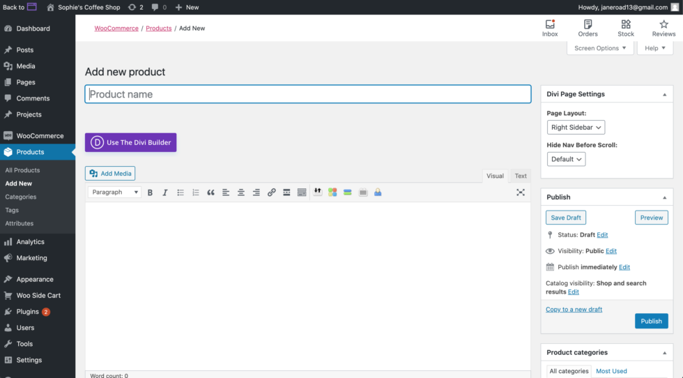
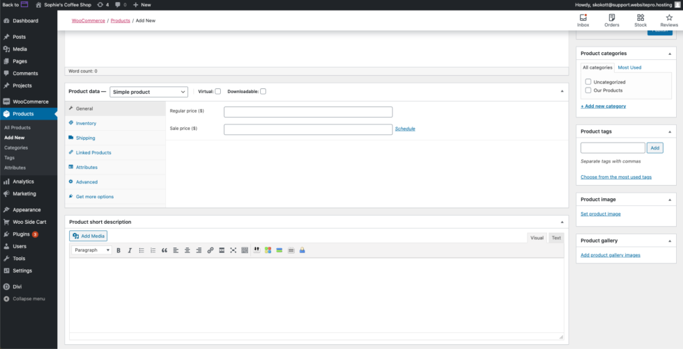
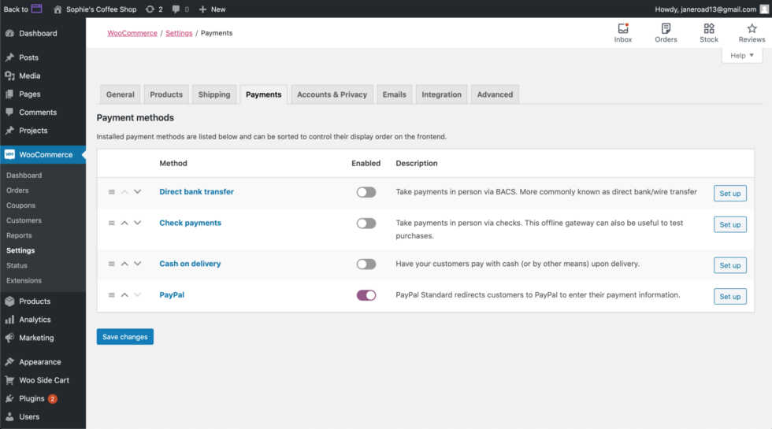

From startups to large enterprises, every business can benefit from an ecommerce website to sell products or services. In today’s convenience-focused world, consumers prefer shopping from the comfort of their homes, making ecommerce a perfect solution for businesses and buyers alike.

With **Business App**, creating an online store is quick and easy using WordPress and WooCommerce.

### What Is WooCommerce?

WooCommerce is a plugin that integrates seamlessly with your WordPress site, transforming it into a fully functional ecommerce platform with just a few clicks. It provides essential store functionality out of the box while offering hundreds of extensions to help you customize your store to meet your business needs.

### Setting Up Your Online Store

1.  **Access Your WordPress Dashboard**: Navigate to your WordPress dashboard.
2.  **Locate WooCommerce Settings**: In the left navigation bar, hover over the **WooCommerce** tab and click **Settings**.
3.  **Launch the Setup Wizard**:
    *   In the top-right corner, click the **Help** tab with the downward arrow.
    *   Select the **Setup Wizard** tab and click the blue **Setup Wizard** button.
    *   Follow the steps and complete the forms as required.

### Adding Products to Your Store

1.  **Open the Products Tab**: In the WordPress dashboard, click the **Products** tab in the left navigation bar.
2.  **Add or Edit Products**:
    *   To create a new product, click **Add New** at the top of the page.
    *   To edit an existing placeholder product, double-click its name and update the details.
3.  **Customize Product Details**:
    *   Input the product name, price, inventory details, and attributes.
    *   Replace or upload product images by clicking **Set Product Image** in the lower-right corner. Add additional images by selecting **Add Product Gallery Images**.

### Setting Up Payments

1.  **Open Payment Settings**:
    *   Hover over the **WooCommerce** tab in the left navigation and select **Settings**.
    *   Click the **Payments** tab. 
2.  **Enable Payment Options**:
    *   Toggle the switch under the **Enabled** column for your preferred payment method. The toggle will turn purple when activated.
    *   Click the **Setup** button next to the selected payment method and follow the prompts to configure it.
3.  **Add Alternative Payment Processors**:
    *   To use a processor like Stripe, go to the **Plugins** tab and click **Add New**.
    *   Search for “WooCommerce Stripe” or your preferred processor. Click **Install Now**, then **Activate**.
    *   Return to the Payments tab to finalize setup.

Congratulations! You’re now ready to build and manage your ecommerce store using WooCommerce.

For more detailed guidance, WooCommerce offers extensive documentation and tutorials to help you set up, edit, and operate your store.