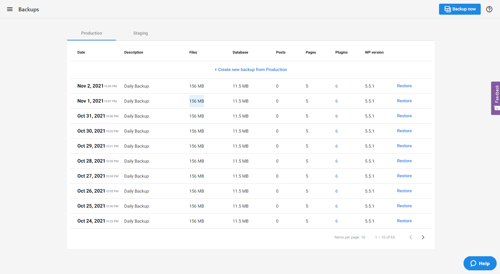
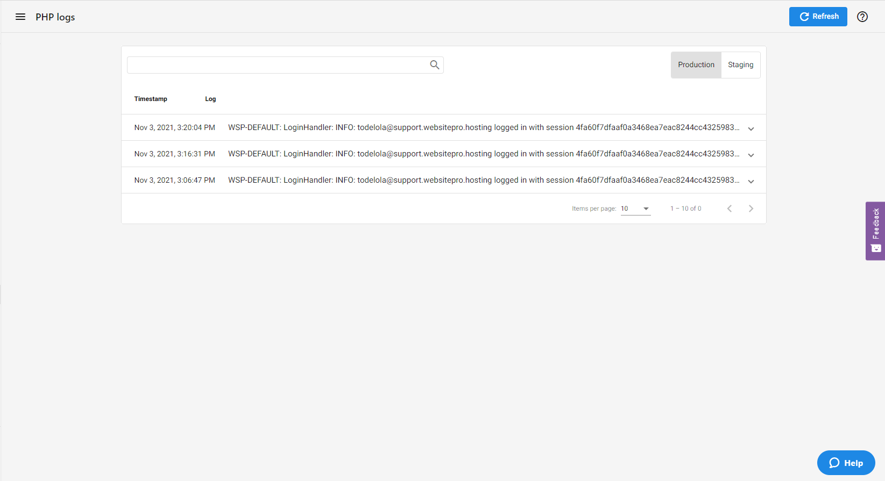
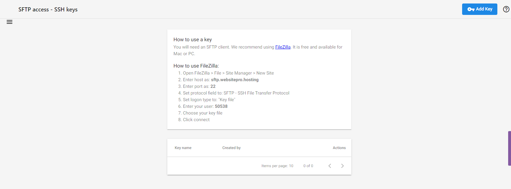
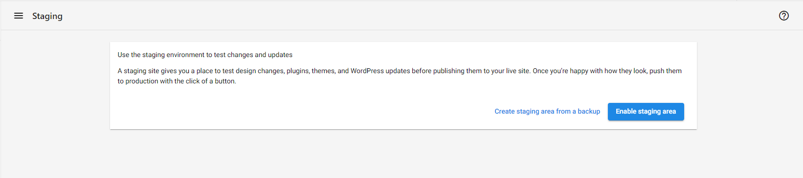
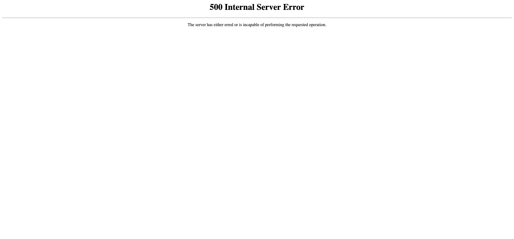
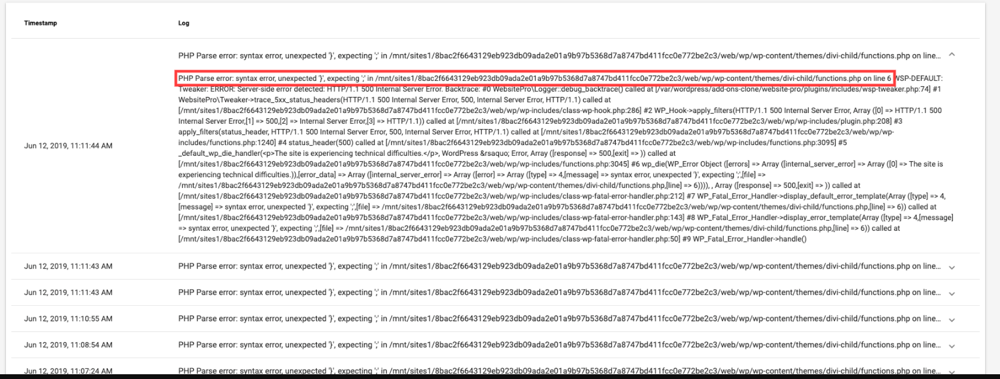
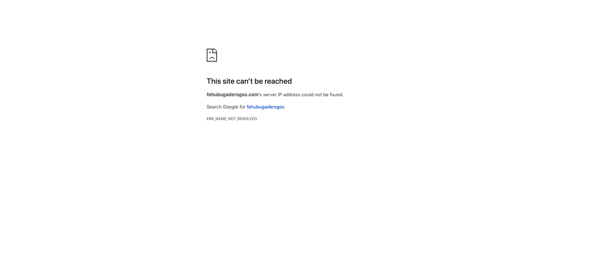

This guide helps you debug common problems that can occur on your WordPress website using tools available in WordPress Hosting Pro. These can range from conflicting plugins preventing certain features from working, all the way to internal server errors that bring the website down.

## When to Use Debugging Tools

Use these debugging tools when:
*   Your website shows an error message
*   A feature or plugin stops working
*   You can't access your WordPress dashboard
*   Your site displays a blank white screen
*   Something changed after updating a plugin or theme

## Available Debugging Tools

### Daily Backups

WordPress Hosting Pro automatically creates daily backups of your website. These backups allow you to restore your site to a previous working state if something goes wrong.

Within WordPress Hosting Pro under the **Backups** tab, you'll see a list of backups that are created. By default, when you create a WordPress Hosting Pro install, there will be a base backup (clean install). Subsequent backups are created daily.

The backup list shows information to help you decide which backup to restore:
*   WordPress version
*   Size of the database
*   Size of the files
*   Number of Posts, Pages, and Plugins

You can restore a backup by clicking the **Restore** link to the right of the backup you wish to use, and then confirm the restoration.

### PHP Logs

PHP logs record errors that occur on your website. They show the date of the error and a full trace of how the problem occurred.

These logs help identify:
*   Which plugin or theme is causing an error
*   What specific code is causing the problem
*   When the error occurred

:::info
For step-by-step instructions on how to access PHP logs, see [How to Find PHP Logs](../../advanced-tools/how-to-find-php-logs.md).
:::

### SFTP Access

**SFTP** (Secure File Transfer Protocol) is a way to access your website files directly. This allows you to rename, delete, or edit files when you can't access your WordPress dashboard.

SFTP access can be found on the **Advanced Tools** tab, under the **WordPress Dashboard** button. This allows you to set up a key that can be used with an SFTP client. The most common SFTP client is FileZilla, which allows you to access the website files directly.

:::info
If you're not comfortable using SFTP, contact support for assistance with file access.
:::

### Staging Environment

A staging environment is a copy of your live website where you can test changes without affecting your actual site. This is useful for troubleshooting and testing updates.

When you first get to the **Staging Environment** tab, you need to enable it, which will take a copy of the live website. This tool includes a toggle for **WP_Debug**, which displays errors or warnings as they occur on your site.

You can use a staging environment for:
1.  Testing plugin updates before applying them to your live site
2.  Troubleshooting errors without affecting your live site
3.  Making large changes and ensuring they work before pushing to live

## Common Errors and How to Fix Them

### Internal Server Error (500 Error)

An internal server error means there's a problem with the code on your WordPress site. This could be caused by:
*   A plugin that didn't update completely
*   A theme with an issue
*   A code problem that can't be resolved

**Ways to fix this:**

1.  **Restore a backup** – Roll back to before the error occurred by restoring a backup from the Backups tab.

2.  **Check PHP logs** – Go into the PHP logs to find the source of the problem. The logs will show which file and line number is causing the error. You can then fix it using an SFTP connection to access the problematic file.

3.  **Use staging environment** – Enable the staging environment and turn on WP_Debug. This will show you exactly what error is occurring, then you can fix it.

4.  **Disable problematic plugins or themes** – Disable any plugin or theme that might be causing the issue. This can be done by renaming the folder of the plugin or theme using an SFTP connection. Simply add `-dis` to the end of the folder name (e.g., `plugin-name-dis`).

**Example:**

The error shown in the PHP logs might indicate that a theme has incorrect syntax. For example, if you see an error about `functions.php` on line 6, you can:
*   Restore a backup from before the change
*   Use SFTP to open the file and correct the syntax issue
*   Or enable staging environment with WP_Debug to see the error clearly

### Site Cannot Be Reached

If your site shows "This site can't be reached" or similar, this usually isn't a WordPress issue. It typically means:

*   Your domain has expired
*   Your domain's nameservers aren't pointing to your hosting
*   There's a problem with your domain's connection to your hosting

**Solution:**

Contact whoever you registered your domain with or the company that manages your nameservers. If you need help setting up your domain with WordPress Hosting Pro, see [Domain Setup](../../domains/connect-a-custom-domain.md).

## General Debugging Steps

Most of the time your site won't be completely down, but you may notice some functionality not working. For instance, maybe your image slider isn't working, or a specific feature has issues.

**Recommended debugging steps:**

1.  **Check PHP logs and WP_Debug** – Even if your site is working, check both locations first as they can provide insights into what's happening.

2.  **Use staging environment** – Perform debugging steps on the staging environment so you don't cause further harm to the live site while testing.

3.  **Update themes and plugins** – If these become outdated, there could be conflicts or security concerns. Make sure everything is up to date.

4.  **Test for plugin conflicts** – If a specific plugin is having an issue:
    *   Disable every plugin except that one
    *   If it works, you know you have a plugin conflict
    *   Re-enable plugins one by one and test
    *   Once the issue returns, you've found the conflicting plugin
    *   Either find a new way to accomplish your objective or contact the plugin developer for a solution

5.  **Test for theme conflicts** – If you disabled all plugins except the problematic one and it still doesn't work:
    *   Try switching to a default theme (like Twenty Twenty-Four)
    *   If it works with the default theme, you know the plugin is conflicting with your theme

## Additional Resources

For more WordPress troubleshooting help, visit [WordPress Codex](https://codex.wordpress.org/). The guides and help offered there are useful for troubleshooting, learning how to use WordPress, tutorials, and more advanced topics.

## Frequently Asked Questions (FAQs)

Why am I getting a memory limit error when editing with Divi or Elementor?

Memory issues in Divi or Elementor are usually caused by:
* Too many post revisions stored in the database
* Conflicting plugins

**Recommended steps:**

1. **Backup your site.**
2. Install the **WordPress Sweep plugin** to clear unnecessary post revisions.
3. If issues persist, disable plugins one by one to find the culprit.

**Known conflicting plugins include:**
* MetaSlider
* Photo Gallery
* Recent Posts Widget With Thumbnails
* Simple Custom Post Order
* Smart Grid Gallery
* Testimonial Rotator
* Unbounce Loading Pages
* WordPress Importer
* WP-Optimize – Clean, Compress, Cache
* WP Responsive Menu

Why do I see a "Storage engine MyISAM is disabled" error?

WordPress Hosting Pro supports only the **InnoDB** storage engine. Plugins or themes trying to use **MyISAM** will fail.

**Why?**  
This is a stability and reliability decision. MyISAM is outdated and lacks support for transactions and row-level locking.

**Workaround:**  
If the plugin requires MyISAM, contact the plugin developer to explore switching to InnoDB in the table creation script.

What does the `WP_AUTO_UPDATE_CORE` error mean?

This WordPress Site Health warning means that **core auto-updates are turned off**.

**Why this is safe:**  
Auto-updating WordPress core versions can break your site if your plugins/themes are not compatible. Manual updates are recommended to maintain stability.

No action is needed unless you choose to handle updates differently.

## Related Articles

*   For login-specific troubleshooting, see [Troubleshooting WordPress Login Issues](troubleshooting-wordpress-login-issues.md)
*   For security best practices, see [WordPress Security Guide](wordpress-security-guide.md)
