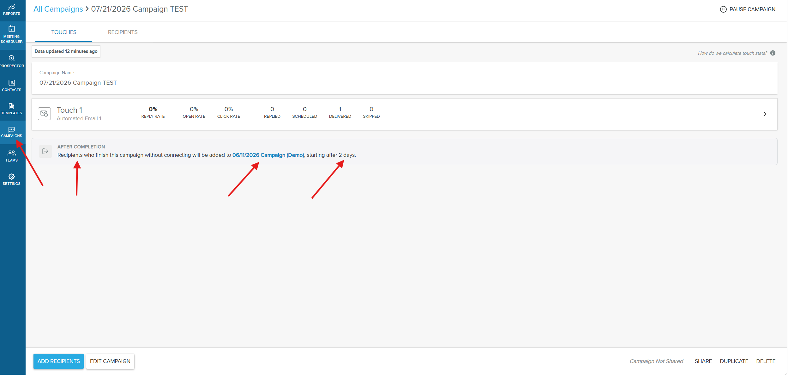
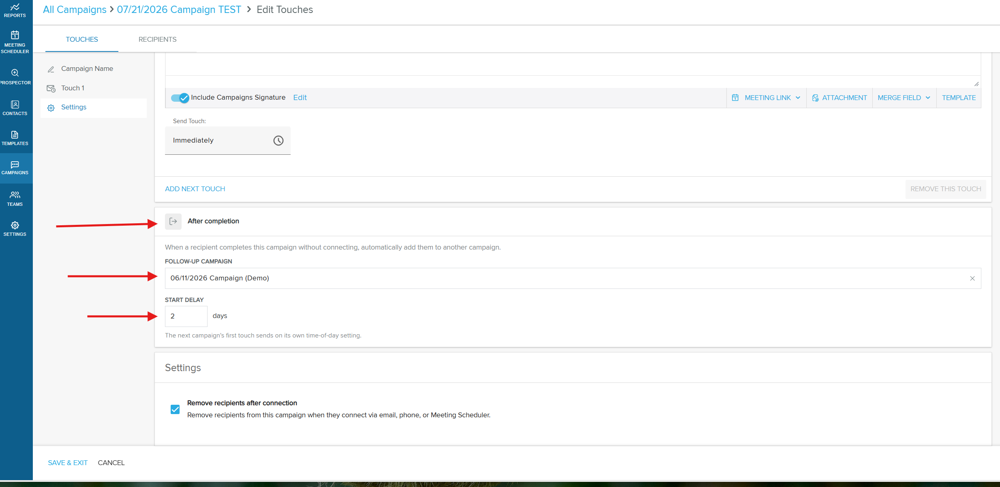
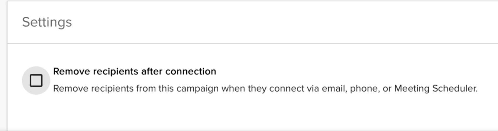
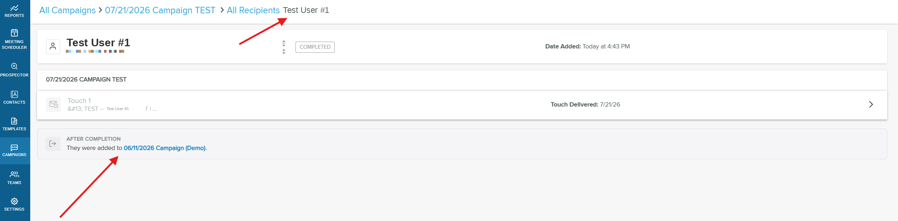
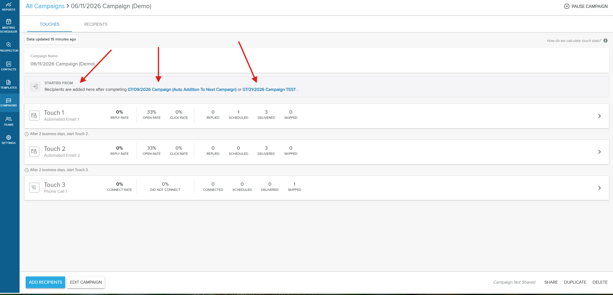

## What are follow-up campaigns?

A follow-up campaign is a campaign that recipients are automatically enrolled into when they finish another campaign without connecting. Instead of a sequence simply ending when a recipient reaches the last touch, you can hand those recipients straight to a new campaign to keep your outreach going.

You set this up in a campaign's `Settings`, in the `After completion` section. There you choose the follow-up campaign and a start delay. A recipient completes the campaign without connecting when they reach the end without replying, connecting by phone, or booking a meeting through Meeting Scheduler. When that happens, they are enrolled into the follow-up campaign after the delay you set.

## Why is this important?

- **No completed recipient falls through the cracks:** recipients who finish a campaign without engaging are handed off to a nurture campaign automatically
- **Save time:** skip the manual work of tracking which recipients completed a campaign and re-enrolling them one by one
- **Keep engaged recipients out of it:** recipients who reply, connect by phone, or book a meeting are left alone, so you don't keep emailing someone who already responded
- **Space out your outreach:** a configurable start delay lets you pace correspondence instead of sending touches back to back
- **Stay compliant:** opted-out and bounced recipients are skipped automatically

## What's included?

- **After completion setting:** attach a single follow-up campaign directly to a campaign's settings
- **Follow-Up Campaign picker:** search and select from the campaigns you have access to
- **Start delay:** choose how many days to wait after completion before the follow-up campaign begins, up to 90 days
- **Automatic skip protection:** opted-out and bounced recipients are never enrolled

## How to set up a follow-up campaign

### Step 1: Open the first campaign

In the Yesware AppSite, go to `Campaigns` and open (or create) the campaign you want recipients to complete first.

### Step 2: Open the campaign's settings

Open the individual campaign's `Settings`.

### Step 3: Go to the After completion section

Scroll to the `After completion` section of the settings.

### Step 4: Choose a follow-up campaign

In the `Follow-Up Campaign` field, search for and select the campaign you want completed recipients added to. The picker lists the campaigns you have access to.

### Step 5: Set the start delay

Set the `Start Delay`, the number of days to wait before the follow-up campaign begins. You can set a delay of up to 90 days.

### Step 6: Save the campaign

Save the campaign. Recipients who complete it without connecting are now enrolled into the follow-up campaign automatically after the delay.

## How follow-up enrollment works

Keep the following behaviors in mind when you chain campaigns together.

**Enrollment triggers only on completion without a connection.** Recipients who reply, connect by phone, or book a meeting through Meeting Scheduler are treated as connected and are not enrolled into the follow-up campaign. Only recipients who reach the end of the campaign without connecting are enrolled.

:::info
If the `Remove recipients after connection` option is disabled in the campaign's settings, connected recipients remain in the campaign and are still enrolled into the follow-up campaign once it completes.
:::

**The follow-up campaign's own timing still applies.** After the start delay passes, the follow-up campaign's first touch sends according to that campaign's own date and time-of-day settings. For example, with a 2-day delay and a follow-up whose first touch is set to 10:00 AM, the first email sends at the next 10:00 AM after the 2-day delay.

**One follow-up per campaign.** Each campaign can point to a single follow-up campaign. You can chain multiple campaigns together in sequence, as long as a recipient is only active on one campaign at a time.

**Opted-out and bounced recipients are protected.** Anyone who has opted out or whose email has bounced is skipped and never enrolled into the follow-up campaign, even if they otherwise completed the campaign without connecting.

On a recipient's record, an `After completion` note shows which follow-up campaign they were added to once they complete the first campaign.

On the follow-up campaign, a `Started from` note lists the source campaigns whose completed recipients feed into it.

## Frequently Asked Questions

Who can set up a follow-up campaign?

Any Campaign user can. Anyone who builds and runs campaigns can attach a follow-up campaign within their campaign settings.

When exactly does the follow-up campaign start?

The start delay is measured from when the recipient completes the first campaign. After that delay, the follow-up campaign's first touch sends according to that campaign's own date and time-of-day setting. For example, with a 2-day delay and a follow-up whose first touch is set to 10:00 AM, the first email lands at the next 10:00 AM after the 2-day delay.

What happens if a recipient replies, connects by phone, or books a meeting?

These recipients are treated as connected and are not added to the follow-up campaign, as long as the `Remove recipients after connection` option is enabled in the campaign. Follow-up enrollment only applies to recipients who complete the campaign without connecting.

Does this change or affect the original campaign?

No. Enrolling recipients into the follow-up campaign is a separate action that happens after they complete the first campaign. The original campaign and its history are unchanged.

Can a recipient be added to a follow-up campaign they've been in before?

Yes. They are re-enrolled, which matches how manual enrollment already works. Their previous history in that campaign stays intact.

What if a recipient has opted out or their email has bounced?

They are skipped and not enrolled, even if they otherwise completed the first campaign without connecting.

How many follow-up campaigns can I chain to a campaign?

Each campaign can point to a single follow-up campaign. You can chain multiple campaigns together in sequence, as long as a recipient is only active on one campaign at a time.

What's the longest start delay I can set?

Up to 90 days.

If I duplicate a campaign, does it copy the follow-up setting?

No. Duplicating a campaign does not carry over the follow-up campaign or start delay, so you'll need to set those up again on the new copy.

What if the follow-up campaign is paused or deleted, or the recipient is already in another active campaign?

In those cases the recipient is not enrolled into the follow-up campaign.

