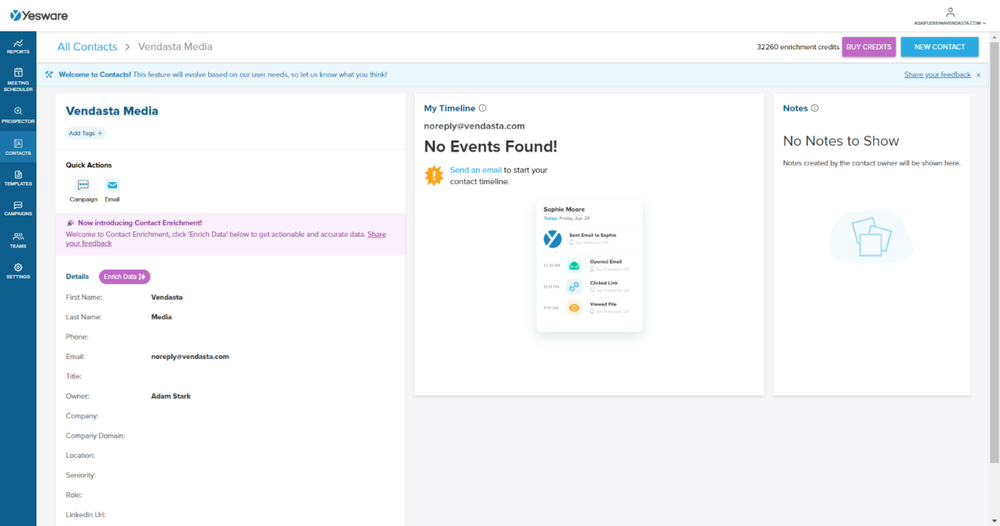

# Creating and Editing Contacts

## What is creating contacts?

Creating contacts allows you to add new profiles to your Yesware address book. While contacts are automatically created when you send or receive emails, you can also manually add contacts before initiating outreach. This gives you the ability to pre-fill information, prepare for campaigns, or add someone who isn't automatically tagged.

## Why is this important?

Manually creating and managing contacts helps you:

- Prepare contact information before starting outreach
- Ensure contact details are accurate and up to date
- Organize your contacts with complete information (name, company, title, phone)
- Remove outdated or incorrect contact records when needed
- Maintain a clean and relevant contact database

## What's included?

You can perform the following actions with contacts:

- **Create New Contacts**: Add contacts manually with email and optional details
- **Edit Contact Information**: Update names, companies, titles, phone numbers, and notes
- **Delete Contacts**: Remove contact records from your Yesware account
- **Add International Phone Numbers**: Support for non-US telephone numbers

## How to create a contact

Contacts are automatically created for every new recipient you email. However, you can also manually add contacts if needed—useful when someone isn't automatically tagged or when you want to pre-fill information in advance.

### For Gmail

1. In the Yesware Sidebar, click the **Add (+) icon** in the top-right corner.
2. Enter the **email address** (required).
3. Optionally add additional details:
   - First Name
   - Last Name
   - Company
   - Title
   - Phone Number
4. Click `Create` to save the contact.

### For Outlook

1. Go to the `Contacts` page in the Yesware web app.
2. Click `New Contact` in the top-right corner.
3. Fill in the required **Email** field.
4. Optionally add:
   - Name
   - Company
   - Title
   - Phone Number
   - Notes
5. Click `Create` to save the contact.

You can return to the contact later to edit or update any information as needed.

## How to edit a contact

Once a contact is created, you can edit the information to make sure it stays relevant and accurate.

### For Gmail

You can edit contacts in your Contacts Sidebar:

1. Open an email with a contact or search for a contact at the top of the sidebar.
2. Once the profile appears in the sidebar, click the **pencil icon** next to any of the fields to update the information.
3. Once you make the edit, click `Enter` to save the updated information.

You can also edit contacts on the [App Site](https://app.yesware.com/contacts):

1. Select a specific contact or search for the contact you'd like to update.
2. Click on any information associated with the contact.
3. Make your changes and click `Enter` to save.

### For Outlook

You can edit contacts within the [app site](https://app.yesware.com/contacts):

1. Select a specific contact or search for the contact you'd like to update.
2. Click on any information associated with the contact and click `Enter` to save.

This allows you to go into the contacts as you notice changes in title and contact information. You can also add notes on the right-hand side of the Contacts page, allowing you to keep updated notes so you always know the latest information as you prep for meetings with the contact.

## How to delete a contact

If you want to remove a contact from your Yesware account, you can do so from the Contacts page on the Yesware app site or directly from Gmail.

### From the App Site (Gmail and Outlook)

1. Go to the `Contacts` page.
2. Search for and select the contact you'd like to delete.
3. Click `Delete` in the top right corner of the contact page.
4. A confirmation message will appear—click `Delete Contact` to confirm.

### From Gmail

You can also delete a contact directly from the Gmail sidebar:

1. Open the Contacts Sidebar.
2. Search for a specific contact or open an email from them to bring up their record.
3. At the bottom of the sidebar, click `Delete Contact Record`.
4. Confirm by clicking `Delete Contact` in the popup.

## Frequently Asked Questions

How do I add a non-US telephone number to a contact?

If you would like to add a non-US-based telephone number, you can do so using the following format:

- Use the format: **+111 (11) 111 1111**
- Include the + country code, followed by the rest of the number
- This must be a valid international number (Yesware uses Google's phone validation library to validate these numbers)

Note: Numbers starting with 0 (which indicate local dialing) are not supported by the Google phone library.

Can I import contacts and leads from Salesforce Campaigns into Yesware?

No, Yesware Campaigns does not currently support importing data directly from the Salesforce Campaigns object.

**What Can Be Imported:**
Users can import Contact and Lead records from Salesforce into Yesware Campaigns. However, other Salesforce objects, including those within the Campaigns object, are not supported for import.

**Workaround Options:**
If you need to use data from the Salesforce Campaigns object, consider these steps:

1. **Export the Campaign Data**: Use Salesforce's export tools to extract the data from the Campaigns object.
2. **Format the Data**: Ensure the exported data is formatted correctly for upload into Yesware as Contact or Lead records.
3. **Import into Yesware**: Follow Yesware's standard process to import Contact or Lead data into your campaign.

How do I add a contact to a Campaign?

From your Contacts tab in the sidebar (Gmail) or on the app site, you can add contacts to Campaigns:

**In Gmail:**
1. Under `Quick Actions` in the Contacts tab of your sidebar, click the `Campaigns` button.
2. It will open the Campaigns screen within Gmail.
3. Select the Campaign you'd like to add the recipient to.
4. You can edit any information in the add recipient screen and Campaign.
5. The information that pulls through is the information available in the Contacts sidebar.
6. Preview the Campaign to make sure your merge fields are set up correctly with the contact information.

**In the App Site:**
1. In the Contacts page, click on the `Campaign` button within the contact.
2. This will launch the Campaign screen in the app site.
3. Select, edit, and add the contact to one of your Yesware Campaigns.

What happens to a contact if I delete them?

When you delete a contact from Yesware, their contact record and any associated notes or enrichment data will be permanently removed from your Yesware account. However, this does not affect your email history or any emails you've exchanged with that person. If you send another email to that address in the future, a new contact record will be created automatically.

Can I edit multiple contacts at once?

Currently, Yesware does not support bulk editing of contacts. You need to edit each contact individually by clicking on their profile and updating the relevant fields.

What information is required to create a contact?

The only required field to create a contact is the email address. All other fields (First Name, Last Name, Company, Title, Phone Number) are optional but recommended for maintaining complete contact records.

