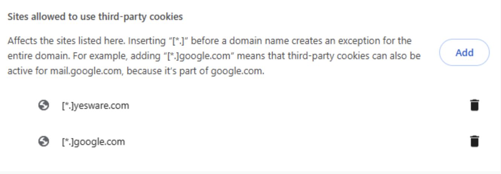

# Blank Activity Feed

A blank activity feed can be caused by cookies from Yesware being blocked.
To check this, follow the steps below:

1. Paste this link into a new browser window: chrome://settings/cookies
2. Make sure the option "Clear cookies and site data when you close all windows" is **OFF.**

---

3. Under 'Sites that can always use cookies', click Add, then type: `[*.]yesware.com`
4. Click Add again, then type: `[*.]google.com`

5. Then please refresh your Gmail at the browser level for the changes to take effect.
   *If these steps do not resolve the blank activity feed, please reach out to Yesware Support. *

