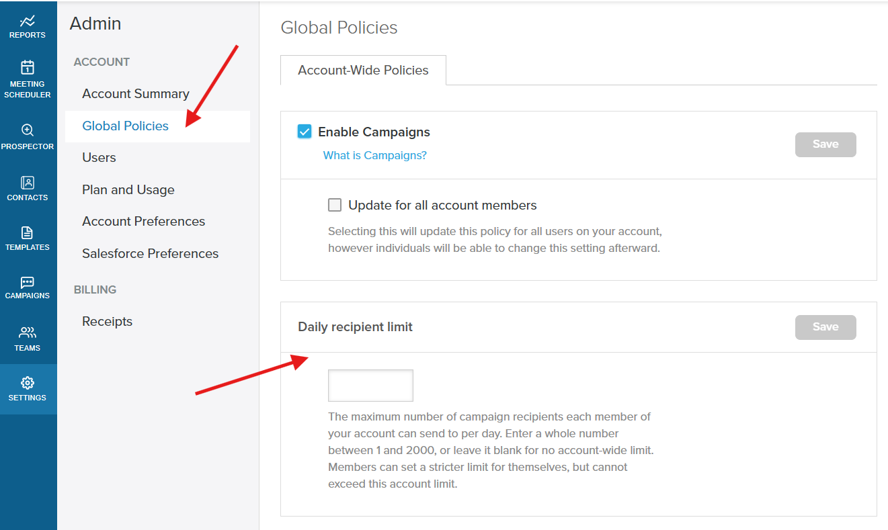
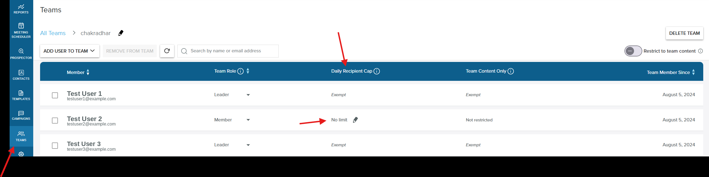
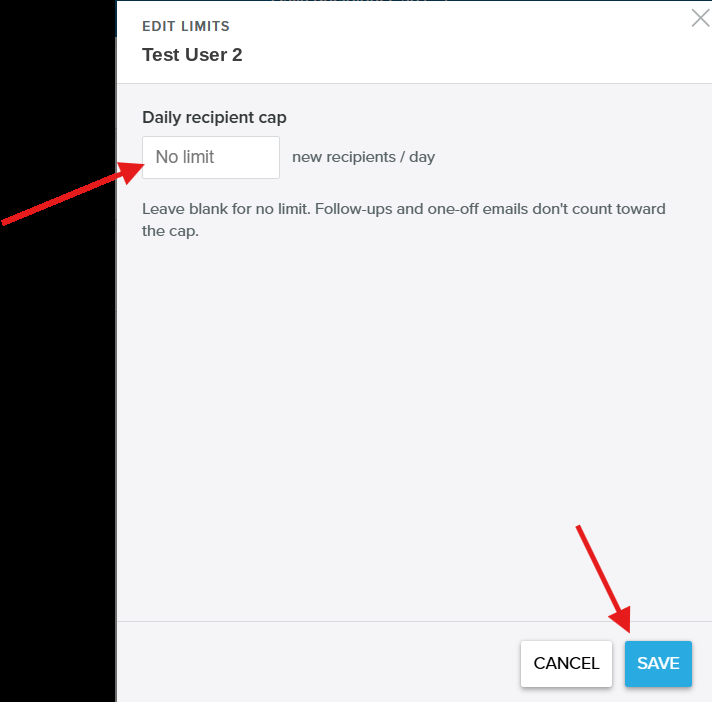
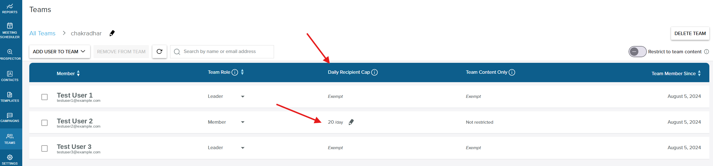
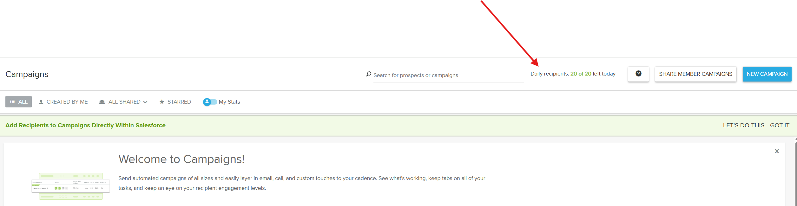
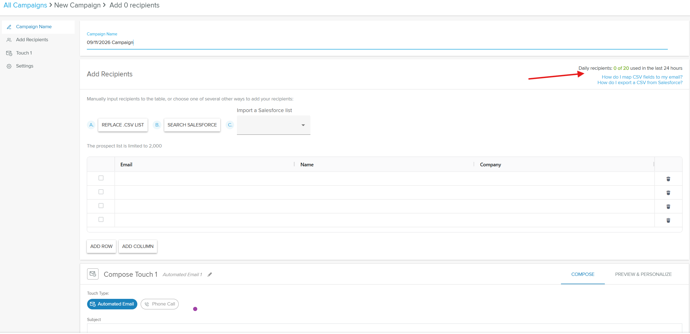
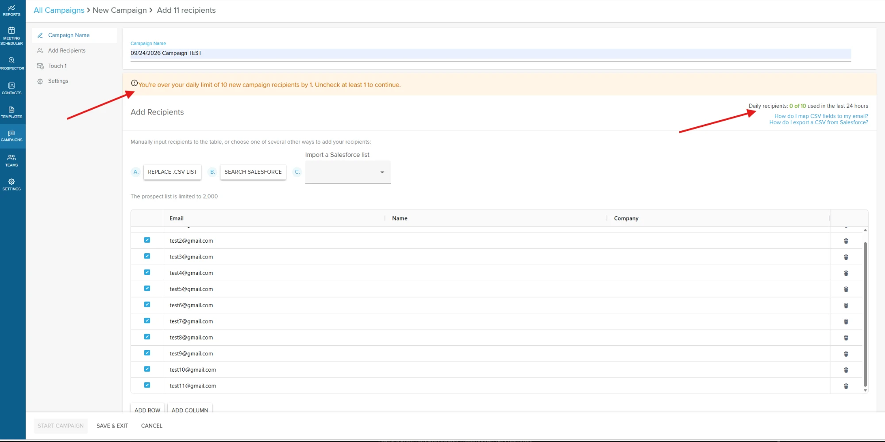
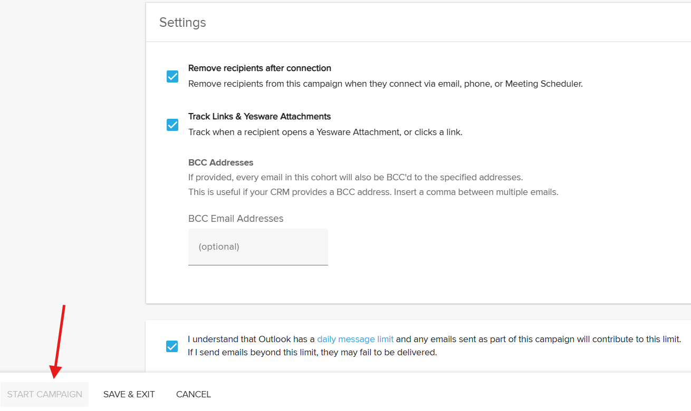

## What is the daily recipient cap?

The daily recipient cap limits how many new campaign recipients a member can add within a rolling 24-hour period. If a member tries to launch a campaign that would push them over their cap, Yesware blocks the launch and prompts them to remove recipients until they are back under the limit.

The cap is managed in two places. Yesware Admins and Account Managers set an account-wide daily recipient limit on the `Global Policies` page, and Team Leaders set a per-member cap for the members they manage from the `Teams` view. Members can see how much of their cap remains directly within the Campaigns feature.

:::info
The daily recipient cap relies on the Teams feature, which is available on the Premium and Enterprise plans.
:::

## Why is this important?

- **Pace outreach deliberately:** a per-person guardrail keeps members from adding a very large number of new recipients at once
- **Set one account-wide standard:** an account-wide ceiling keeps every member within a consistent limit
- **Stay flexible per member:** Team Leaders can set a lower cap for specific members without changing the account-wide policy
- **Keep members informed:** the remaining count is visible in Campaigns, and the launch block clearly explains what to do next
- **Avoid over-contacting prospects:** capping new recipients keeps sending volume consistent from day to day

## What's included?

- **Account-wide ceiling:** an account-level daily recipient limit that no individual member's cap can exceed
- **Per-member caps:** a daily recipient cap that Team Leaders set for each member they manage
- **Team Leader exemption:** Team Leaders are not capped and appear as `Exempt` in the Teams view
- **New-recipient counting:** only new campaign recipients added in the rolling 24-hour window count toward the cap
- **Pre-send enforcement:** the cap is enforced at campaign launch, not when recipients are added
- **Remaining-cap visibility:** members can see how many recipients they have left for the current window

## How to set and use the daily recipient cap

### For Yesware Admins: set the account-wide ceiling

Step 1: Go to `Settings` and open `Global Policies`, then select the `Account-Wide Policies` tab.

Step 2: Under `Daily recipient limit`, enter a whole number between 1 and 2,000, or leave it blank for no account-wide limit. Click `Save`.

The value you set becomes the maximum any member's daily recipient cap can be set to.

### For Team Leaders: set a per-member cap

Step 3: Go to `Teams` and open your team. Each member's current cap appears in the read-only `Daily Recipient Cap` column. Team Leaders appear as `Exempt`, and members without a cap show `No limit`.

Step 4: Click the pencil next to a member to open the `Edit Limits` modal. Enter their daily recipient cap in new recipients per day, at or below the account-wide ceiling, and click `Save`. Leave it blank for no limit.

The saved cap then appears in the member's `Daily Recipient Cap` column.

### For members: work within your cap

Step 5: On the `Campaigns` page, check the `Daily recipients` counter to see how many recipients you have left today.

Step 6: Build a campaign as usual. The `Add Recipients` step shows a running count of how much of your cap you have used in the last 24 hours.

Step 7: If your selected recipients would exceed your cap, a warning asks you to uncheck recipients (or start with fewer) before you can continue.

Step 8: Until you are under the cap, the `Start Campaign` button stays disabled. Uncheck recipients to re-enable it, then launch.

## How the cap is enforced

Keep the following behaviors in mind.

**The account-wide value is a hard ceiling.** A per-member cap can be equal to or lower than the account default, but never higher. The system always enforces the lower of the account default and the per-member value, so if the account-wide limit is later lowered below a member's existing cap, the effective limit drops to the lower value immediately.

**Only new campaign recipients count.** The cap counts new campaign recipients added within the rolling 24-hour window. Follow-ups and one-off emails do not count toward it, and it is not a limit on total emails sent.

**Enforcement happens at launch.** All checked recipients are added to the campaign normally. If a launch would put the member over their cap, the `Start Campaign` action is blocked until they remove recipients. Recipients are never silently dropped, and there is no queue of held-back recipients.

## Frequently Asked Questions

Who can set the daily recipient cap?

The cap relies on the Teams feature, which is available on the Premium and Enterprise plans. Yesware Admins set the account-wide limit on the `Global Policies` page, and Team Leaders set per-member caps for the members they manage.

Does the daily recipient cap apply to Team Leaders?

No. The cap applies to members only. Team Leaders are exempt and appear as `Exempt` in the Teams view.

What counts against the cap, enrolled recipients or emails sent?

The cap counts the number of new campaign recipients a member adds within a rolling 24-hour period. Follow-ups and one-off emails do not count, and it is not a limit on total emails sent.

What happens when a member reaches their cap?

Recipients still enroll into the campaign, but at launch the campaign is blocked if it would put the member over their limit. A warning prompts them to uncheck recipients until they are under the cap, and the `Start Campaign` button stays disabled until they are. Once under the limit, they can start the campaign.

Can a Team Leader set a member's cap higher than the account-wide limit?

No. The account-wide value is a hard ceiling. A per-member cap can be equal to or lower than the account default, but never higher.

What happens if the account-wide limit is lowered below a member's existing cap?

The effective limit immediately drops to the lower value. The system always enforces the lower of the account default and the per-member value.

How long until the daily recipient cap resets?

The cap uses a rolling 24-hour window. Members can see how many recipients they have left for the current window within the Campaigns feature.

Are recipients ever silently dropped or queued?

No. All checked recipients are added to the campaign, and enforcement happens as a block at launch. There is no silent drop when recipients are added, and no queue of held-back recipients.

What value can the account-wide daily recipient limit be?

A whole number from 1 to 2,000, or blank for no account-wide limit.

